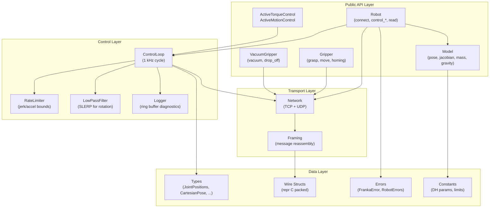
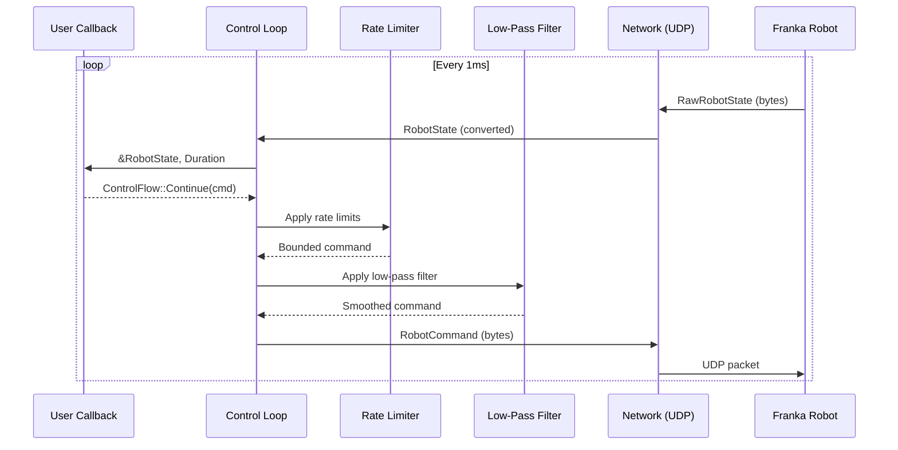

# Architecture Overview

`franka-rs` is structured as a layered architecture, with each layer building on the one below it.

## Layer Diagram



## Module Map

| Module | Role | Key Types |
|--------|------|-----------|
| `types` | Domain newtypes wrapping raw arrays | `JointPositions`, `Torques`, `CartesianPose`, `Frame` |
| `errors` | Error hierarchy and robot error flags | `FrankaError`, `RobotErrors`, `FrankaResult<T>` |
| `wire` | Binary packed structs matching the FCI protocol | `RawRobotState`, `RobotCommand`, `CommandHeader` |
| `network` | TCP+UDP socket management and framing | `Network`, `connect_robot()` |
| `control_loop` | 1 kHz real-time loop orchestration | `run_motion_loop()`, `run_torque_loop()` |
| `rate_limiting` | Joint/Cartesian rate and jerk limiting | `limit_rate_torques()`, `limit_rate_joint_position()` |
| `lowpass_filter` | Butterworth filter with quaternion SLERP | `lowpass_filter()`, `cartesian_lowpass_filter()` |
| `logging` | Ring buffer of state/command pairs for diagnostics | `Logger` |
| `robot` | Main public interface | `Robot` |
| `active_control` | Non-callback streaming control interface | `ActiveTorqueControl`, `ActiveMotionControl<M>` |
| `model` | Kinematics (FK, Jacobians) and dynamics (M, C, g) | `Model` |
| `gripper` | Parallel gripper interface | `Gripper`, `GripperState` |
| `vacuum_gripper` | Vacuum gripper interface | `VacuumGripper`, `VacuumGripperState` |

## Data Flow (Control Loop)



## Ownership Model

Rust's borrow checker enforces single-writer access to the robot:

```rust
// Robot owns the network connection
let mut robot = Robot::connect("172.16.0.2")?;

// control_torques takes &mut self — no concurrent access possible
robot.control_torques(|state, duration| {
    // You have exclusive, safe access to state here
    ControlFlow::Continue(Torques::new([0.0; 7]))
})?;

// Or use active control (borrows &mut robot for lifetime of control)
let mut ctrl = robot.start_torque_control()?;
// robot is now borrowed — can't call robot.read_once() here
ctrl.write_torques(Torques::new([0.0; 7]))?;
drop(ctrl); // returns borrow, robot usable again
```

This replaces the C++ approach of runtime mutexes with compile-time guarantees.
