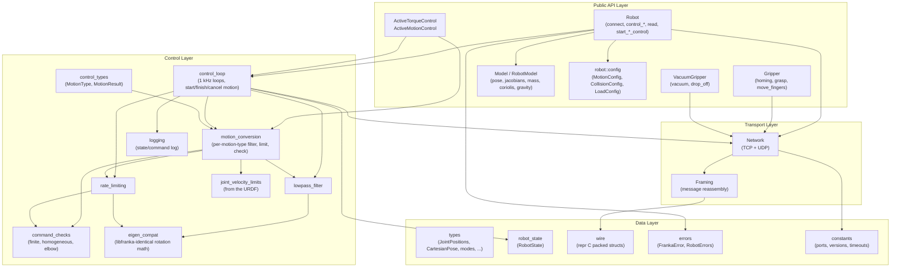
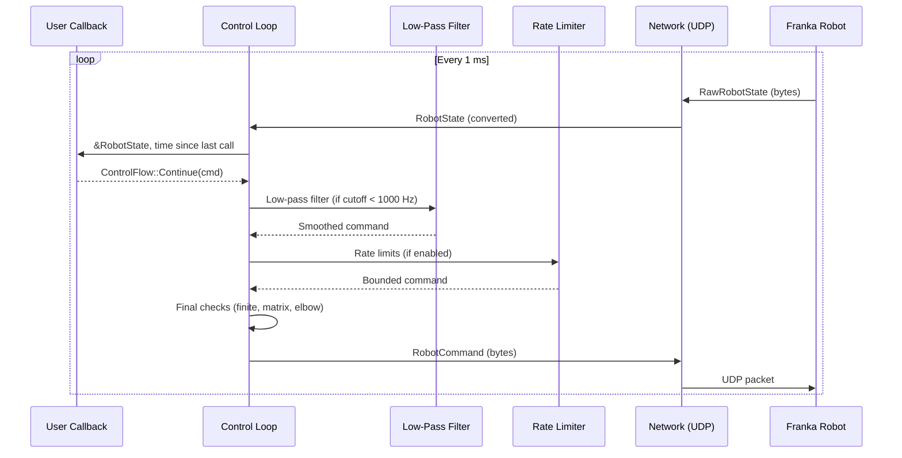

# Architecture Overview

`franka-rs` is structured as a layered architecture, with each layer building on the one below it.

## Layer Diagram


```mermaid
graph TD
    subgraph "Public API Layer"
        ROBOT["Robot<br/>(connect, control_*, read, start_*_control)"]
        GRIPPER["Gripper<br/>(homing, grasp, move_fingers)"]
        VACUUM["VacuumGripper<br/>(vacuum, drop_off)"]
        MODEL["Model / RobotModel<br/>(pose, jacobians, mass, coriolis, gravity)"]
        ACTIVE["ActiveTorqueControl<br/>ActiveMotionControl"]
        CONFIG["robot::config<br/>(MotionConfig, CollisionConfig, LoadConfig)"]
    end

    subgraph "Control Layer"
        CLOOP["control_loop<br/>(1 kHz loops, start/finish/cancel motion)"]
        CONV["motion_conversion<br/>(per-motion-type filter, limit, check)"]
        CTYPES["control_types<br/>(MotionType, MotionResult)"]
        LPFILT["lowpass_filter"]
        RLIMIT["rate_limiting"]
        JVL["joint_velocity_limits<br/>(from the URDF)"]
        CHECKS["command_checks<br/>(finite, homogeneous, elbow)"]
        EIGEN["eigen_compat<br/>(libfranka-identical rotation math)"]
        LOG["logging<br/>(state/command log)"]
    end

    subgraph "Transport Layer"
        NET["Network<br/>(TCP + UDP)"]
        FRAME["Framing<br/>(message reassembly)"]
    end

    subgraph "Data Layer"
        TYPES["types<br/>(JointPositions, CartesianPose, modes, ...)"]
        STATE["robot_state<br/>(RobotState)"]
        WIRE["wire<br/>(repr C packed structs)"]
        ERRORS["errors<br/>(FrankaError, RobotErrors)"]
        CONST["constants<br/>(ports, versions, timeouts)"]
    end

    ROBOT --> CLOOP
    ROBOT --> NET
    ROBOT --> MODEL
    ROBOT --> CONFIG
    ACTIVE --> CLOOP
    ACTIVE --> CONV
    GRIPPER --> NET
    VACUUM --> NET
    CLOOP --> CONV
    CLOOP --> LPFILT
    CLOOP --> RLIMIT
    CLOOP --> LOG
    CLOOP --> NET
    CONV --> LPFILT
    CONV --> RLIMIT
    CONV --> CHECKS
    CONV --> JVL
    LPFILT --> EIGEN
    RLIMIT --> EIGEN
    RLIMIT --> CHECKS
    NET --> FRAME
    FRAME --> WIRE
    CLOOP --> STATE
    CTYPES --> CONV
    ROBOT --> ERRORS
    NET --> CONST
```

## Module Map

| Module | Role | Key Types |
|--------|------|-----------|
| `types` | Command and mode types | `JointPositions`, `Torques`, `CartesianPose`, `Frame`, `ControllerMode` |
| `robot_state` | The robot state received every millisecond | `RobotState` |
| `errors` | Error hierarchy and robot error flags | `FrankaError`, `RobotErrors`, `FrankaResult<T>` |
| `wire` (crate-private) | Binary packed structs matching the FCI protocol | `RawRobotState`, `RobotCommand`, `CommandHeader` |
| `network` | TCP+UDP socket management and framing | `Network`, `connect_robot()` |
| `control_types` | Motion command trait and callback result | `MotionType` (sealed), `MotionResult<T>` |
| `control_loop` | 1 kHz loops, motion start/finish/cancel | `run_motion_loop()`, `run_torque_loop()` |
| `motion_conversion` (private) | Converts each motion type to a robot command | `ConvertMotion` |
| `command_checks` (private) | libfranka's finite, matrix and elbow checks | `check_finite()`, `check_matrix()`, `check_elbow()` |
| `eigen_compat` (private) | Eigen-identical rotation arithmetic | `affine_rotation()`, `quaternion_slerp()` |
| `rate_limiting` | Joint/Cartesian rate and jerk limiting (checks inputs) | `limit_rate_torques()`, `limit_rate_joint_positions()` |
| `lowpass_filter` | First-order low-pass filter, slerp for rotation (checks inputs) | `lowpass_filter()`, `cartesian_lowpass_filter()` |
| `joint_velocity_limits` | Position-dependent joint velocity limits from the URDF | `JointVelocityLimits` |
| `logging` | State/command pairs of a successful motion | `Logger`, `LogEntry` |
| `robot` | Main public interface and its configuration | `Robot`, `MotionConfig`, `CollisionConfig` |
| `active_control` | Non-callback control interface | `ActiveTorqueControl`, `ActiveMotionControl<M>` |
| `model` | Kinematics (FK, Jacobians) and dynamics (M, C, g) from the URDF | `Model`, `RobotModel`, `RigidBodyInertia` |
| `gripper` | Parallel gripper interface | `Gripper`, `GripperState` |
| `vacuum_gripper` | Vacuum gripper interface | `VacuumGripper`, `VacuumGripperState` |

## Data Flow (Control Loop)


```mermaid
sequenceDiagram
    participant User as User Callback
    participant CL as Control Loop
    participant LP as Low-Pass Filter
    participant RL as Rate Limiter
    participant Net as Network (UDP)
    participant Robot as Franka Robot

    loop Every 1 ms
        Robot->>Net: RawRobotState (bytes)
        Net->>CL: RobotState (converted)
        CL->>User: &RobotState, time since last call
        User-->>CL: ControlFlow::Continue(cmd)
        CL->>LP: Low-pass filter (if cutoff < 1000 Hz)
        LP-->>CL: Smoothed command
        CL->>RL: Rate limits (if enabled)
        RL-->>CL: Bounded command
        CL->>CL: Final checks (finite, matrix, elbow)
        CL->>Net: RobotCommand (bytes)
        Net->>Robot: UDP packet
    end
```

## Ownership Model

Rust's borrow checker enforces single-writer access to the robot:

```rust
use std::ops::ControlFlow;

use franka_rs::robot::Robot;
use franka_rs::robot::config::MotionConfig;
use franka_rs::types::Torques;

// Robot owns the network connection
let mut robot = Robot::connect("172.16.0.2")?;

// control_torques takes &mut self — no concurrent access possible
robot.control_torques(&MotionConfig::default(), |_state, _period| {
    ControlFlow::Break(Torques::new([0.0; 7]))
})?;

// Or use active control (borrows &mut robot for the lifetime of the session)
let mut ctrl = robot.start_torque_control()?;
// robot is now borrowed — can't call robot.read_once() here
ctrl.write_torques(&Torques::new([0.0; 7]))?;
ctrl.finish(&Torques::new([0.0; 7]))?;
drop(ctrl); // returns the borrow; robot usable again
```

Dropping a session that has not finished cancels the motion (StopMove). This replaces the C++
approach of runtime mutexes with compile-time guarantees.
