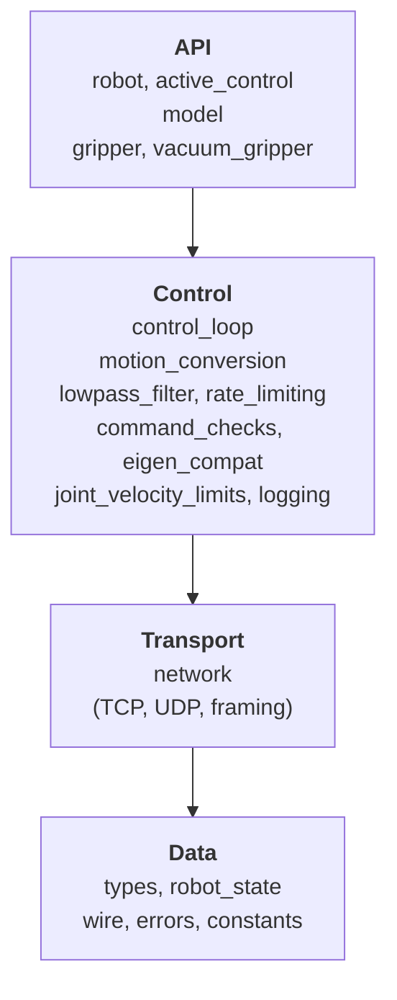
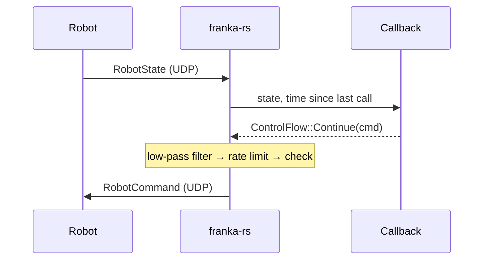

# Architecture Overview

`franka-rs` is layered; dependencies mostly run downward (a few cross: `types` uses `command_checks`, `robot_state` uses `model::RigidBodyInertia`, and `control_loop` and `motion_conversion` use each other).


```mermaid
flowchart TB
    API["<b>API</b><br/>robot, active_control<br/>model<br/>gripper, vacuum_gripper"]
    CTRL["<b>Control</b><br/>control_loop<br/>motion_conversion<br/>lowpass_filter, rate_limiting<br/>command_checks, eigen_compat<br/>joint_velocity_limits, logging"]
    NET["<b>Transport</b><br/>network<br/>(TCP, UDP, framing)"]
    DATA["<b>Data</b><br/>types, robot_state<br/>wire, errors, constants"]
    API --> CTRL --> NET --> DATA
```

## Module Map

| Module | Role | Key items |
|--------|------|-----------|
| `robot` | Main interface and its configuration | `Robot`, `MotionConfig`, `CollisionConfig`, `LoadConfig` |
| `active_control` | Non-callback control sessions | `ActiveTorqueControl`, `ActiveMotionControl<M>` |
| `model` | Kinematics and dynamics from the URDF | `Model`, `RobotModel`, `RigidBodyInertia` |
| `gripper`, `vacuum_gripper` | Gripper interfaces | `Gripper`, `VacuumGripper` |
| `control_types` | Motion command trait and callback result | `MotionType` (sealed), `MotionResult<T>` |
| `control_loop` | 1 kHz loops; motion start, finish, cancel | `run_motion_loop`, `run_torque_loop` |
| `motion_conversion` (private) | Per-type filtering, limiting and checks | `ConvertMotion` |
| `lowpass_filter`, `rate_limiting` | libfranka's filter and limiters (check their inputs) | `lowpass_filter`, `limit_rate_*` |
| `command_checks` (private) | Finite, homogeneous-matrix and elbow checks | `check_finite`, `check_matrix`, `check_elbow` |
| `eigen_compat` (private) | Eigen-identical rotation arithmetic | `affine_rotation`, `quaternion_slerp` |
| `joint_velocity_limits` | Position-dependent joint velocity limits | `JointVelocityLimits` |
| `logging` | State/command log of a successful motion | `Logger`, `LogEntry` |
| `network` | TCP and UDP sockets, framing, handshakes | `Network`, `connect_robot` |
| `types`, `robot_state` | Command, mode and state types | `JointPositions`, `CartesianPose`, `RobotState` |
| `wire` (crate-private) | Packed structs of the FCI protocol | `RawRobotState`, `RobotCommand` |
| `errors` | Errors and robot error flags | `FrankaError`, `RobotErrors`, `FrankaResult` |

## One Control Cycle


```mermaid
sequenceDiagram
    participant R as Robot
    participant F as franka-rs
    participant U as Callback
    R->>F: RobotState (UDP)
    F->>U: state, time since last call
    U-->>F: ControlFlow::Continue(cmd)
    Note over F: low-pass filter → rate limit → check
    F->>R: RobotCommand (UDP)
```

## Ownership

`Robot` owns the connection; control methods take `&mut self`, so the borrow checker prevents
concurrent use (libfranka uses runtime mutexes):

```rust
let mut robot = Robot::connect("172.16.0.2")?;
robot.control_torques(&MotionConfig::default(), |_state, _period| {
    ControlFlow::Break(Torques::new([0.0; 7]))
})?;

let mut ctrl = robot.start_torque_control()?; // borrows robot until dropped
ctrl.finish(&Torques::new([0.0; 7]))?;
drop(ctrl); // robot usable again
```

A session dropped without finishing cancels the motion (StopMove).
