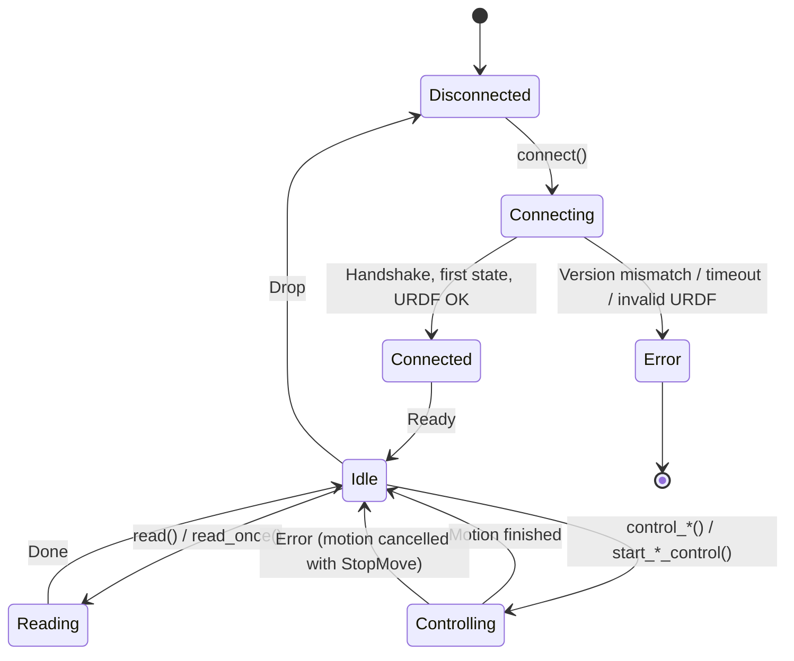

# Connecting to the Robot

## Basic Connection

```rust
use franka_rs::robot::Robot;

let mut robot = Robot::connect("172.16.0.2")?;
```

This performs, in order:
1. TCP connection to port 1337 (with keepalive and a 1 s read/write timeout)
2. UDP socket binding on an ephemeral port, for the state stream
3. Protocol version handshake (the Connect request carries the UDP port)
4. Waiting for the first robot state
5. Downloading the robot's URDF (GetRobotModel) and reading its joint velocity limits

## Realtime Configuration

```rust
use franka_rs::robot::Robot;
use franka_rs::types::RealtimeConfig;

let mut robot = Robot::connect_with_config("172.16.0.2", RealtimeConfig::Ignore)?;
```

`Robot::connect` uses `RealtimeConfig::Ignore`. The network settings are `NetworkConfig::default()`
and cannot be changed through `Robot`.

## Connection Lifecycle



## Error Handling

Connection can fail in several ways:

| Error | Cause | Recovery |
|-------|-------|----------|
| `FrankaError::Network` | Robot unreachable, timeout | Check network, retry |
| `FrankaError::IncompatibleVersion` | Protocol version mismatch | Update firmware or library |
| `FrankaError::Protocol` | Malformed response | Restart robot controller |
| `FrankaError::Command` | The robot rejected GetRobotModel | Check the robot's state in Desk |
| `FrankaError::Model` | The robot's URDF lacks valid joint velocity limits | Check the robot's URDF |

```rust
use franka_rs::errors::FrankaError;
use franka_rs::robot::Robot;

match Robot::connect("172.16.0.2") {
    Ok(robot) => { /* proceed */ }
    Err(FrankaError::Network { message, .. }) => {
        eprintln!("Network error: {message}");
        eprintln!("Is the robot powered on and FCI activated?");
    }
    Err(FrankaError::IncompatibleVersion { server_version, library_version }) => {
        eprintln!("Version mismatch: server={server_version}, library={library_version}");
    }
    Err(e) => eprintln!("Unexpected: {e}"),
}
```

## RealtimeConfig

| Variant | Behavior in franka-rs |
|---------|----------|
| `Enforce` | Stored and returned by `Robot::realtime_config()`; not acted on |
| `Ignore` | Stored and returned by `Robot::realtime_config()`; not acted on |

franka-rs does not set thread priorities or check for a real-time kernel. libfranka, with its
default `kEnforce`, sets the highest scheduler priority and refuses to connect without a real-time
kernel. Run franka-rs control loops on a real-time kernel and set the thread priority yourself if
you need real-time scheduling.
