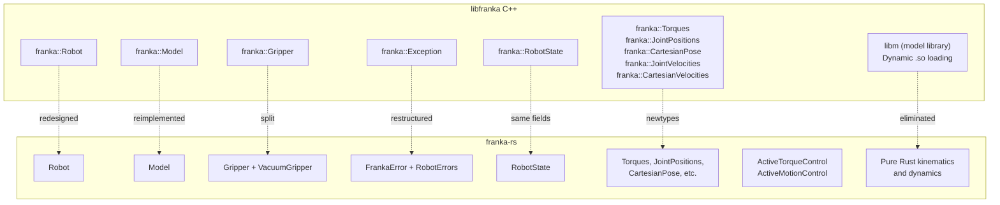

# Comparison with libfranka C++

## Design Philosophy

`franka-rs` is not a 1:1 port of `libfranka`. It restructures the API to leverage Rust's type system, ownership model, and error handling patterns.



## Key Differences

### 1. No C/C++ Dependencies

| Aspect | libfranka | franka-rs |
|--------|-----------|-----------|
| Model library | Dynamic `.so` loaded at runtime | Pure Rust implementation |
| Build system | CMake + C++ compiler | Cargo only |
| Cross-compilation | Complex (need target `.so`) | Standard Rust cross-compile |
| Dependencies | Eigen, Poco, libfranka.so | nalgebra, thiserror, bitflags, socket2 |

### 2. Compile-Time Safety vs. Runtime Checks

**C++ (runtime mutex):**
```cpp
franka::Robot robot("172.16.0.2");
// Nothing prevents concurrent access at compile time
// Runtime mutexes protect shared state
robot.control([](const franka::RobotState& state, 
                 franka::Duration period) -> franka::Torques {
    return {{0.0, 0.0, 0.0, 0.0, 0.0, 0.0, 0.0}};
});
```

**Rust (borrow checker):**
```rust
let mut robot = Robot::connect("172.16.0.2")?;
// &mut self prevents concurrent access at compile time
robot.control_torques(&config, |state, duration| {
    ControlFlow::Continue(Torques::new([0.0; 7]))
})?;
```

### 3. Error Handling

**C++ (exceptions):**
```cpp
try {
    robot.control(callback);
} catch (const franka::ControlException& e) {
    std::cerr << e.what() << std::endl;
    // Log is in e.log
}
```

**Rust (Result + pattern matching):**
```rust
match robot.control_torques(&config, callback) {
    Ok(log) => { /* inspect log entries */ }
    Err(FrankaError::Control { message, log }) => {
        eprintln!("{message}");
        // Structured access to error state
    }
    Err(e) => eprintln!("{e}"),
}
```

### 4. Motion Completion Signaling

**C++ (bool `finished` field):**
```cpp
// Must set finished = true AND return correct values
return franka::Torques(tau, /* finished = */ true);
```

**Rust (ControlFlow enum):**
```rust
// Type-safe: Break means stop, Continue means keep going
ControlFlow::Break(Torques::new(tau))    // finished
ControlFlow::Continue(Torques::new(tau)) // keep going
```

### 5. Active Control (Non-Callback)

libfranka only supports callback-based control. `franka-rs` adds `ActiveTorqueControl` and `ActiveMotionControl` for imperative-style control with RAII cleanup:

```rust
let mut ctrl = robot.start_torque_control()?;
loop {
    let state = ctrl.read_state()?;
    ctrl.write_torques(&Torques::new(compute(state)))?;
    if done() { break; }
}
// ctrl dropped — automatically finishes motion
```

### 6. Model API

**C++ (requires `.so` file):**
```cpp
franka::Model model = robot.loadModel();
// Loads libfrankamodel.so at runtime
// Fails if library not found
```

**Rust (pure computation):**
```rust
let model = Model::new();
// No file loading — kinematics/dynamics computed in Rust
// Works everywhere, no runtime dependencies
```

## API Mapping

| libfranka C++ | franka-rs | Notes |
|---------------|-----------|-------|
| `franka::Robot` | `Robot` | Same concept |
| `franka::Robot::control()` | `Robot::control_torques()` | Split by type |
| `franka::Robot::read()` | `Robot::read()` | Uses `bool` return instead of callback |
| `franka::Robot::readOnce()` | `Robot::read_once()` | Same |
| `franka::Model` | `Model` | Pure Rust, no `.so` |
| `franka::Gripper` | `Gripper` | Same |
| — | `VacuumGripper` | Separated from gripper |
| `franka::RobotState` | `RobotState` | Same fields, `f64` instead of `std::array` |
| `franka::Torques` | `Torques` | Newtype with `Deref` |
| `franka::JointPositions` | `JointPositions` | Newtype with `Deref` |
| `franka::CartesianPose` | `CartesianPose` | Uses `Isometry3` internally |
| `franka::Duration` | `std::time::Duration` | Standard library type |
| `franka::Exception` | `FrankaError` | Enum with variants |
| `franka::Errors` | `RobotErrors` | `bitflags` crate |
| — | `ActiveTorqueControl` | New: non-callback control |
| — | `ActiveMotionControl<M>` | New: non-callback control |
| `franka::MotionFinished` | `ControlFlow::Break` | Standard library enum |

## What's Not (Yet) Implemented

| Feature | Status |
|---------|--------|
| Real-time thread scheduling | API present, enforcement not yet implemented |
| Automatic controller switching | Planned |
| FCI firmware auto-detection | Planned |
