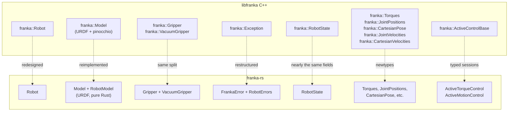

# Comparison with libfranka C++

## Design Philosophy

`franka-rs` is not a 1:1 port of libfranka 0.21.3. It restructures the API around Rust's type
system, ownership model and error handling, while sending the robot the same bytes. This has been
validated offline (bit-identical, every mode and interface, filtering and rate limiting on and off,
error paths) and on the robot (identical except the message ID for the torque and four motion
modes, both interfaces, filtering and rate limiting off); combined motion + torque offline only.
See `validation/torque_validation_plan.md`.


```mermaid
flowchart TD
    subgraph "libfranka C++"
        CPP_R["franka::Robot"]
        CPP_M["franka::Model<br/>(URDF + pinocchio)"]
        CPP_G["franka::Gripper<br/>franka::VacuumGripper"]
        CPP_EX["franka::Exception"]
        CPP_RS["franka::RobotState"]
        CPP_CMD["franka::Torques<br/>franka::JointPositions<br/>franka::CartesianPose<br/>franka::JointVelocities<br/>franka::CartesianVelocities"]
        CPP_AC["franka::ActiveControlBase"]
    end

    subgraph "franka-rs"
        RS_R["Robot"]
        RS_M["Model + RobotModel<br/>(URDF, pure Rust)"]
        RS_G["Gripper + VacuumGripper"]
        RS_ERR["FrankaError + RobotErrors"]
        RS_RS["RobotState"]
        RS_CMD["Torques, JointPositions,<br/>CartesianPose, etc."]
        RS_AC["ActiveTorqueControl<br/>ActiveMotionControl"]
    end

    CPP_R -.->|"redesigned"| RS_R
    CPP_M -.->|"reimplemented"| RS_M
    CPP_G -.->|"same split"| RS_G
    CPP_EX -.->|"restructured"| RS_ERR
    CPP_RS -.->|"nearly the same fields"| RS_RS
    CPP_CMD -.->|"newtypes"| RS_CMD
    CPP_AC -.->|"typed sessions"| RS_AC
```

## Key Differences

### 1. Dependencies

| Aspect | libfranka | franka-rs |
|--------|-----------|-----------|
| Model | Built from the robot's URDF with pinocchio | Built from the robot's URDF in Rust |
| Build system | CMake + C++ compiler | Cargo only |
| Dependencies | Eigen, Poco, pinocchio, TinyXML2, console_bridge | nalgebra, thiserror, bitflags, socket2, libc, roxmltree |

### 2. Compile-Time Safety vs. Runtime Checks

**C++ (runtime mutex):**
```cpp
franka::Robot robot("172.16.0.2");
// Nothing prevents concurrent access at compile time
// Runtime mutexes protect shared state
robot.control([](const franka::RobotState& state,
                 franka::Duration period) -> franka::Torques {
    return {{0.0, 0.0, 0.0, 0.0, 0.0, 0.0, 0.0}};
});
```

**Rust (borrow checker):**
```rust
let mut robot = Robot::connect("172.16.0.2")?;
// &mut self prevents concurrent access at compile time
robot.control_torques(&MotionConfig::default(), |_state, _period| {
    ControlFlow::Continue(Torques::new([0.0; 7]))
})?;
```

### 3. Error Handling

**C++ (exceptions):**
```cpp
try {
    robot.control(callback);
} catch (const franka::ControlException& e) {
    std::cerr << e.what() << std::endl;
    // Log is in e.log
}
```

**Rust (Result + pattern matching):**
```rust
match robot.control_torques(&config, callback) {
    Ok(log) => { /* Vec<LogEntry> of the motion */ }
    Err(FrankaError::Control { message, .. }) => {
        eprintln!("{message}");
    }
    Err(e) => eprintln!("{e}"),
}
```

`FrankaError::Control` has a `log` field, but franka-rs does not fill it (it is always empty);
libfranka attaches its recent state/command log to a `ControlException`.

### 4. Motion Completion Signaling

**C++ (`motion_finished` field):**
```cpp
franka::Torques torques(tau);
torques.motion_finished = true;
return torques;
```

**Rust (ControlFlow enum):**
```rust
ControlFlow::Break(Torques::new(tau))    // finished
ControlFlow::Continue(Torques::new(tau)) // keep going
```

### 5. Active Control (Non-Callback)

Both libraries offer a non-callback interface (libfranka: `startTorqueControl`,
`startJointPositionControl`, … returning `ActiveControlBase` with `readOnce`/`writeOnce`).
franka-rs types the session by its motion type (`ActiveMotionControl<M>`) and ties it to the
robot's borrow:

```rust
let mut ctrl = robot.start_torque_control()?;
let mut state = ctrl.read_state()?;
loop {
    let tau = Torques::new(compute(&state));
    if done() {
        ctrl.finish(&tau)?;
        break;
    }
    state = ctrl.write_torques(&tau)?;
}
// A session dropped without finishing is cancelled (StopMove), as libfranka's destructor does.
```

### 6. Model API

**C++:**
```cpp
franka::Model model = robot.loadModel();  // URDF from the robot, pinocchio model
```

**Rust:**
```rust
use franka_rs::model::RobotModel;

let model = robot.load_model()?;  // URDF from the robot, Rust model
// or Model::from_urdf(&urdf_text)?
```

## API Mapping

| libfranka C++ | franka-rs | Notes |
|---------------|-----------|-------|
| `franka::Robot` | `Robot` | Same concept |
| `franka::Robot::control()` | `Robot::control_torques()`, `control_joint_positions()`, … | Split by type; take a `MotionConfig` |
| `franka::Robot::read()` | `Robot::read()` | Callback returns `bool` (continue) as in libfranka |
| `franka::Robot::readOnce()` | `Robot::read_once()` | Same |
| `franka::Robot::startTorqueControl()` … | `Robot::start_torque_control()`, `start_motion_control::<M>()` | Typed sessions |
| `franka::Model` | `Model` + `RobotModel` trait | From the URDF |
| `franka::Gripper` | `Gripper` | See the known header issue in [Gripper Interface](../gripper.md) |
| `franka::VacuumGripper` | `VacuumGripper` | Same API; see the known header issue in [Gripper Interface](../gripper.md) |
| `franka::RobotState` | `RobotState` | Same fields except `m_total`, `I_total`, `F_x_Ctotal` (use `RobotState::total_load()`); adds `motion_generator_mode` |
| `franka::Torques` | `Torques` | Newtype with `Deref` |
| `franka::JointPositions` | `JointPositions` | Newtype with `Deref` |
| `franka::CartesianPose` | `CartesianPose` | Same column-major matrix; `Option` elbow; `Isometry3` conversions |
| `franka::Duration` | `std::time::Duration` | Standard library type |
| `franka::Exception` and subclasses | `FrankaError` | Enum with variants; `std::invalid_argument` → `InvalidArgument` |
| `franka::Errors` | `RobotErrors` | `bitflags` crate |
| `motion_finished = true` | `ControlFlow::Break` | Standard library enum |

## Known Behavioral Differences

These were found by comparing the sources; none affects the validated control sequences.

| Area | libfranka | franka-rs |
|------|-----------|-----------|
| Real-time scheduling | `kEnforce` (default) sets the highest thread priority and refuses to connect without a real-time kernel | `RealtimeConfig` is stored only; nothing is set or checked |
| TCP replies | Waits for a reply without a time limit | Times out after 1 s (`NetworkConfig::tcp_timeout`) with `FrankaError::Network` |
| UDP state larger than expected | Truncated and accepted | Rejected with `FrankaError::Protocol` |
| UDP receive error | Shuts the TCP socket down before raising the error | Leaves TCP open (a cancelling StopMove can still be sent) |
| Unexpected "motion started" reply while a motion runs | Protocol error | Accepted |
| `load_model` on a mobile robot | Refused before any request | Sends GetRobotModel, then fails to build the model |
| `ControlException` log | Recent states and commands | `FrankaError::Control::log` is empty |
| Error type for misuse (finished session, wrong controller, …) | `ControlException` / `std::invalid_argument` | `FrankaError::InvalidOperation` ("start multiple motions" is `FrankaError::Control` in both) |
