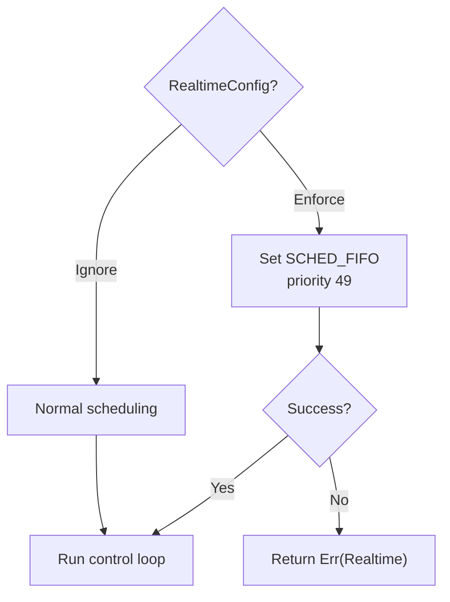
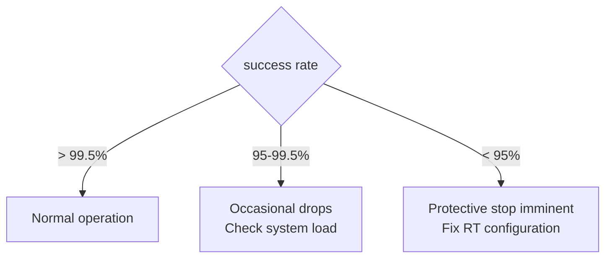
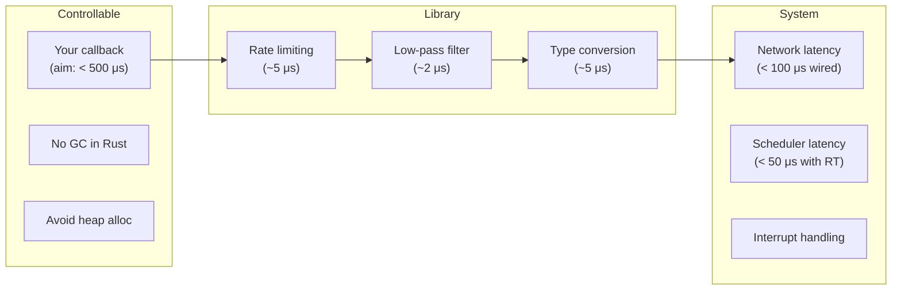

# Real-Time Considerations

## The 1 kHz Constraint

The Franka robot operates a control loop at 1 kHz (1 ms cycle time). Every millisecond:

1. The robot sends its current state over UDP
2. Your application must compute and return a command
3. The robot applies the command to its actuators

Missing a deadline causes a communication violation, and multiple violations trigger a protective stop.

```mermaid
gantt
    title 1 kHz Control Cycle (1 ms budget)
    dateFormat X
    axisFormat %L

    section Timeline
    UDP receive     :a, 0, 100
    State conversion :b, 100, 150
    User callback    :c, 150, 600
    Rate limiting    :d, 600, 700
    Low-pass filter  :e, 700, 800
    UDP send         :f, 800, 900
    Margin           :g, 900, 1000
```



## What You Control

Your callback runs inside the control loop. Its execution time is part of the 1 ms budget:

```rust
robot.control_torques(&config, |state, duration| {
    // This code must complete in < ~500 μs
    let gravity = model.gravity_from_state(state);
    ControlFlow::Continue(Torques::new(gravity))
})?;
```

### What to Avoid in the Callback

| Operation | Risk | Alternative |
|-----------|------|-------------|
| `println!` / logging | Blocks on I/O | Write to a buffer, log after control ends |
| Heap allocation (`Vec::new`) | Allocator contention, latency spikes | Pre-allocate before the loop |
| File I/O | Blocks on disk | Not in the loop |
| Network calls | Unbounded latency | Pre-fetch data |
| Mutex locking | Priority inversion | Lock-free channels or atomic vars |
| Complex math (matrix inverse) | CPU time | Use precomputed values or simplified models |

### What's Safe in the Callback

| Operation | Typical Time |
|-----------|-------------|
| Array indexing, arithmetic | < 1 μs |
| `model.gravity()` | ~10-50 μs |
| `model.mass()` | ~20-100 μs |
| `model.zero_jacobian()` | ~10-30 μs |
| Rate limiting (done for you) | ~5 μs |
| Low-pass filter (done for you) | ~2 μs |

## `RealtimeConfig`

Controls whether `franka-rs` attempts to set real-time thread scheduling:

```rust
// Production: require SCHED_FIFO
let robot = Robot::connect("172.16.0.2")?; // default: Enforce

// Development: normal scheduling
let robot = Robot::connect_with_config(
    "172.16.0.2",
    RealtimeConfig::Ignore,
)?;
```



## Linux Real-Time Setup

For production deployments, use a PREEMPT_RT patched kernel:

### 1. Install PREEMPT_RT Kernel

```bash
sudo apt install linux-image-rt-amd64
```

### 2. Configure User Permissions

Add to `/etc/security/limits.conf`:

```
@realtime   -   rtprio   99
@realtime   -   memlock  unlimited
```

Add your user to the `realtime` group:

```bash
sudo groupadd -f realtime
sudo usermod -aG realtime $USER
```

### 3. CPU Isolation (Optional)

Isolate a CPU core for the control thread in `/etc/default/grub`:

```
GRUB_CMDLINE_LINUX="isolcpus=3 nohz_full=3 rcu_nocbs=3"
```

## Communication Monitoring

The `RobotState` includes a metric for monitoring communication health:

```rust
let state = robot.read_once()?;
println!("Success rate: {:.1}%", state.control_command_success_rate * 100.0);
// Should be > 99.5% for stable operation
```



## Latency Sources



## Tips

1. **Measure your callback time** — use `std::time::Instant` sparingly to profile critical paths
2. **Pre-compute everything possible** — build lookup tables, pre-allocate arrays before the loop
3. **Use wired Ethernet** — WiFi adds 1-5 ms of jitter, incompatible with 1 kHz control
4. **Disable CPU frequency scaling** — set governor to `performance` mode
5. **Monitor `control_command_success_rate`** — it's your canary for real-time violations
