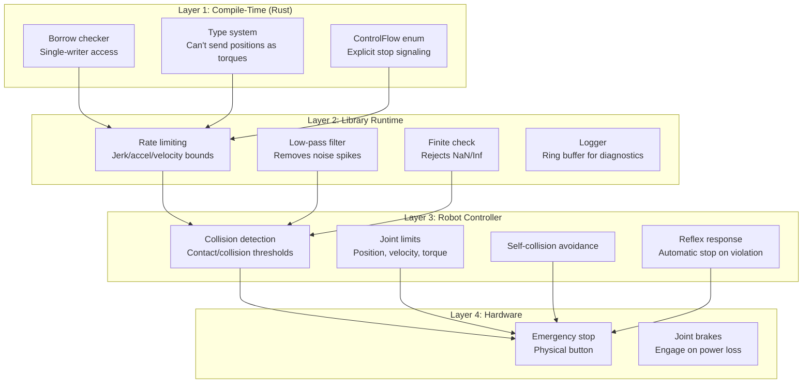
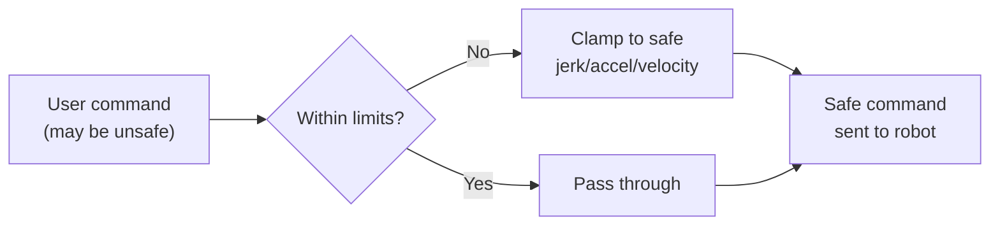
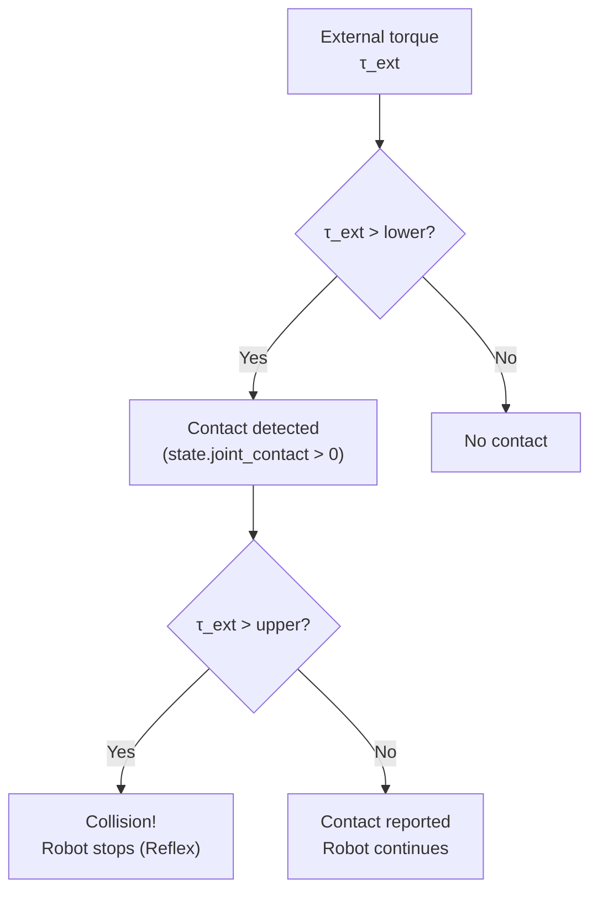
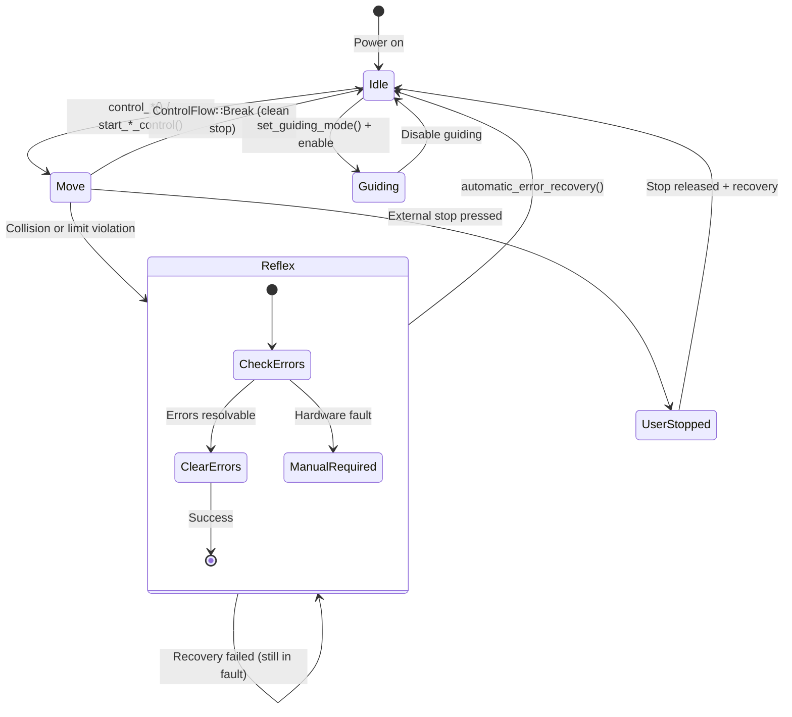

# Safety & Error Recovery

## Safety Architecture

`franka-rs` implements multiple layers of safety, from compile-time type checking to runtime hardware limits:



## Compile-Time Safety

### Single-Writer Access

The borrow checker prevents concurrent access to the robot:

```rust
let mut robot = Robot::connect("172.16.0.2")?;

// OK: sequential access
let state = robot.read_once()?;
robot.control_torques(&config, callback)?;

// Compile error: can't borrow robot while control is active
let mut ctrl = robot.start_torque_control()?;
// robot.read_once()?;  // ← would not compile
```

### Type-Safe Commands

You can't accidentally send the wrong command type:

```rust
// This callback must return JointPositions — Torques won't compile
robot.control_joint_positions(&config, |state, dt| {
    // ControlFlow::Continue(Torques::new([0.0; 7]))  // compile error!
    ControlFlow::Continue(JointPositions::new(state.q_d))
})?;
```

## Runtime Safety

### Rate Limiting

Applied automatically before every command is sent:



| What's Limited | Why |
|----------------|-----|
| Joint velocity | Prevent mechanical damage |
| Joint acceleration | Prevent excessive forces |
| Joint jerk | Prevent vibration and instability |
| Torque rate | Prevent actuator damage |
| Cartesian velocity | Prevent fast end-effector motion |
| Cartesian acceleration | Prevent dynamic instability |

### Finite Value Check

Every command is validated before transmission:

```rust
// This would return Err(FrankaError::Realtime)
let bad_torques = Torques::new([f64::NAN, 0.0, 0.0, 0.0, 0.0, 0.0, 0.0]);
```

### RAII Cleanup

Active control handles automatically stop motion when dropped:

```rust
{
    let mut ctrl = robot.start_torque_control()?;
    ctrl.write_torques(&torques)?;
    // If we panic or return early, ctrl's Drop impl sends stop
}
```

## Collision Behavior

Configure contact and collision detection thresholds:

```rust
use franka_rs::robot::config::CollisionConfig;

let collision = CollisionConfig::symmetric(
    [20.0; 7],  // lower: contact detection (Nm)
    [40.0; 7],  // upper: collision detection (Nm)
    [20.0; 6],  // lower: Cartesian contact (N/Nm)
    [40.0; 6],  // upper: Cartesian collision (N/Nm)
);
robot.set_collision_behavior(&collision)?;
```



Separate thresholds exist for:
- **Acceleration phase** — higher thresholds during fast motion
- **Nominal phase** — lower thresholds during steady motion

## Error Recovery

### Automatic Recovery

After a collision or safety violation:

```rust
match robot.automatic_error_recovery() {
    Ok(()) => {
        // Robot is back in Idle mode
        println!("Recovery successful");
    }
    Err(e) => {
        // Manual intervention needed
        eprintln!("Auto-recovery failed: {e}");
    }
}
```

### Error Recovery Flow



### Post-Mortem Diagnostics

When a control error occurs, the log entries from the ring buffer are available:

```rust
match robot.control_torques(&config, callback) {
    Err(FrankaError::Control { message, log }) => {
        eprintln!("Control error: {message}");

        // Inspect the last few states before the error
        for entry in log.iter().rev().take(5) {
            eprintln!("  q = {:?}", entry.state.q);
            eprintln!("  tau_ext = {:?}", entry.state.tau_ext_hat_filtered);
            eprintln!("  errors = {:?}", entry.state.current_errors);
        }
    }
    _ => {}
}
```

## Safety Checklist

Before running any control program:

- [ ] Robot is in FCI mode (check Desk UI)
- [ ] Emergency stop button is accessible
- [ ] Workspace is clear of obstacles
- [ ] Collision thresholds are set appropriately
- [ ] Load parameters are configured (`set_load`)
- [ ] Controller starts with gravity compensation
- [ ] Control gains start low and are tuned incrementally
- [ ] `control_command_success_rate` is monitored
- [ ] Code handles `FrankaError::Control` gracefully

## Common Error Scenarios

| Symptom | Likely Cause | Fix |
|---------|-------------|-----|
| Immediate reflex on control start | Gravity not compensated | Add `model.gravity()` to torques |
| Reflex after a few seconds | Gains too high → instability | Reduce stiffness/damping |
| Communication violation | Callback too slow | Profile and optimize callback |
| Joint position limit | Trajectory goes out of range | Check workspace bounds |
| Self-collision | Path passes through robot body | Add collision-aware planning |
| Torque discontinuity | Sudden change in commanded torques | Ensure smooth torque profiles |
