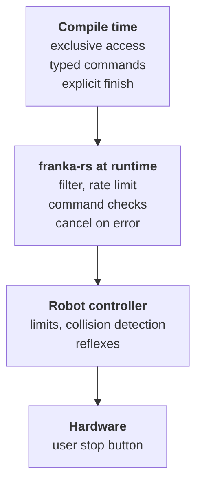

# Safety & Error Recovery

franka-rs adds compile-time and runtime checks in front of the robot's own safety functions.


```mermaid
flowchart TB
    A["<b>Compile time</b><br/>exclusive access<br/>typed commands<br/>explicit finish"]
    B["<b>franka-rs at runtime</b><br/>filter, rate limit<br/>command checks<br/>cancel on error"]
    C["<b>Robot controller</b><br/>limits, collision detection<br/>reflexes"]
    D["<b>Hardware</b><br/>user stop button"]
    A --> B --> C --> D
```

## Compile Time

- **Exclusive access:** control methods and active sessions borrow the robot mutably, so nothing
  else can use it meanwhile.
- **Typed commands:** each control method fixes its command type (a joint-position callback cannot
  return torques), and `MotionType` is sealed to the four motion types.
- **Explicit finish:** `ControlFlow::Break` or `finish(…)`.

## Runtime

- **Filtering and rate limiting** (callback interface; defaults on): see
  [Motion Control](../motion-control.md#filtering-and-rate-limiting).
- **Command checks** (both interfaces, as libfranka): finite values, homogeneous pose, elbow sign
  ±1. A failed check returns `InvalidArgument` and nothing is sent; constructing an invalid
  command (`Torques::new([f64::NAN, …])`) is not an error until it is commanded.
- **Cancel on error:** in the callback interface, any error during the motion (invalid command,
  robot error, lost connection) or a panic in a callback sends StopMove before the error returns or
  the panic continues. An active session dropped without a successful `finish` is cancelled the
  same way (errors while cancelling are ignored).

## Collision Behavior

```rust
robot.set_collision_behavior(&CollisionConfig::symmetric(
    [20.0; 7], [40.0; 7],   // joint torque: contact (lower), collision (upper), Nm
    [20.0; 6], [40.0; 6],   // Cartesian force/torque: contact, collision, N and Nm
))?;
```

Above the lower thresholds the robot reports contact (`joint_contact`, `cartesian_contact`);
above the upper ones it stops the motion with a reflex. `symmetric` uses the same values for the
acceleration and nominal phases; the struct's fields set them separately.

## Error Recovery

```rust
if let Err(FrankaError::Control { message, .. }) = robot.control_torques(&config, callback) {
    eprintln!("{message}");                                   // includes last_motion_errors
    eprintln!("{:?}", robot.read_once()?.last_motion_errors);
    robot.automatic_error_recovery()?;                        // clear the reflex
}
```

`FrankaError::Control::log` is empty (libfranka attaches recent states); a successful motion
returns its log.

## Checklist

- FCI activated; user stop button in reach; workspace clear
- End effector and load configured correctly in Desk (or `set_load`)
- Collision thresholds set; gains start low
- `control_command_success_rate` monitored; errors from the control methods handled

## Common Problems

| Symptom | Cause | Fix |
|---------|-------|-----|
| `InvalidArgument` | NaN/Inf, invalid pose or elbow, invalid cutoff | Fix the command computation |
| `InvalidOperation` | Finished session; torques missing or given for the controller mode | Match the session's controller mode |
| Reflex "configured force thresholds reached" (observed here: gripper attached, Desk "None") | End effector configured wrongly | Configure it in Desk |
| Arm drifts under zero torque (observed here) | Inaccurate end-effector mass or center of mass in Desk | Calibrate the end-effector parameters |

General guidance, not verified with franka-rs: reflexes after a few seconds of torque control
often mean gains are too high; communication errors, a slow callback or missing real-time
scheduling; torque-discontinuity errors, sudden torque changes.
