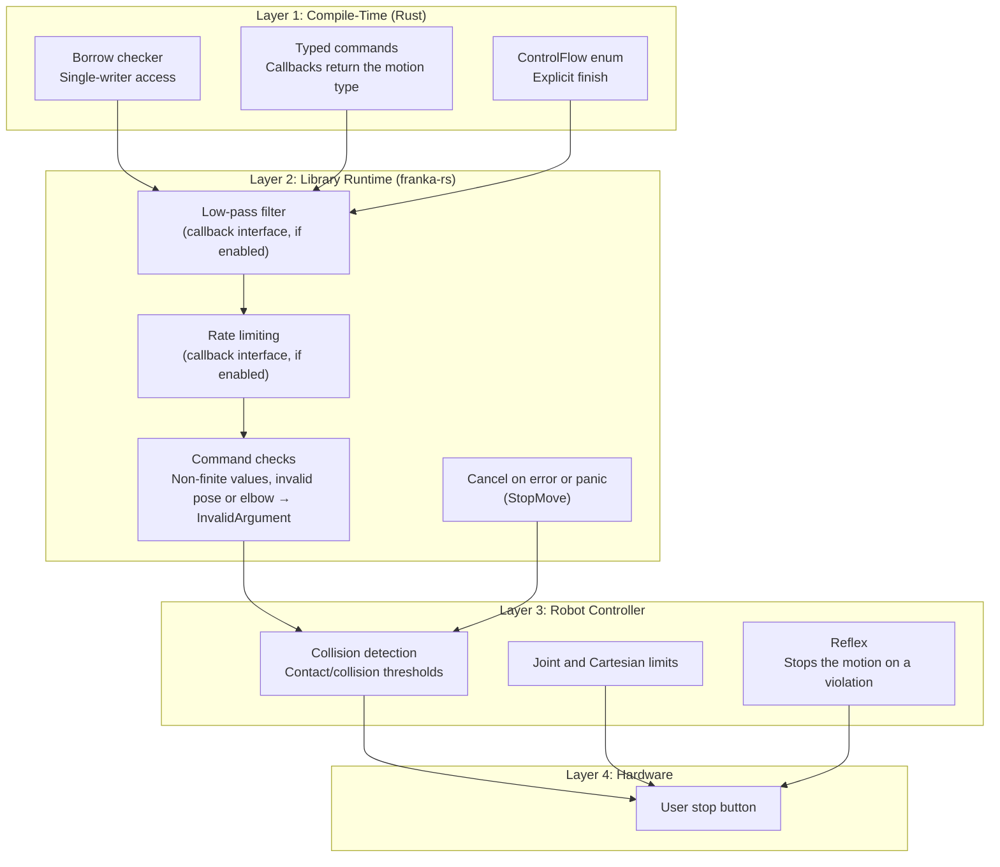
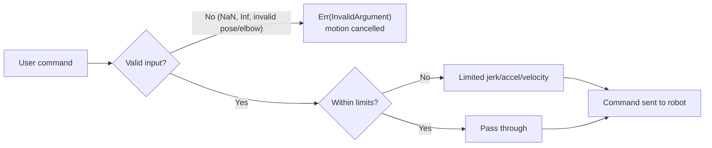
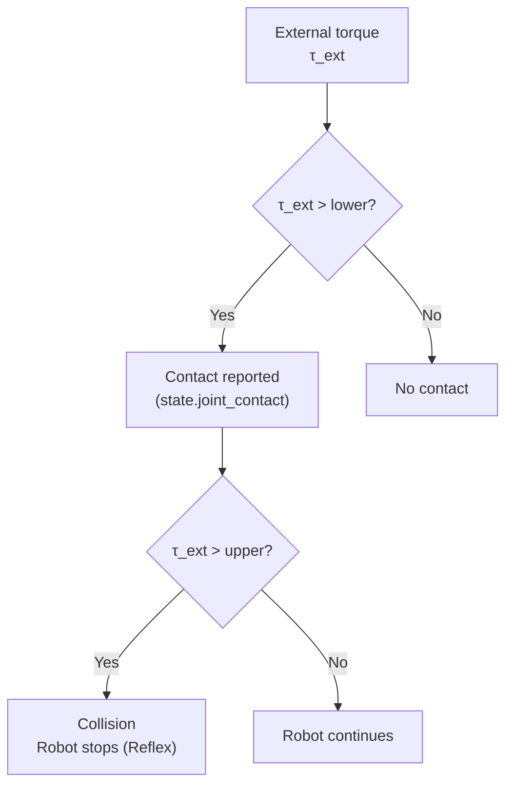

# Safety & Error Recovery

## Safety Architecture

`franka-rs` contributes compile-time and library-runtime checks; the robot's controller and
hardware provide the safety functions behind them:


```mermaid
flowchart TD
    subgraph "Layer 1: Compile-Time (Rust)"
        BORROW["Borrow checker<br/>Single-writer access"]
        TYPES["Typed commands<br/>Callbacks return the motion type"]
        CTRL["ControlFlow enum<br/>Explicit finish"]
    end

    subgraph "Layer 2: Library Runtime (franka-rs)"
        FILTER["Low-pass filter<br/>(callback interface, if enabled)"]
        RATE["Rate limiting<br/>(callback interface, if enabled)"]
        CHECKS["Command checks<br/>Non-finite values, invalid pose or elbow → InvalidArgument"]
        CANCEL["Cancel on error or panic<br/>(StopMove)"]
    end

    subgraph "Layer 3: Robot Controller"
        COLL["Collision detection<br/>Contact/collision thresholds"]
        LIMITS["Joint and Cartesian limits"]
        REFLEX["Reflex<br/>Stops the motion on a violation"]
    end

    subgraph "Layer 4: Hardware"
        ESTOP["User stop button"]
    end

    BORROW --> FILTER
    TYPES --> FILTER
    CTRL --> FILTER
    FILTER --> RATE
    RATE --> CHECKS
    CHECKS --> COLL
    CANCEL --> COLL
    COLL --> ESTOP
    LIMITS --> ESTOP
    REFLEX --> ESTOP
```

## Compile-Time Safety

### Single-Writer Access

The borrow checker prevents concurrent access to the robot:

```rust
let mut robot = Robot::connect("172.16.0.2")?;

// OK: sequential access
let state = robot.read_once()?;
robot.control_torques(&config, callback)?;

// Compile error: can't use robot while an active session borrows it
let mut ctrl = robot.start_torque_control()?;
// robot.read_once()?;  // ← would not compile
```

### Type-Safe Commands

Each control method fixes its command type, and `MotionType` is sealed (only `JointPositions`,
`JointVelocities`, `CartesianPose` and `CartesianVelocities` implement it):

```rust
// This callback must return JointPositions — Torques won't compile
robot.control_joint_positions(&config, |state, _period| {
    // ControlFlow::Continue(Torques::new([0.0; 7]))  // compile error!
    ControlFlow::Continue(JointPositions::new(state.q_d))
})?;
```

## Runtime Safety

### Filtering and Rate Limiting

In the callback interface, with the defaults of `MotionConfig` (rate limiting on, 100 Hz
cutoff), each command is low-pass filtered and then rate limited before it is sent, as libfranka
does. The active interface sends commands without filtering or limiting.


```mermaid
flowchart LR
    USER["User command"] --> CHECKIN{"Valid input?"}
    CHECKIN -->|"No (NaN, Inf, invalid pose/elbow)"| ERR["Err(InvalidArgument)<br/>motion cancelled"]
    CHECKIN -->|Yes| LIM{"Within limits?"}
    LIM -->|Yes| PASS["Pass through"]
    LIM -->|No| CLAMP["Limited jerk/accel/velocity"]
    CLAMP --> SAFE["Command sent to robot"]
    PASS --> SAFE
```

| What's Limited | Limit (reduced by 1e-3) |
|----------------|-----|
| Joint velocity | Position-dependent, from the robot's URDF |
| Joint acceleration / jerk | 10 rad/s², 5000 rad/s³ |
| Torque rate | 1000 Nm/s |
| Cartesian translation | 3.0 m/s, 9 m/s², 4500 m/s³ |
| Cartesian rotation | 2.5 rad/s, 17 rad/s², 8500 rad/s³ |
| Elbow | 1.5 rad/s, 10 rad/s², 5000 rad/s³ |

### Command Checks

Every command is checked before it is sent, in both interfaces, as libfranka does: all values
finite, a Cartesian pose a homogeneous transformation, an elbow's joint-4 sign exactly ±1. A
failed check returns `FrankaError::InvalidArgument` and nothing is sent:

```rust
// Commanding this returns Err(FrankaError::InvalidArgument { .. }); constructing it does not.
let bad_torques = Torques::new([f64::NAN, 0.0, 0.0, 0.0, 0.0, 0.0, 0.0]);
```

### Cancelling on Errors

In the callback interface, any error during the motion (a rejected command, a robot error, a lost
connection) or a panic in the callback cancels the motion with a StopMove request before the
error is returned or the panic continues. An active session that is dropped without a successful
`finish` (for example on `?` or a panic) is cancelled the same way; errors while cancelling are
ignored. After a successful `finish`, nothing more is sent.

## Collision Behavior

Configure contact and collision detection thresholds:

```rust
use franka_rs::robot::config::CollisionConfig;

let collision = CollisionConfig::symmetric(
    [20.0; 7],  // lower: joint contact thresholds (Nm)
    [40.0; 7],  // upper: joint collision thresholds (Nm)
    [20.0; 6],  // lower: Cartesian contact thresholds (N, Nm)
    [40.0; 6],  // upper: Cartesian collision thresholds (N, Nm)
);
robot.set_collision_behavior(&collision)?;
```


```mermaid
flowchart TD
    TAU["External torque<br/>τ_ext"] --> CMP1{"τ_ext > lower?"}
    CMP1 -->|Yes| CONTACT["Contact reported<br/>(state.joint_contact)"]
    CMP1 -->|No| NONE["No contact"]

    CONTACT --> CMP2{"τ_ext > upper?"}
    CMP2 -->|Yes| COLLISION["Collision<br/>Robot stops (Reflex)"]
    CMP2 -->|No| REPORT["Robot continues"]
```

`CollisionConfig::symmetric` uses the same thresholds for the acceleration and nominal phases;
the struct's fields set them separately.

## Error Recovery

After a reflex, clear the error before the next motion:

```rust
match robot.automatic_error_recovery() {
    Ok(()) => println!("Recovery successful"),
    Err(e) => eprintln!("Auto-recovery failed: {e}"),
}
```

`RobotState::robot_mode` is a `RobotMode`, with the variants `Other`, `Idle`, `Move`, `Guiding`, `Reflex`, `UserStopped` and `AutomaticErrorRecovery`.

### Diagnostics

A failed motion returns `FrankaError::Control { message, log }`. The message includes the robot's
`last_motion_errors` when the robot ended the motion; the `log` field is currently always empty
(libfranka attaches its recent states). A successful motion returns its `Vec<LogEntry>`. For
diagnostics after a failure, read the state:

```rust
if let Err(FrankaError::Control { message, .. }) = robot.control_torques(&config, callback) {
    eprintln!("Control error: {message}");
    let state = robot.read_once()?;
    eprintln!("errors = {:?}", state.last_motion_errors);
}
```

## Safety Checklist

Before running any control program:

- [ ] FCI is activated in Desk
- [ ] The user stop button is in reach
- [ ] Workspace is clear of obstacles
- [ ] Collision thresholds are set appropriately
- [ ] End effector and load are configured correctly in Desk (or with `set_load`)
- [ ] Control gains start low and are tuned incrementally
- [ ] `control_command_success_rate` is monitored
- [ ] Code handles errors from the control methods

## Common Error Scenarios

| Symptom | Cause | Fix |
|---------|-------------|-----|
| `InvalidArgument` | NaN/Inf in a command, invalid pose matrix or elbow, invalid cutoff | Fix the command computation |
| `InvalidOperation` | Using a finished session; torques missing or given for the session's controller | Follow the session's controller mode |
| Reflex "configured force thresholds reached" (observed in this project with a gripper attached and Desk set to "None") | End effector configured wrongly in Desk | Configure the end effector in Desk |
| Arm drifts under zero-torque control (observed in this project) | Inaccurate end-effector mass or center of mass in Desk | Calibrate the end-effector parameters |

General guidance (not verified with franka-rs): a reflex after a few seconds of torque control
often indicates gains that are too high; communication errors indicate a slow callback or missing
real-time scheduling; torque discontinuity errors indicate sudden torque changes (keep rate
limiting on).
