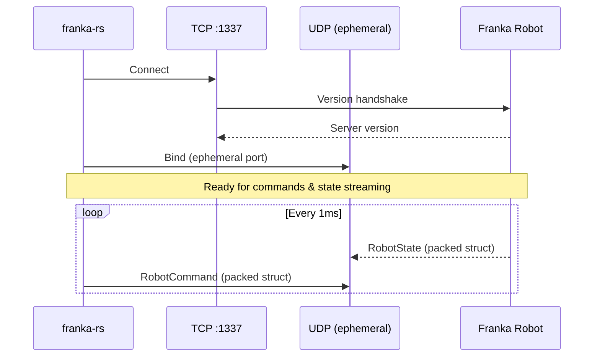

# Getting Started

## Prerequisites

- Rust 1.85+ (edition 2024)
- Network access to a Franka robot with FCI enabled
- Robot in FCI mode (external control activated via Desk)

## Installation

Add `franka-rs` to your `Cargo.toml`:

```toml
[dependencies]
franka-rs = { path = "../franka-rs" }
```

## Dependencies

`franka-rs` uses these core crates:

| Crate | Purpose |
|-------|---------|
| `nalgebra` | Linear algebra (matrices, quaternions, isometries) |
| `bitflags` | 41-flag robot error bitfield |
| `thiserror` | Ergonomic error types |
| `socket2` | Low-level socket configuration (keepalive, timeouts) |

## First Connection

```rust
use franka_rs::robot::Robot;

fn main() -> franka_rs::errors::FrankaResult<()> {
    // Connect to the robot (TCP handshake + UDP state socket)
    let mut robot = Robot::connect("172.16.0.2")?;

    // Read the current state once
    let state = robot.read_once()?;
    println!("Robot mode: {:?}", state.robot_mode);
    println!("Joint positions: {:?}", state.q);
    println!("Joint velocities: {:?}", state.dq);

    Ok(())
}
```

## Network Setup

The robot communicates over two channels:



Ensure your workstation:
1. Is on the same subnet as the robot (typically `172.16.0.0/24`)
2. Has low-latency connectivity (wired Ethernet, not WiFi)
3. Can reach ports 1337 (TCP commands), and receive UDP state packets

## Verifying the Connection

```rust
use franka_rs::robot::Robot;

fn main() -> franka_rs::errors::FrankaResult<()> {
    let mut robot = Robot::connect("172.16.0.2")?;
    println!("Connected! Server version: {}", robot.server_version());

    // Continuous state reading
    robot.read(|state| {
        println!("q[0] = {:.4} rad", state.q[0]);
        std::ops::ControlFlow::Continue(())
    })?;

    Ok(())
}
```
