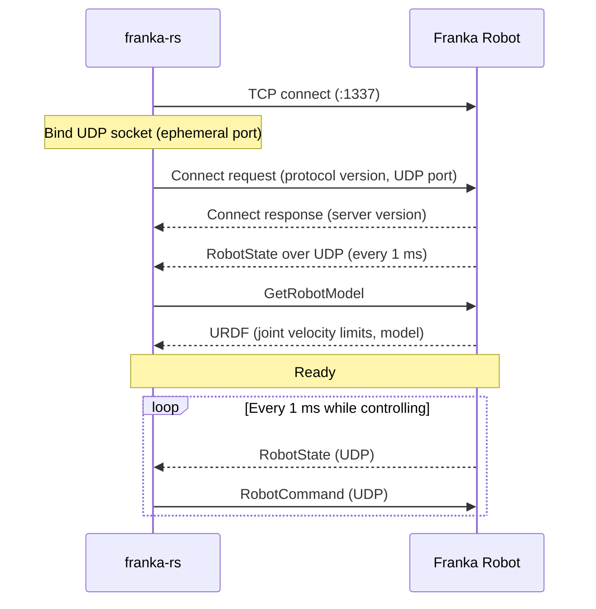

# Getting Started

## Prerequisites

- Rust 1.89+ (edition 2024; `nalgebra` 0.35 requires 1.89)
- A Linux or other Unix system (franka-rs uses Unix socket flags through `libc`)
- Network access to a Franka robot with FCI activated in Desk

## Installation

Add `franka-rs` to your `Cargo.toml`:

```toml
[dependencies]
franka-rs = { path = "../franka-rs" }
```

## Dependencies

`franka-rs` uses these crates:

| Crate | Purpose |
|-------|---------|
| `nalgebra` | Linear algebra (matrices, quaternions, isometries) |
| `bitflags` | 41-flag robot error bitfield |
| `thiserror` | Error types |
| `socket2` | Socket configuration (keepalive) and non-blocking receives with flags |
| `libc` | Socket flags (`MSG_PEEK`, `MSG_DONTWAIT`) and `poll` for connection checks |
| `roxmltree` | Parsing the robot's URDF (model and joint velocity limits) |

## First Connection

```rust
use franka_rs::robot::Robot;

fn main() -> franka_rs::errors::FrankaResult<()> {
    // TCP connection, UDP state socket, version handshake, first state, URDF download
    let robot = Robot::connect("172.16.0.2")?;

    // Read the newest state
    let state = robot.read_once()?;
    println!("Robot mode: {:?}", state.robot_mode);
    println!("Joint positions: {:?}", state.q);
    println!("Joint velocities: {:?}", state.dq);

    Ok(())
}
```

## Network Setup

The robot communicates over two channels:


```mermaid
sequenceDiagram
    participant App as franka-rs
    participant Robot as Franka Robot

    App->>Robot: TCP connect (:1337)
    Note over App: Bind UDP socket (ephemeral port)
    App->>Robot: Connect request (protocol version, UDP port)
    Robot-->>App: Connect response (server version)
    Robot-->>App: RobotState over UDP (every 1 ms)
    App->>Robot: GetRobotModel
    Robot-->>App: URDF (joint velocity limits, model)
    Note over App,Robot: Ready

    loop Every 1 ms while controlling
        Robot-->>App: RobotState (UDP)
        App->>Robot: RobotCommand (UDP)
    end
```

When only reading state, no commands are sent.

Ensure your workstation:
1. Is on the same subnet as the robot (typically `172.16.0.0/24`)
2. Has low-latency connectivity (wired Ethernet, not WiFi)
3. Can reach TCP port 1337 and receive UDP state packets from the robot

## Verifying the Connection

```rust
use franka_rs::robot::Robot;

fn main() -> franka_rs::errors::FrankaResult<()> {
    let robot = Robot::connect("172.16.0.2")?;
    println!("Connected! Server version: {}", robot.server_version());

    // Print 100 states; the callback returns false to stop.
    let mut count = 0;
    robot.read(|state| {
        println!("q[0] = {:.4} rad", state.q[0]);
        count += 1;
        count < 100
    })?;

    Ok(())
}
```

The example `examples/echo_robot_state.rs` reads 101 states and prints each full state (`cargo run --example echo_robot_state -- <robot-ip>`).
