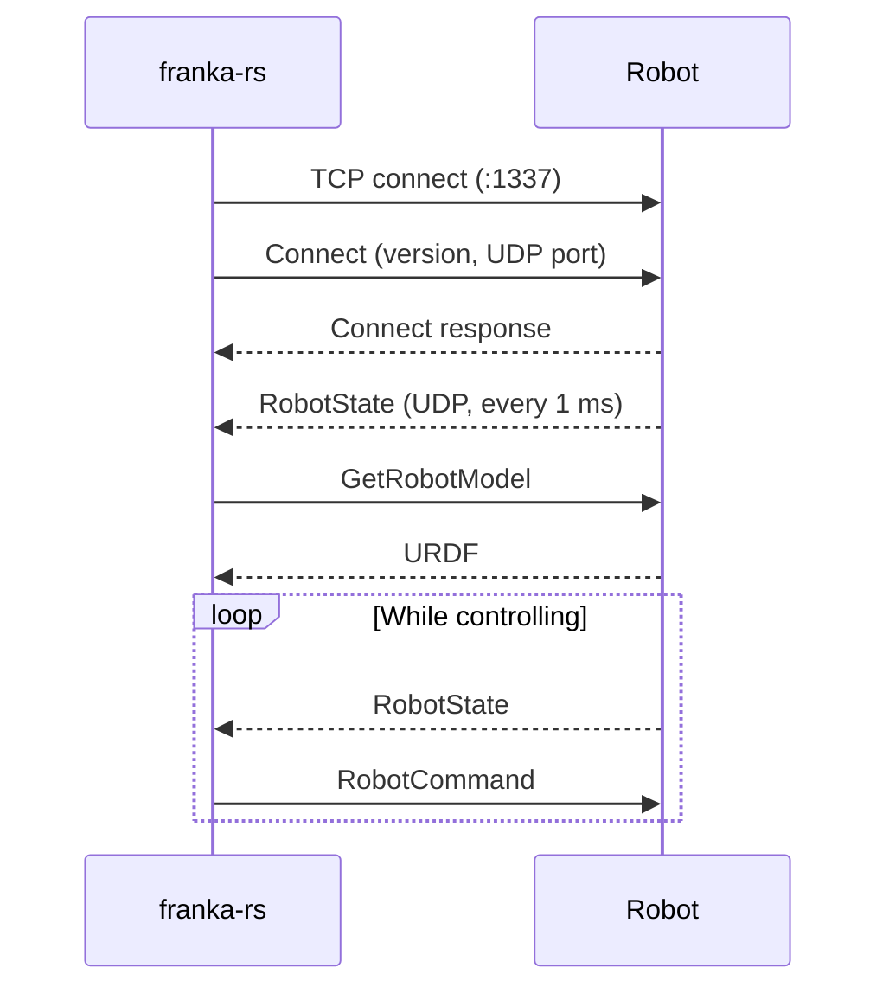

# Getting Started

## Prerequisites

- Rust 1.89+ (edition 2024; `nalgebra` 0.35 requires 1.89)
- Linux or another Unix (socket flags through `libc`)
- A Franka Research 3 with FCI activated in Desk, on a wired network

```toml
[dependencies]
franka-rs = { path = "../franka-rs" }
```

| Dependency | Purpose |
|------------|---------|
| `nalgebra` | Linear algebra |
| `bitflags` | Robot error flags |
| `thiserror` | Error types |
| `socket2`, `libc` | Keepalive, non-blocking receives (`MSG_DONTWAIT`, `MSG_PEEK`), `poll` |
| `roxmltree` | URDF parsing |

## First Connection

```rust
use franka_rs::robot::Robot;

fn main() -> franka_rs::errors::FrankaResult<()> {
    let robot = Robot::connect("172.16.0.2")?;
    println!("server version {}", robot.server_version());

    let mut count = 0;
    robot.read(|state| {
        println!("q = {:?}, mode = {:?}", state.q, state.robot_mode);
        count += 1;
        count < 100 // stop after 100 states
    })?;
    Ok(())
}
```

`examples/echo_robot_state.rs` prints 101 full states:
`cargo run --example echo_robot_state -- <robot-ip>`.

## Network


```mermaid
sequenceDiagram
    participant A as franka-rs
    participant R as Robot
    A->>R: TCP connect (:1337)
    A->>R: Connect (version, UDP port)
    R-->>A: Connect response
    R-->>A: RobotState (UDP, every 1 ms)
    A->>R: GetRobotModel
    R-->>A: URDF
    loop While controlling
        R-->>A: RobotState
        A->>R: RobotCommand
    end
```

The workstation must reach TCP port 1337 and receive UDP from the robot (typically on
`172.16.0.0/24`), over wired Ethernet. When only reading state, no commands are sent.
