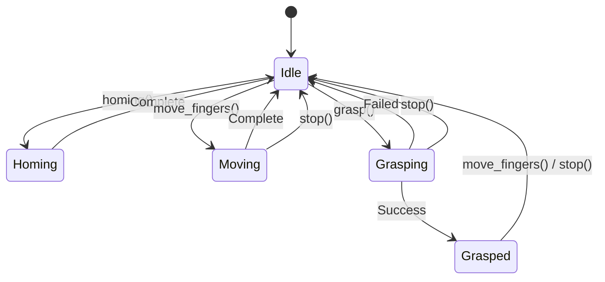
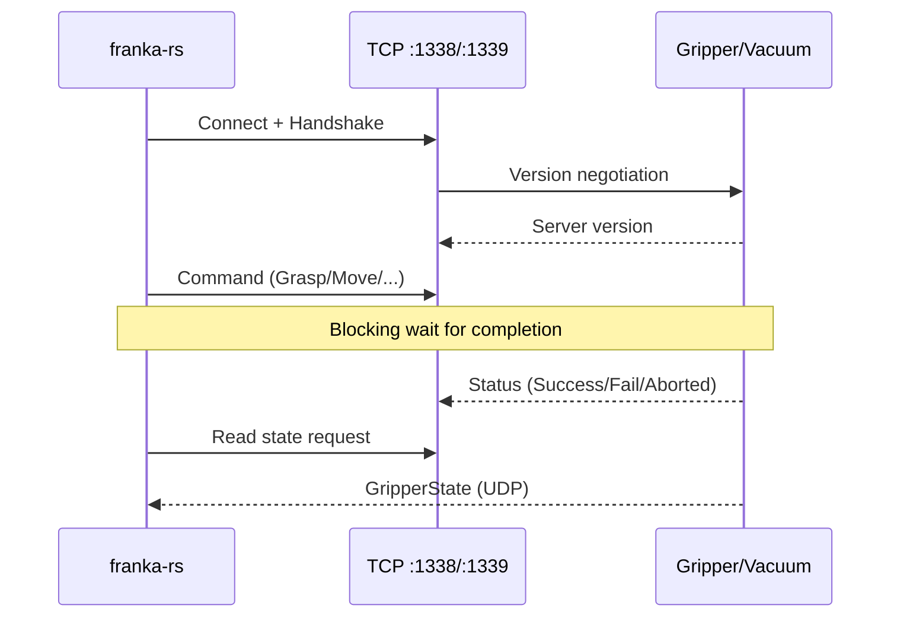

# Gripper Interface

## Parallel Gripper

The Franka parallel gripper connects on TCP port 1338 (same IP as the robot).

```rust
use franka_rs::gripper::Gripper;

let mut gripper = Gripper::connect("172.16.0.2")?;
```

### Homing

Calibrates the gripper by fully opening and closing to measure the maximum width:

```rust
gripper.homing()?;
```

### Grasping

Closes the gripper to a target width with specified force:

```rust
let success = gripper.grasp(
    0.04,   // width: 40mm target
    0.1,    // speed: 0.1 m/s
    60.0,   // force: 60 N
    0.005,  // epsilon_inner: 5mm tolerance
    0.005,  // epsilon_outer: 5mm tolerance
)?;

if success {
    println!("Object grasped!");
}
```

An object is considered grasped if the measured width `d` satisfies:
`(width - epsilon_inner) < d < (width + epsilon_outer)`

### Moving

Opens or moves fingers to a specific width:

```rust
gripper.move_fingers(0.08, 0.1)?; // Open to 80mm at 0.1 m/s
```

### Reading State

```rust
let state = gripper.read_once()?;
println!("Width: {:.3} m", state.width);
println!("Max width: {:.3} m", state.max_width);
println!("Grasped: {}", state.is_grasped);
println!("Temperature: {} °C", state.temperature);
```

### Gripper State Machine



## Vacuum Gripper

The vacuum gripper connects on TCP port 1339:

```rust
use franka_rs::vacuum_gripper::VacuumGripper;

let mut vacuum = VacuumGripper::connect("172.16.0.2")?;
```

### Vacuum Profiles

| Profile | Description |
|---------|-------------|
| `P0` | Slow vacuum build-up, energy saving |
| `P1` | Medium vacuum |
| `P2` | Fast vacuum build-up |
| `P3` | Maximum suction |

### Operations

```rust
use franka_rs::vacuum_gripper::VacuumProfile;

// Pick up an object
vacuum.vacuum(VacuumProfile::P2, Duration::from_secs(3))?;

// Check status
let state = vacuum.read_once()?;
println!("Part detected: {}", state.part_present);

// Release
vacuum.drop_off(Duration::from_secs(2))?;
```

## Communication Protocol


