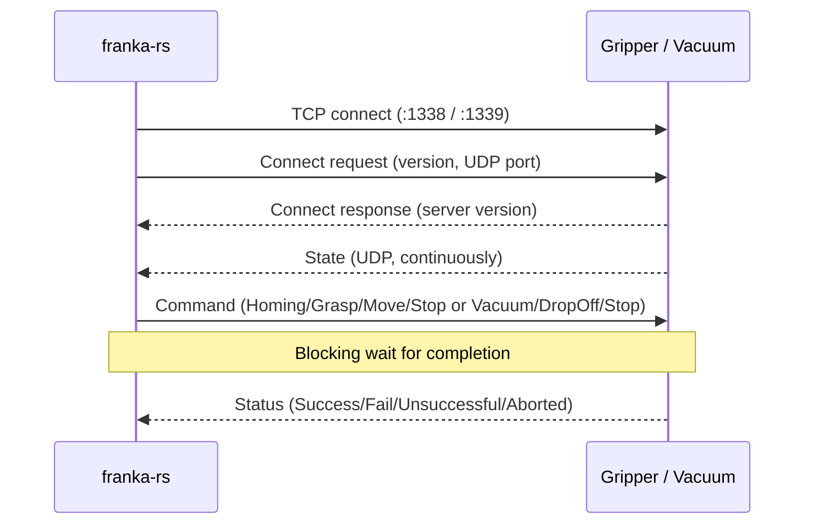

# Gripper Interface

> **Known issue (not validated):** libfranka's gripper and vacuum gripper protocols use a 10-byte
> message header with a 16-bit command field. franka-rs currently sends and parses the robot's
> 12-byte header (32-bit command field) on these connections as well, so the gripper interfaces are
> not expected to work with a real gripper until this is fixed. They have not been tested on
> hardware.

## Parallel Gripper

The Franka parallel gripper connects on TCP port 1338 (same IP as the robot).

```rust
use franka_rs::gripper::Gripper;

let mut gripper = Gripper::connect("172.16.0.2")?;
```

### Homing

Calibrates the gripper's maximum width; needed after changing the fingers. Returns `true` on
success:

```rust
let homed: bool = gripper.homing()?;
```

### Grasping

Closes the gripper to a target width with a specified force:

```rust
let success = gripper.grasp(
    0.04,   // width: 40 mm target
    0.1,    // speed: 0.1 m/s
    60.0,   // force: 60 N
    0.005,  // epsilon_inner: 5 mm tolerance
    0.005,  // epsilon_outer: 5 mm tolerance
)?;

if success {
    println!("Object grasped!");
}
```

An object is considered grasped if the measured width `d` satisfies
`(width - epsilon_inner) < d < (width + epsilon_outer)`.

`homing`, `grasp`, `move_fingers` and `stop` return `Ok(true)` on success, `Ok(false)` when the
gripper reports the command unsuccessful, and `FrankaError::Command` when it reports the command
failed or aborted.

### Moving

```rust
gripper.move_fingers(0.08, 0.1)?; // open to 80 mm at 0.1 m/s
```

### Reading State

`read_once` waits for the next state the gripper sends over UDP:

```rust
let state = gripper.read_once()?;
println!("Width: {:.3} m", state.width);
println!("Max width: {:.3} m", state.max_width);
println!("Grasped: {}", state.is_grasped);
println!("Temperature: {} °C", state.temperature);
```

## Vacuum Gripper

The vacuum gripper connects on TCP port 1339:

```rust
use franka_rs::vacuum_gripper::VacuumGripper;

let mut vacuum = VacuumGripper::connect("172.16.0.2")?;
```

### Vacuum Profiles

`VacuumProfile` selects one of the device's production setup profiles, `P0` to `P3`, as configured
on the device.

### Operations

```rust
use std::time::Duration;

use franka_rs::vacuum_gripper::VacuumProfile;

// Pick up an object: vacuum setpoint (units of 10 mbar), timeout, profile
let established = vacuum.vacuum(100, Duration::from_secs(3), VacuumProfile::P0)?;

// Check status
let state = vacuum.read_once()?;
println!("Part present: {}", state.part_present);
println!("Vacuum: {} mbar, power: {} %", state.vacuum, state.actual_power);

// Release
vacuum.drop_off(Duration::from_secs(2))?;
```

## Communication Protocol


```mermaid
sequenceDiagram
    participant App as franka-rs
    participant Gripper as Gripper / Vacuum

    App->>Gripper: TCP connect (:1338 / :1339)
    App->>Gripper: Connect request (version, UDP port)
    Gripper-->>App: Connect response (server version)
    Gripper-->>App: State (UDP, continuously)

    App->>Gripper: Command (Homing/Grasp/Move/Stop or Vacuum/DropOff/Stop)
    Note over App,Gripper: Blocking wait for completion
    Gripper-->>App: Status (Success/Fail/Unsuccessful/Aborted)
```
