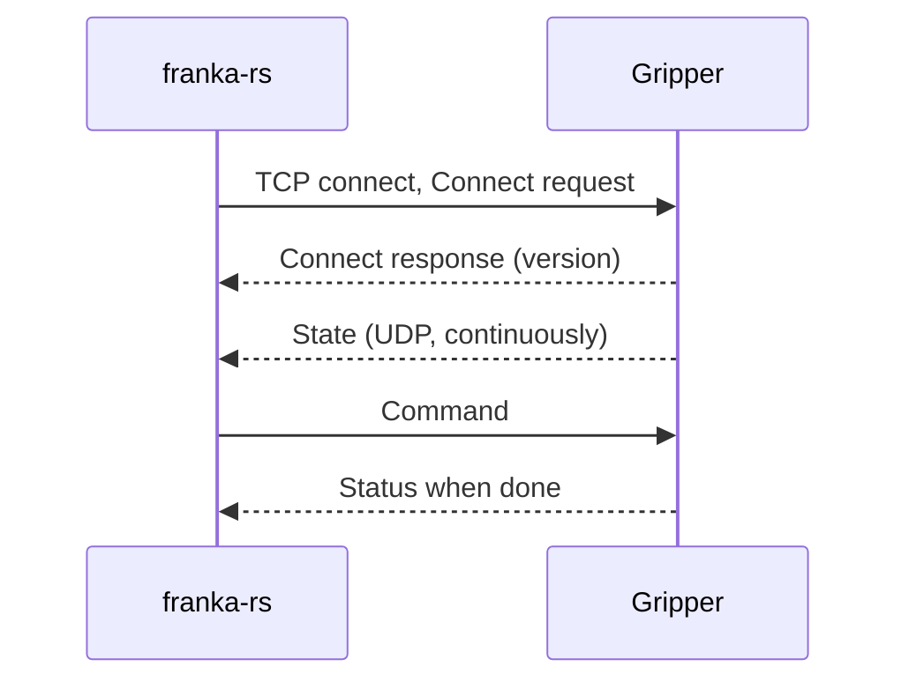

# Gripper Interface

> **Not validated on hardware.** The gripper protocols' 10-byte header (16-bit command) is tested
> against a local fake gripper only, not against a real gripper or libfranka.

API reference: [Gripper & Vacuum Gripper](./modules/grippers.md).

## Parallel Gripper (port 1338)

```rust
use franka_rs::gripper::Gripper;

let mut gripper = Gripper::connect("172.16.0.2")?;
gripper.homing()?;                                     // calibrate max width (after changing fingers)
let grasped = gripper.grasp(0.04, 0.1, 60.0, 0.005, 0.005)?; // width m, speed m/s, force N, ε inner/outer m
gripper.move_fingers(0.08, 0.1)?;                      // open to 80 mm at 0.1 m/s

let state = gripper.read_once()?;
println!("width {:.3} m, grasped {}", state.width, state.is_grasped);
```

Commands block until the gripper reports a result: `Ok(true)` success, `Ok(false)` unsuccessful
(e.g. no object within the grasp tolerance), `Err(Command)` failed or aborted.

## Vacuum Gripper (port 1339)

```rust
use std::time::Duration;

use franka_rs::vacuum_gripper::{VacuumGripper, VacuumProfile};

let mut vacuum = VacuumGripper::connect("172.16.0.2")?;
vacuum.vacuum(100, Duration::from_secs(3), VacuumProfile::P0)?; // setpoint in 10 mbar units
println!("part present: {}", vacuum.read_once()?.part_present);
vacuum.drop_off(Duration::from_secs(2))?;
```

## Protocol


```mermaid
sequenceDiagram
    participant A as franka-rs
    participant G as Gripper
    A->>G: TCP connect, Connect request
    G-->>A: Connect response (version)
    G-->>A: State (UDP, continuously)
    A->>G: Command
    G-->>A: Status when done
```
