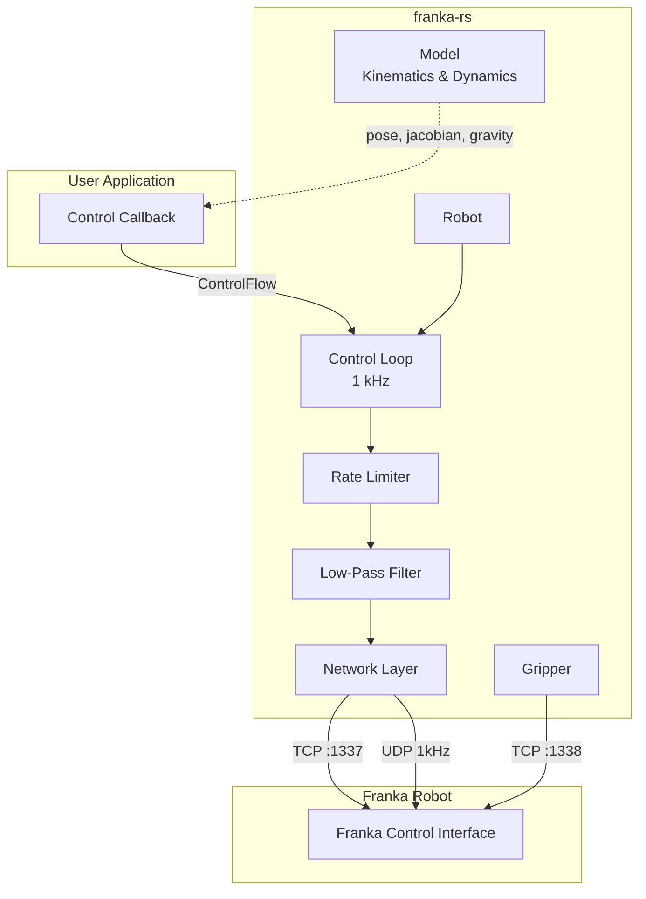

# franka-rs

**Idiomatic Rust interface for the Franka Research 3 robot.**

`franka-rs` is a pure-Rust implementation of the Franka Control Interface (FCI), providing a safe, performant, and ergonomic API for controlling Franka Emika Panda and FR3 robots at 1 kHz.

## Key Features

- **Pure Rust** — no C/C++ dependencies, no FFI
- **Type-safe** — leverages Rust's ownership model to prevent concurrent control access
- **Real-time capable** — synchronous 1 kHz control loop with rate limiting and filtering
- **Complete** — kinematics, dynamics, motion generation, torque control, gripper interface
- **Idiomatic** — uses `nalgebra` for linear algebra, `thiserror` for errors, `bitflags` for error states

## System Diagram



## Quick Example

```rust
use franka_rs::robot::Robot;
use franka_rs::types::{Torques, Frame};
use std::ops::ControlFlow;

fn main() -> Result<(), Box<dyn std::error::Error>> {
    let mut robot = Robot::connect("172.16.0.2")?;

    // Read the current state
    let state = robot.read_once()?;
    println!("Joint positions: {:?}", state.q);

    // Gravity compensation (zero-torque control)
    robot.control_torques(|state, _duration| {
        ControlFlow::Continue(Torques::new([0.0; 7]))
    })?;

    Ok(())
}
```

## Supported Hardware

| Robot | Status |
|-------|--------|
| Franka Emika Panda | Supported |
| Franka Research 3 (FR3) | Supported |

Requires **Franka Control Interface (FCI)** firmware. The robot must be in FCI mode (not Desk mode).
