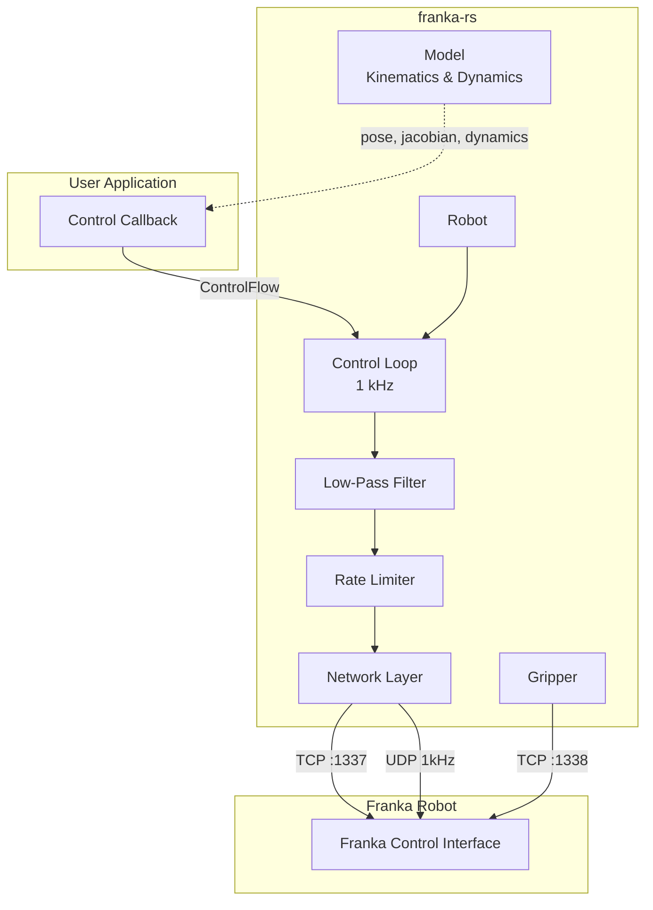

# franka-rs

**Idiomatic Rust interface for the Franka Research 3 robot.**

`franka-rs` is a Rust implementation of the Franka Control Interface (FCI) client, restructured
from libfranka 0.21.3 into an idiomatic Rust API, for controlling a Franka Research 3 at 1 kHz.

## Key Features

- **Rust** — no C++ code; system calls go through `libc` and `socket2`
- **Type-safe** — the ownership model prevents concurrent control access, and the motion types are
  checked at compile time
- **Matches libfranka** — validated against libfranka 0.21.3 (built on the test machine; see
  `validation/torque_validation_plan.md`): offline against a mock robot, bit-identical commands in
  every mode and interface, with filtering and rate limiting on and off, and on the error paths; on
  the robot, identical commands except the message ID for torque, joint position, joint velocity,
  Cartesian pose and Cartesian velocity control through both interfaces (filtering and rate
  limiting off, JointImpedance); combined motion + torque offline only
- **Complete** — kinematics and dynamics from the robot's URDF, motion generation and torque control;
  gripper and vacuum gripper interfaces exist but have a known protocol issue (see
  [Gripper Interface](./gripper.md))
- **Idiomatic** — `nalgebra` for linear algebra, `thiserror` for errors, `bitflags` for error states

## System Diagram


```mermaid
graph TB
    subgraph "User Application"
        APP[Control Callback]
    end

    subgraph "franka-rs"
        ROBOT[Robot]
        CL[Control Loop<br/>1 kHz]
        LP[Low-Pass Filter]
        RL[Rate Limiter]
        NET[Network Layer]
        MODEL[Model<br/>Kinematics & Dynamics]
        GRIP[Gripper]
    end

    subgraph "Franka Robot"
        FCI[Franka Control Interface]
    end

    APP -->|ControlFlow| CL
    ROBOT --> CL
    CL --> LP
    LP --> RL
    RL --> NET
    NET -->|TCP :1337| FCI
    NET -->|UDP 1kHz| FCI
    MODEL -.->|pose, jacobian, dynamics| APP
    GRIP -->|TCP :1338| FCI
```

## Quick Example

```rust
use std::ops::ControlFlow;

use franka_rs::robot::Robot;
use franka_rs::robot::config::MotionConfig;
use franka_rs::types::Torques;

fn main() -> Result<(), Box<dyn std::error::Error>> {
    let mut robot = Robot::connect("172.16.0.2")?;

    // Read the current state
    let state = robot.read_once()?;
    println!("Joint positions: {:?}", state.q);

    // Zero torques for 5 s: the robot compensates gravity itself (for the end effector as
    // configured in Desk), so the arm holds if that configuration is accurate.
    let mut time = 0.0;
    robot.control_torques(&MotionConfig::default(), |_state, period| {
        time += period.as_secs_f64();
        let torques = Torques::new([0.0; 7]);
        if time >= 5.0 { ControlFlow::Break(torques) } else { ControlFlow::Continue(torques) }
    })?;

    Ok(())
}
```

## Supported Hardware

| Robot | Status |
|-------|--------|
| Franka Research 3 (FR3) | Supported; validated on the robot |
| Franka Emika Panda | Not tested (franka-rs implements robot protocol version 10, as libfranka 0.21.3) |

Requires the **Franka Control Interface (FCI)** to be activated in Desk.
