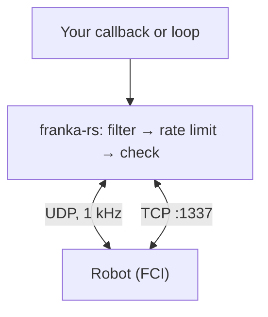

# franka-rs

**Idiomatic Rust interface for the Franka Research 3 robot.**

`franka-rs` is a Rust client for the Franka Control Interface (FCI): libfranka 0.21.3 restructured
into an idiomatic Rust API for 1 kHz control.

- **Matches libfranka** (see [Validation](#validation)).
- **Type-safe** — ownership prevents concurrent control; command types are checked at compile time.
- **Complete** — motion and torque control (callback and active interfaces), kinematics and
  dynamics from the robot's URDF, gripper interfaces (with a [known protocol issue](./gripper.md)).
- **Rust only** — no C++; `nalgebra`, `thiserror`, `bitflags`, `socket2`, `libc`, `roxmltree`.


```mermaid
flowchart TB
    APP["Your callback or loop"] --> F["franka-rs: filter → rate limit → check"]
    F <-->|"UDP, 1 kHz"| R["Robot (FCI)"]
    F <-->|"TCP :1337"| R
```

## Quick Example

```rust
use std::ops::ControlFlow;

use franka_rs::robot::Robot;
use franka_rs::robot::config::MotionConfig;
use franka_rs::types::Torques;

fn main() -> Result<(), Box<dyn std::error::Error>> {
    let mut robot = Robot::connect("172.16.0.2")?;
    println!("q = {:?}", robot.read_once()?.q);

    // Zero torques for 5 s. The robot compensates gravity for the end effector configured in
    // Desk, so the arm holds if that configuration is accurate.
    let mut time = 0.0;
    robot.control_torques(&MotionConfig::default(), |_state, period| {
        time += period.as_secs_f64();
        let torques = Torques::new([0.0; 7]);
        if time >= 5.0 { ControlFlow::Break(torques) } else { ControlFlow::Continue(torques) }
    })?;
    Ok(())
}
```

## Validation

Against libfranka 0.21.3 built on the test machine (`validation/torque_validation_plan.md`):

| Check | Result |
|-------|--------|
| Offline, mock robot | Bit-identical commands in every mode and interface, filtering and rate limiting on and off, including error paths |
| On the robot | Identical except the message ID: torque, joint position/velocity, Cartesian pose/velocity, callback and active interfaces (filtering and limiting off) |
| Filter and limiter arithmetic | Bit-identical (1146 reference cases) |
| Model | Matches libfranka/pinocchio on the robot's URDF |

Combined motion + torque was checked offline only.

## Hardware

| Robot | Status |
|-------|--------|
| Franka Research 3 | Supported; validated on the robot |
| Franka Emika Panda | Not tested (franka-rs implements robot protocol version 10, as libfranka 0.21.3) |

FCI must be activated in Desk.
