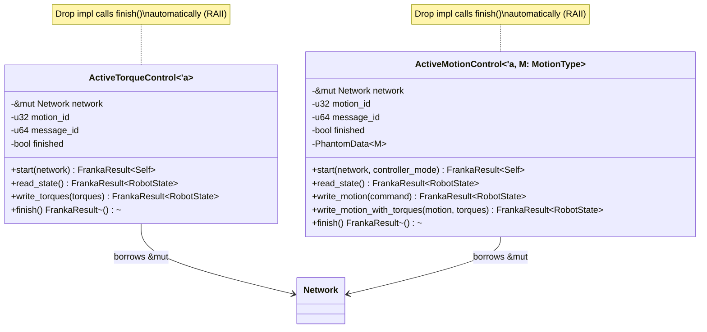
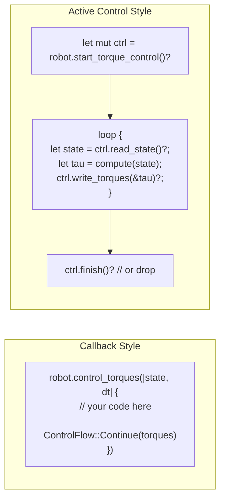
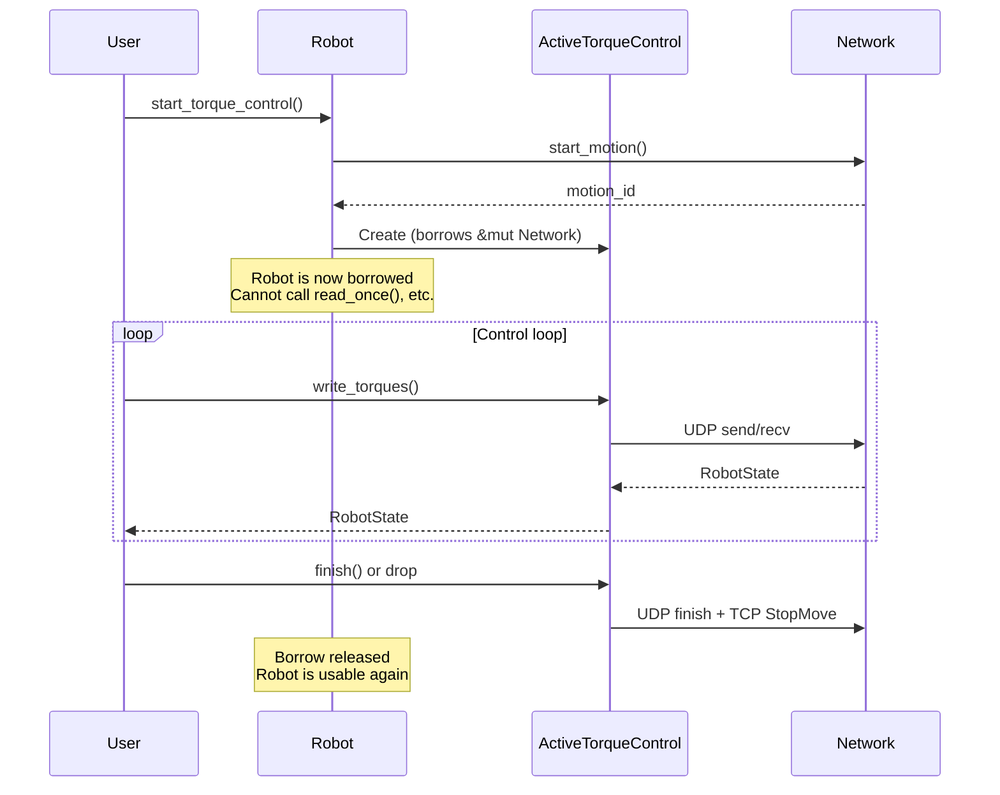

# Active Control

## Overview

The `active_control` module provides a non-callback (imperative) interface for controlling the robot. Instead of passing a closure to a control loop, you get a handle that lets you read state and write commands in your own loop structure.

This is useful for:
- Integration with external control loops or frameworks
- Async/event-driven architectures
- State machines where control flow is complex
- Testing and prototyping



## Callback vs. Active Control



## `ActiveTorqueControl`

### Creation

```rust
let mut ctrl = robot.start_torque_control()?;
// Robot is now in external control mode
// `robot` is mutably borrowed — no other operations allowed
```

### Read / Write Loop

```rust
loop {
    let state = ctrl.read_state()?;
    let tau = compute_torques(&state);

    if should_stop(&state) {
        // finish() sends the final zero-torque command and stops motion
        ctrl.finish()?;
        break;
    }

    // write_torques sends the command and returns the next state
    let next_state = ctrl.write_torques(&Torques::new(tau))?;
}
```

### RAII Cleanup

If the `ActiveTorqueControl` is dropped without calling `finish()`, the `Drop` impl sends a stop command automatically:

```rust
{
    let mut ctrl = robot.start_torque_control()?;
    ctrl.write_torques(&Torques::new([0.0; 7]))?;
    // ctrl dropped here — finish() called automatically
}
// robot is usable again
```

## `ActiveMotionControl<M>`

Generic over the motion type `M: MotionType`. Works with `JointPositions`, `JointVelocities`, `CartesianPose`, or `CartesianVelocities`.

### Creation

```rust
use franka_rs::types::{ControllerMode, JointPositions};

let mut ctrl = robot.start_motion_control::<JointPositions>(
    ControllerMode::JointImpedance,
)?;
```

### Writing Motion Commands

```rust
use franka_rs::wire::robot::MotionGeneratorCommand;

let cmd = MotionGeneratorCommand {
    q_c: desired_positions,
    dq_c: [0.0; 7],
    o_t_ee_c: [0.0; 16],
    o_dp_ee_c: [0.0; 6],
    elbow_c: [0.0; 2],
    valid_elbow: 0,
    motion_generation_finished: 0,
};

let state = ctrl.write_motion(&cmd)?;
```

### Combined Motion + Torques

```rust
let state = ctrl.write_motion_with_torques(&motion_cmd, &torques)?;
```

## Ownership and Lifetime



The key safety guarantee: while `ActiveTorqueControl` or `ActiveMotionControl` exists, it holds a `&mut Network` borrow from `Robot`. This means:

- No concurrent access to the robot connection
- No way to start a second control session
- The robot is automatically stopped when the handle is dropped
- All of this is checked at **compile time**, not runtime
