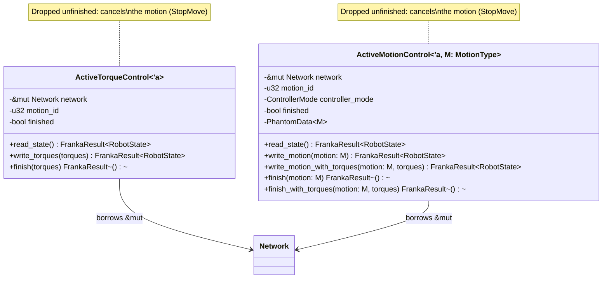
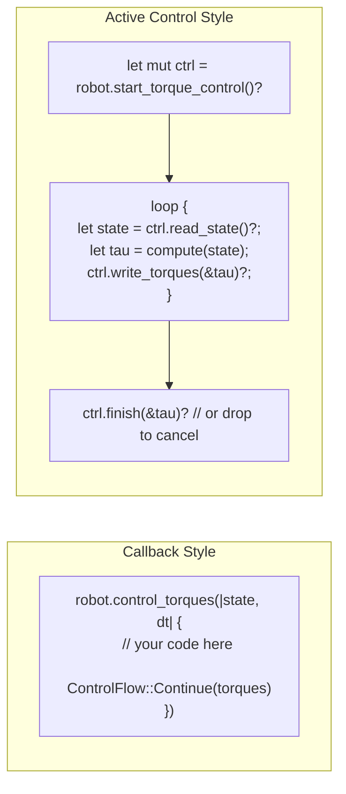

# Active Control

## Overview

The `active_control` module provides a non-callback (imperative) interface for controlling the robot. Instead of passing a closure to a control loop, you get a handle that lets you read state and write commands in your own loop structure.

This is useful for:
- Integration with external control loops or frameworks
- Async/event-driven architectures
- State machines where control flow is complex
- Testing and prototyping


```mermaid
classDiagram
    class ActiveTorqueControl~'a~ {
        -&mut Network network
        -u32 motion_id
        -bool finished
        +read_state() FrankaResult~RobotState~
        +write_torques(torques) FrankaResult~RobotState~
        +finish(torques) FrankaResult~()~
    }

    class ActiveMotionControl~'a, M: MotionType~ {
        -&mut Network network
        -u32 motion_id
        -ControllerMode controller_mode
        -bool finished
        -PhantomData~M~
        +read_state() FrankaResult~RobotState~
        +write_motion(motion: M) FrankaResult~RobotState~
        +write_motion_with_torques(motion: M, torques) FrankaResult~RobotState~
        +finish(motion: M) FrankaResult~()~
        +finish_with_torques(motion: M, torques) FrankaResult~()~
    }

    ActiveTorqueControl --> Network : borrows &mut
    ActiveMotionControl --> Network : borrows &mut

    note for ActiveTorqueControl "Dropped unfinished: cancels\nthe motion (StopMove)"
    note for ActiveMotionControl "Dropped unfinished: cancels\nthe motion (StopMove)"
```

## Callback vs. Active Control


```mermaid
flowchart LR
    subgraph "Callback Style"
        direction TB
        CB_ROBOT["robot.control_torques(|state, dt| {<br/>    // your code here<br/>    ControlFlow::Continue(torques)<br/>})"]
    end

    subgraph "Active Control Style"
        direction TB
        AC_START["let mut ctrl = robot.start_torque_control()?"]
        AC_LOOP["loop {<br/>    let state = ctrl.read_state()?;<br/>    let tau = compute(state);<br/>    ctrl.write_torques(&tau)?;<br/>}"]
        AC_FINISH["ctrl.finish(&tau)? // or drop to cancel"]
        AC_START --> AC_LOOP --> AC_FINISH
    end
```

## `ActiveTorqueControl`

### Creation

```rust
let mut ctrl = robot.start_torque_control()?;
// Robot is now in external control mode
// `robot` is mutably borrowed — no other operations allowed
```

### Read / Write Loop

```rust
loop {
    let state = ctrl.read_state()?;
    let tau = compute_torques(&state);

    if should_stop(&state) {
        // finish() sends the final torques with the finished flag until the robot stops the
        // controller, then waits for the robot's confirmation
        ctrl.finish(&Torques::new(tau))?;
        break;
    }

    // write_torques sends the command and returns the next state
    let next_state = ctrl.write_torques(&Torques::new(tau))?;
}
```

### RAII Cleanup

If the `ActiveTorqueControl` is dropped without a successful `finish()` (including during a panic), the `Drop` impl cancels the motion with a StopMove request, as libfranka's destructor does:

```rust
{
    let mut ctrl = robot.start_torque_control()?;
    ctrl.write_torques(&Torques::new([0.0; 7]))?;
    // ctrl dropped here — the motion is cancelled (StopMove)
}
// robot is usable again
```

## `ActiveMotionControl<M>`

Generic over the motion type `M: MotionType`. Works with `JointPositions`, `JointVelocities`, `CartesianPose`, or `CartesianVelocities`.

### Creation

```rust
use franka_rs::types::{ControllerMode, JointPositions};

let mut ctrl = robot.start_motion_control::<JointPositions>(
    ControllerMode::JointImpedance,
)?;
```

### Writing Motion Commands

Commands have the session's motion type. As in libfranka's active control, they are sent without
filtering or rate limiting, after libfranka's checks: every value finite, a Cartesian pose a
homogeneous transformation, an elbow sign of exactly +1 or -1. An invalid command returns an error
without sending anything.

```rust
let state = ctrl.write_motion(&JointPositions::new(desired_positions))?;
// ...
ctrl.finish(&JointPositions::new(final_positions))?;
```

### Combined Motion + Torques

Only for a session started with `ControllerMode::ExternalController`, which must send torques with
every motion command:

```rust
let state = ctrl.write_motion_with_torques(&motion, &torques)?;
// ...
ctrl.finish_with_torques(&final_motion, &final_torques)?;
```

## Ownership and Lifetime

```mermaid
sequenceDiagram
    participant User
    participant Robot
    participant Ctrl as ActiveTorqueControl
    participant Net as Network

    User->>Robot: start_torque_control()
    Robot->>Net: start_motion()
    Net-->>Robot: motion_id
    Robot->>Ctrl: Create (borrows &mut Network)
    Note over Robot: Robot is now borrowed<br/>Cannot call read_once(), etc.

    loop Control loop
        User->>Ctrl: write_torques()
        Ctrl->>Net: UDP send/recv
        Net-->>Ctrl: RobotState
        Ctrl-->>User: RobotState
    end

    User->>Ctrl: finish(final command) or drop
    Ctrl->>Net: finish: UDP final command until stopped, then Move response; drop: TCP StopMove
    Note over Robot: Borrow released<br/>Robot is usable again
```

The key safety guarantee: while `ActiveTorqueControl` or `ActiveMotionControl` exists, it holds a `&mut Network` borrow from `Robot`. This means:

- No concurrent access to the robot connection
- No way to start a second control session
- The robot is automatically stopped when the handle is dropped
- All of this is checked at **compile time**, not runtime
