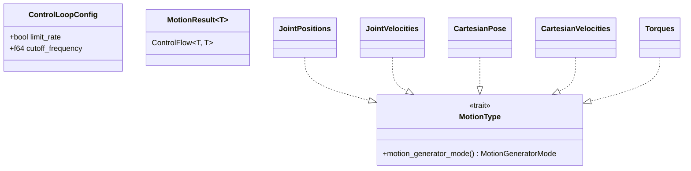
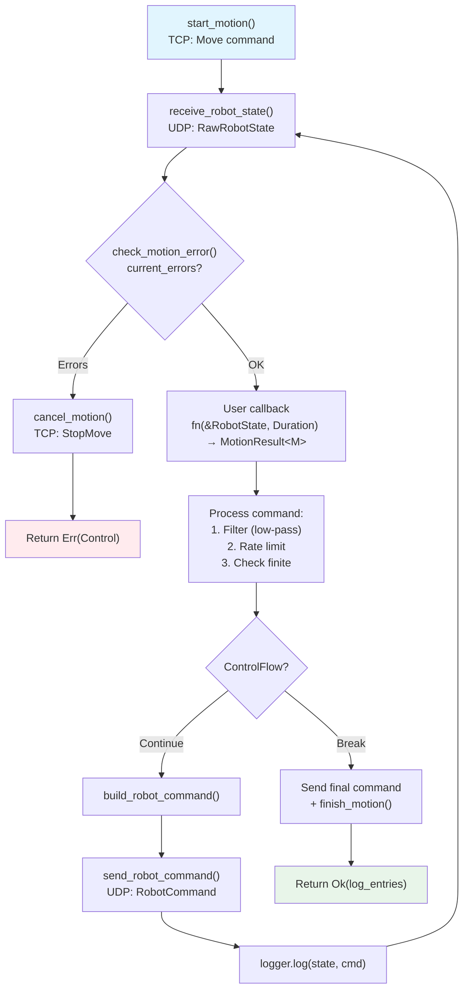
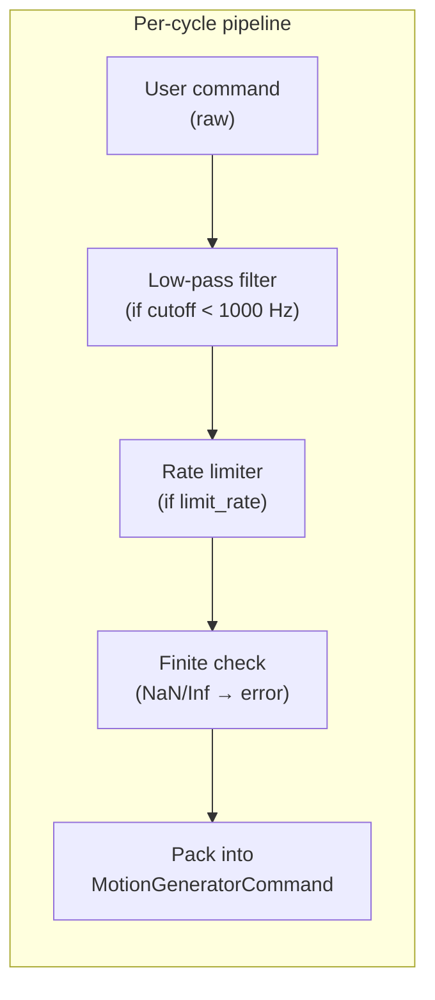
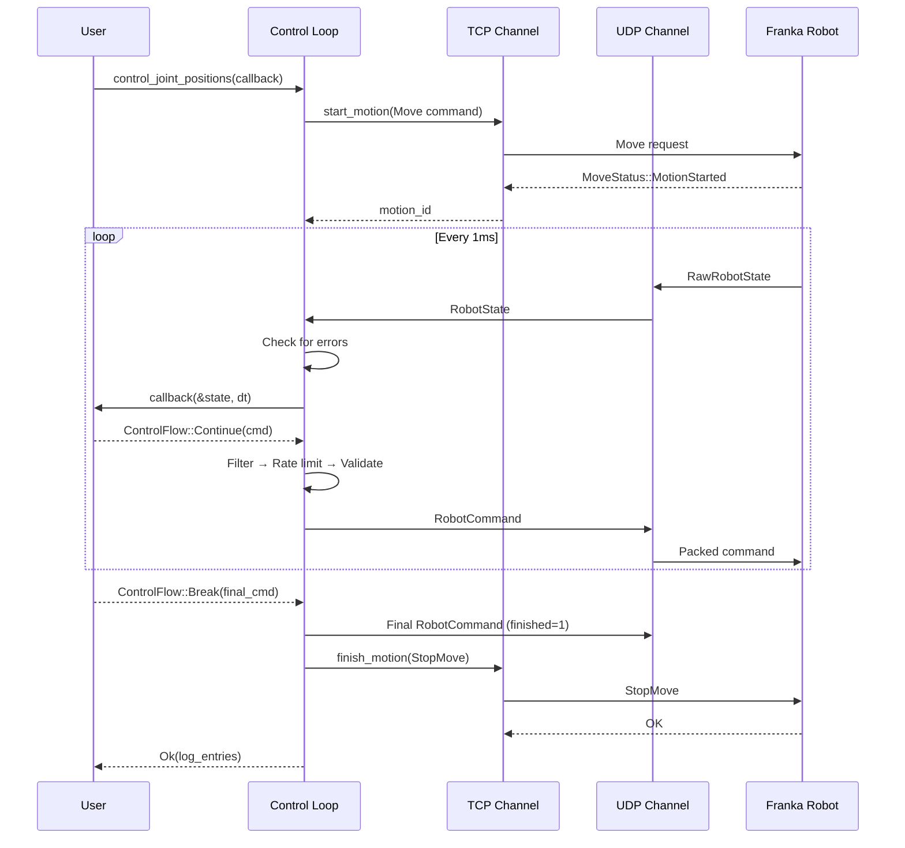

# Control Loop

## Overview

The `control_loop` module implements the real-time 1 kHz control loop that orchestrates motion generation, rate limiting, filtering, and network communication. It is the core execution engine of `franka-rs`.



## Loop Variants

Three loop functions handle different control modes:

| Function | Motion Generator | Torque Control | Use Case |
|----------|-----------------|----------------|----------|
| `run_motion_loop<M>` | Yes (type `M`) | No (internal) | Joint/Cartesian motion with robot's internal controller |
| `run_torque_loop` | No | Yes | Direct torque control (gravity comp, impedance, etc.) |
| `run_motion_with_control_loop<M>` | Yes (type `M`) | Yes | Combined motion + torque overlay (impedance on trajectory) |

## Execution Flow



## `ControlLoopConfig`

```rust
use franka_rs::control_loop::ControlLoopConfig;

let config = ControlLoopConfig {
    limit_rate: true,           // Apply rate limiting (default: true)
    cutoff_frequency: 100.0,    // Low-pass filter cutoff in Hz (default: 100)
};
```

| Field | Default | Effect |
|-------|---------|--------|
| `limit_rate` | `true` | Clamp joint/Cartesian rates to hardware limits |
| `cutoff_frequency` | `100.0` Hz | Low-pass filter cutoff; set to 1000.0 to disable |

## `MotionType` Trait

Maps command types to their wire-format motion generator mode:

| Type | `motion_generator_mode()` |
|------|--------------------------|
| `JointPositions` | `JointPosition` |
| `JointVelocities` | `JointVelocity` |
| `CartesianPose` | `CartesianPosition` |
| `CartesianVelocities` | `CartesianVelocity` |
| `Torques` | `None` (torque-only, no motion gen) |

## `MotionResult<T>`

An alias for `std::ops::ControlFlow<T, T>`:

```rust
pub type MotionResult<T> = ControlFlow<T, T>;
```

- **`Continue(cmd)`** — keep the loop running, send `cmd` this cycle
- **`Break(cmd)`** — send `cmd` as the final command, then stop

Helper functions:
- `motion_value(result)` — extracts the inner `T` from either variant
- `is_finished(result)` — returns `true` for `Break`

## Command Processing Pipeline

Each cycle, the user's command passes through a processing pipeline before transmission:



Processing varies by motion type:

| Motion Type | Filter Method | Rate Limit Method |
|-------------|---------------|-------------------|
| `JointPositions` | `lowpass_filter_joints` | `limit_rate_joint_positions` |
| `JointVelocities` | `lowpass_filter_joints` | `limit_rate_joint_velocities` |
| `CartesianPose` | `cartesian_lowpass_filter` (SLERP) | `limit_rate_cartesian_pose` |
| `CartesianVelocities` | Per-element `lowpass_filter` | `limit_rate_cartesian_velocity` |
| `Torques` | `lowpass_filter_joints` | `limit_rate_torques` |

## Motion Lifecycle



## Logger Integration

Every cycle, the state and command are recorded in a ring buffer (`Logger`):

- Capacity: 1000 entries (~1 second at 1 kHz)
- On success: log entries returned to the caller
- On error: log entries attached to `FrankaError::Control` for post-mortem debugging

```rust
let log = robot.control_torques(&config, |state, _| {
    ControlFlow::Break(Torques::new([0.0; 7]))
})?;

// Inspect the last few commands
for entry in &log[log.len().saturating_sub(5)..] {
    println!("q = {:?}", entry.state.q);
}
```
