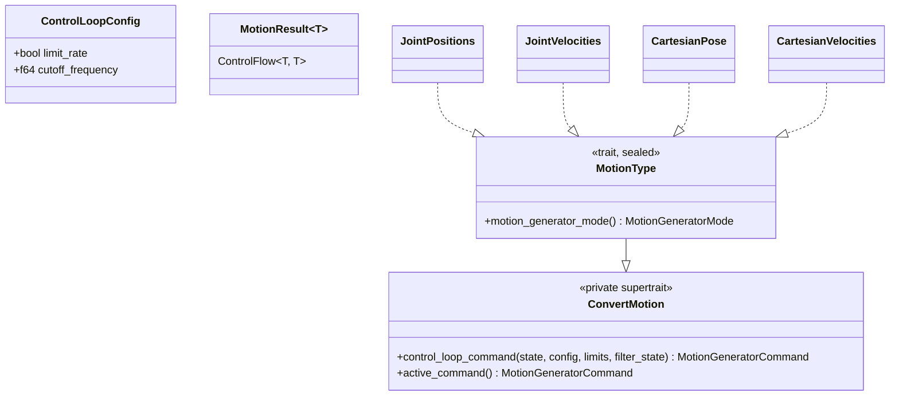
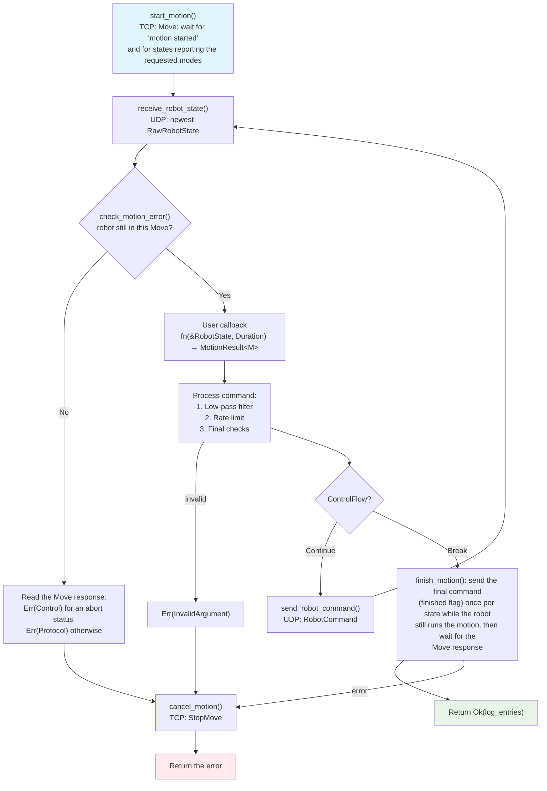
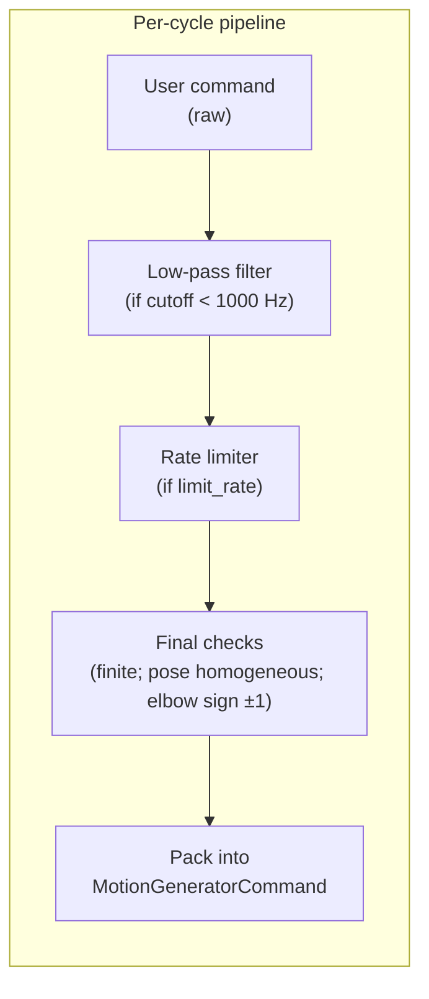
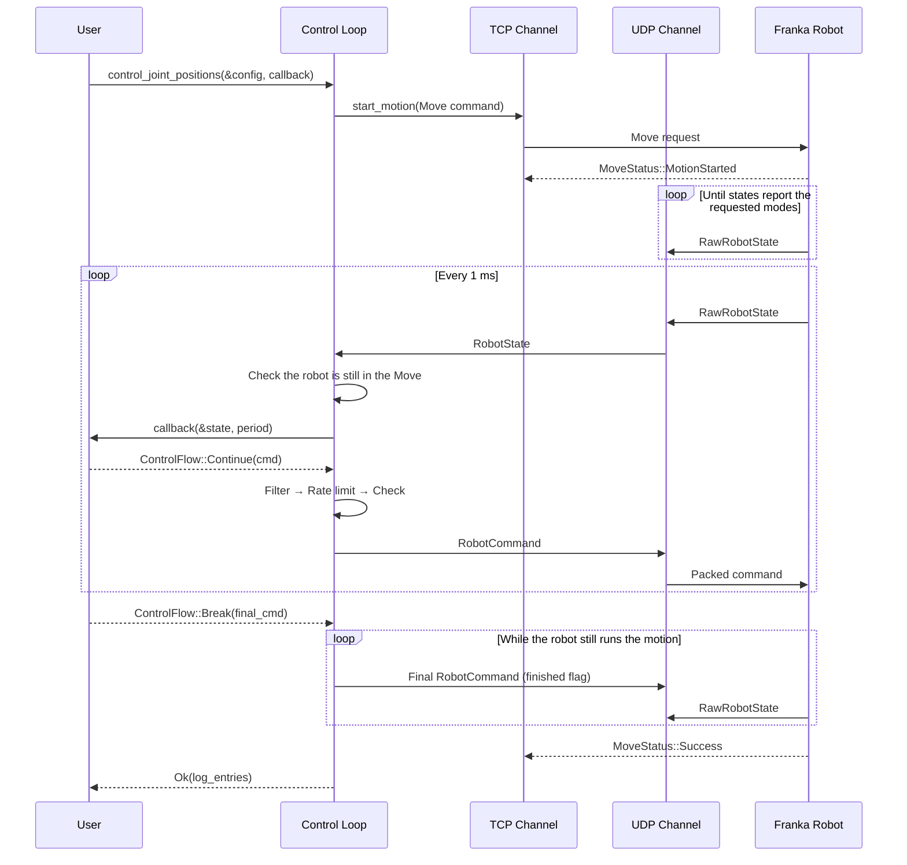

# Control Loop

## Overview

The `control_loop` module implements the 1 kHz control loops and the motion lifecycle (start, finish, cancel), following libfranka's `ControlLoop` and `Robot::Impl`. Its commands are bit-identical to libfranka 0.21.3's in every mode offline (A1); on the robot, identical except the message ID for torque and the four motion modes with filtering and rate limiting off (A2); see `validation/torque_validation_plan.md`. `MotionType` and `MotionResult` are defined in `control_types`; the per-type conversion of motion commands is in the private `motion_conversion` module.


```mermaid
classDiagram
    class ControlLoopConfig {
        +bool limit_rate
        +f64 cutoff_frequency
    }

    class MotionType {
        <<trait, sealed>>
        +motion_generator_mode() MotionGeneratorMode
    }

    class ConvertMotion {
        <<private supertrait>>
        +control_loop_command(state, config, limits, filter_state) MotionGeneratorCommand
        +active_command() MotionGeneratorCommand
    }

    class MotionResult~T~ {
        ControlFlow~T, T~
    }

    JointPositions ..|> MotionType
    JointVelocities ..|> MotionType
    CartesianPose ..|> MotionType
    CartesianVelocities ..|> MotionType
    MotionType --|> ConvertMotion
```

`Torques` is not a `MotionType`; torque commands have their own processing (`process_torque_command`).

## Loop Variants

Three loop functions handle different control modes:

| Function | Motion Generator | Torque Control | Use Case |
|----------|-----------------|----------------|----------|
| `run_motion_loop<M>` | Yes (type `M`) | No (internal) | Joint/Cartesian motion with the robot's internal controller; `ExternalController` returns `InvalidOperation` |
| `run_torque_loop` | No | Yes | Direct torque control (impedance, etc.) |
| `run_motion_with_control_loop<M>` | Yes (type `M`) | Yes | Combined motion + torque under the external controller; the torque callback runs first and, while it has not finished, the motion callback |

`run_motion_loop` and `run_motion_with_control_loop` also take the robot's `JointVelocityLimits`. The robot methods (`Robot::control_*`) call these with a `MotionConfig` converted to a `ControlLoopConfig`.

## Execution Flow


```mermaid
flowchart TD
    START["start_motion()<br/>TCP: Move; wait for 'motion started'<br/>and for states reporting the requested modes"] --> RECV["receive_robot_state()<br/>UDP: newest RawRobotState"]
    RECV --> CHECK{"check_motion_error()<br/>robot still in this Move?"}
    CHECK -->|No| RESP["Read the Move response:<br/>Err(Control) for an abort status,<br/>Err(Protocol) otherwise"]

    CHECK -->|Yes| CALLBACK["User callback<br/>fn(&RobotState, Duration) → MotionResult&lt;M&gt;"]
    CALLBACK --> PROCESS["Process command:<br/>1. Low-pass filter<br/>2. Rate limit<br/>3. Final checks"]
    PROCESS -->|"invalid"| ERRP["Err(InvalidArgument)"]

    PROCESS --> FINISHED{"ControlFlow?"}
    FINISHED -->|Continue| SEND["send_robot_command()<br/>UDP: RobotCommand"]
    SEND --> RECV

    FINISHED -->|Break| FINAL["finish_motion(): send the final command<br/>(finished flag) once per state while the robot<br/>still runs the motion, then wait for the<br/>Move response"]
    FINAL --> OK["Return Ok(log_entries)"]

    RESP --> CANCEL["cancel_motion()<br/>TCP: StopMove"]
    ERRP --> CANCEL
    FINAL -->|"error"| CANCEL
    CANCEL --> ERR["Return the error"]

    style START fill:#e1f5fe
    style ERR fill:#ffebee
    style OK fill:#e8f5e9
```

`run_and_finish` wraps every loop: an error from the loop or the finish, or a panic in a callback,
cancels the motion (StopMove) before the error is returned or the panic continues. Before each
send and before the first state read, the loop checks that the robot has not closed the TCP
connection.

## `ControlLoopConfig`

```rust
use franka_rs::control_loop::ControlLoopConfig;

let config = ControlLoopConfig {
    limit_rate: true,           // Apply rate limiting (default: true)
    cutoff_frequency: 100.0,    // Low-pass filter cutoff in Hz (default: 100)
};
```

| Field | Default | Effect |
|-------|---------|--------|
| `limit_rate` | `true` | Clamp joint/Cartesian rates to hardware limits |
| `cutoff_frequency` | `100.0` Hz | Low-pass filter cutoff; 1000.0 or more (or NaN) disables it; zero or below is rejected with `InvalidArgument` |

## `MotionType` Trait

Maps command types to their wire-format motion generator mode:

| Type | `motion_generator_mode()` |
|------|--------------------------|
| `JointPositions` | `JointPosition` |
| `JointVelocities` | `JointVelocity` |
| `CartesianPose` | `CartesianPosition` |
| `CartesianVelocities` | `CartesianVelocity` |

Torque-only loops start the Move with motion generator `None`.

## `MotionResult<T>`

An alias for `std::ops::ControlFlow<T, T>`:

```rust
pub type MotionResult<T> = ControlFlow<T, T>;
```

- **`Continue(cmd)`** — keep the loop running, send `cmd` this cycle
- **`Break(cmd)`** — send `cmd` as the final command, then stop

Helper functions:
- `motion_value(result)` — extracts the inner `T` from either variant
- `is_finished(result)` — returns `true` for `Break`

## Command Processing Pipeline

Each cycle, the user's command passes through a processing pipeline before transmission:


```mermaid
flowchart LR
    subgraph "Per-cycle pipeline"
        RAW["User command<br/>(raw)"] --> FILTER["Low-pass filter<br/>(if cutoff < 1000 Hz)"]
        FILTER --> RATE["Rate limiter<br/>(if limit_rate)"]
        RATE --> VALID["Final checks<br/>(finite; pose homogeneous; elbow sign ±1)"]
        VALID --> PACK["Pack into<br/>MotionGeneratorCommand"]
    end
```

Processing varies by motion type. The filters and limiters check their own inputs and return `FrankaError::InvalidArgument` for invalid ones, as libfranka's throw `std::invalid_argument`; the Cartesian ones reproduce Eigen's arithmetic (`source/eigen_compat.rs`) so results are bit-identical to libfranka's:

| Motion Type | Filter Method | Rate Limit Method |
|-------------|---------------|-------------------|
| `JointPositions` | `lowpass_filter_joints` | `limit_rate_joint_positions` |
| `JointVelocities` | `lowpass_filter_joints` | `limit_rate_joint_velocities` |
| `CartesianPose` | `cartesian_lowpass_filter` (slerp, Eigen-identical arithmetic) | `limit_rate_cartesian_pose` |
| `CartesianVelocities` | Per-element `lowpass_filter` | `limit_rate_cartesian_velocity` |
| Elbow (pose and velocity commands) | Scalar `lowpass_filter` | `limit_rate_position` with the elbow limits |
| `Torques` (torque loops) | `lowpass_filter_joints` | `limit_rate_torques` |

The first cycle of a joint position or pose motion is filtered and limited against the command
itself (as libfranka's `initialized_filter_`); later cycles against the robot's last commanded
value from the state. A pose's elbow reference is the commanded elbow on the first cycle and the
state's `elbow_c` afterwards; a Cartesian velocity's elbow reference is always `elbow_c`.

## Motion Lifecycle


```mermaid
sequenceDiagram
    participant User
    participant CL as Control Loop
    participant TCP as TCP Channel
    participant UDP as UDP Channel
    participant Robot as Franka Robot

    User->>CL: control_joint_positions(&config, callback)

    CL->>TCP: start_motion(Move command)
    TCP->>Robot: Move request
    Robot-->>TCP: MoveStatus::MotionStarted
    loop Until states report the requested modes
        Robot->>UDP: RawRobotState
    end

    loop Every 1 ms
        Robot->>UDP: RawRobotState
        UDP->>CL: RobotState
        CL->>CL: Check the robot is still in the Move
        CL->>User: callback(&state, period)
        User-->>CL: ControlFlow::Continue(cmd)
        CL->>CL: Filter → Rate limit → Check
        CL->>UDP: RobotCommand
        UDP->>Robot: Packed command
    end

    User-->>CL: ControlFlow::Break(final_cmd)
    loop While the robot still runs the motion
        CL->>UDP: Final RobotCommand (finished flag)
        Robot->>UDP: RawRobotState
    end
    Robot-->>TCP: MoveStatus::Success
    CL-->>User: Ok(log_entries)
```

## Logger Integration

Every cycle, the state and command are recorded in a ring buffer (`Logger`, capacity 1000 entries,
about 1 second at 1 kHz). A successful motion returns the entries (`Vec<LogEntry>`, oldest first);
on an error the entries are not returned (`FrankaError::Control::log` is empty).

```rust
let log = robot.control_torques(&MotionConfig::default(), |_state, _period| {
    ControlFlow::Break(Torques::new([0.0; 7]))
})?;

// Inspect the last few entries
for entry in &log[log.len().saturating_sub(5)..] {
    println!("q = {:?}", entry.state.q);
}
```
