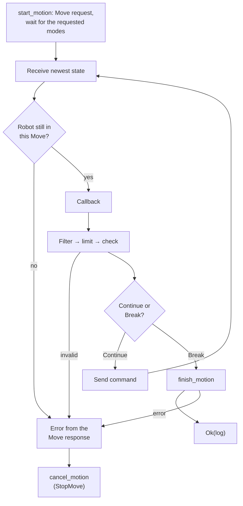

# Control Loop

`control_loop` runs the 1 kHz loops and the motion lifecycle (start, finish, cancel), following
libfranka's `ControlLoop` and `Robot::Impl`. Offline its commands are bit-identical to libfranka
0.21.3's in every mode; on the robot they matched except the message ID (torque and the four
motion modes, filtering and limiting off) — see `validation/torque_validation_plan.md`.

## Loops

| Function | Commands | Controller |
|----------|----------|------------|
| `run_motion_loop<M>` | motion type `M` | internal (`ExternalController` → `InvalidOperation`) |
| `run_torque_loop` | `Torques` | external |
| `run_motion_with_control_loop<M>` | `M` + `Torques`; the torque callback runs first, then (until it finishes) the motion callback | external |

`Robot::control_*` call these with `MotionConfig` converted to `ControlLoopConfig`
(`limit_rate`, default `true`; `cutoff_frequency`, default 100 Hz). The motion loops also take the
robot's `JointVelocityLimits`.

## One Motion


```mermaid
flowchart TB
    START["start_motion: Move request,<br/>wait for the requested modes"] --> RECV["Receive newest state"]
    RECV --> CHECK{"Robot still in<br/>this Move?"}
    CHECK -- no --> ERR["Error from the<br/>Move response"]
    CHECK -- yes --> CB["Callback"]
    CB --> PROC["Filter → limit → check"]
    PROC -- invalid --> ERR
    PROC --> FLOW{"Continue or<br/>Break?"}
    FLOW -- Continue --> SEND["Send command"] --> RECV
    FLOW -- Break --> FIN["finish_motion"]
    FIN --> OK["Ok(log)"]
    FIN -- error --> ERR
    ERR --> CANCEL["cancel_motion<br/>(StopMove)"]
```

- **start_motion** sends Move, checks the "motion started" reply, and reads states until they
  report the requested modes.
- **check_motion_error** (each state): if the robot left the Move, it reads the Move response: an
  abort status or malformed response gives `Control`; a "success" or "motion started" reply gives
  `Protocol`.
- **finish_motion** resends the final command, with its finished flag, once per state while the
  robot still runs the motion, then awaits the Move response.
- **cancel_motion** runs on any error, and on a panic in a callback before the panic continues.
- The loop checks that the robot has not closed the TCP connection before each send and before
  the first state read.

## Command Processing

| Command | Filter | Rate limiter |
|---------|--------|--------------|
| `JointPositions` | `lowpass_filter_joints` | `limit_rate_joint_positions` |
| `JointVelocities` | `lowpass_filter_joints` | `limit_rate_joint_velocities` |
| `CartesianPose` | `cartesian_lowpass_filter` | `limit_rate_cartesian_pose` |
| `CartesianVelocities` | `lowpass_filter` per element | `limit_rate_cartesian_velocity` |
| Elbow | `lowpass_filter` | `limit_rate_position` (elbow limits) |
| `Torques` | `lowpass_filter_joints` | `limit_rate_torques` |

- The filter runs when the cutoff is below 1000 Hz (NaN disables it; zero or below is rejected
  with `InvalidArgument`); the limiter when `limit_rate` is set. Both reject invalid inputs with
  `InvalidArgument`, then the final checks run (finite; pose homogeneous; elbow sign ±1).
- **References:** the first cycle of a joint position or pose motion is filtered and limited
  against the command itself; later cycles against the robot's last commanded value. A pose's
  elbow reference is the commanded elbow on the first cycle, then the state's `elbow_c`; a
  Cartesian velocity's elbow reference is always `elbow_c`.

## Types

- `MotionType` (sealed; in `control_types`) is implemented by the four motion types and maps each
  to its motion generator mode. Torque loops start the Move with mode `None`; `Torques` is not a
  `MotionType`.
- `MotionResult<T> = ControlFlow<T, T>`; helpers `motion_value` and `is_finished`.

## Log

Each cycle's state and command go into a ring buffer (`Logger`, 1000 entries). A successful
motion returns them, oldest first:

```rust
let log = robot.control_torques(&MotionConfig::default(), |_s, _p| ControlFlow::Break(Torques::new([0.0; 7])))?;
for entry in log.iter().rev().take(5) {
    println!("q = {:?}", entry.state.q);
}
```

On an error the log is not returned (`FrankaError::Control::log` is empty).
