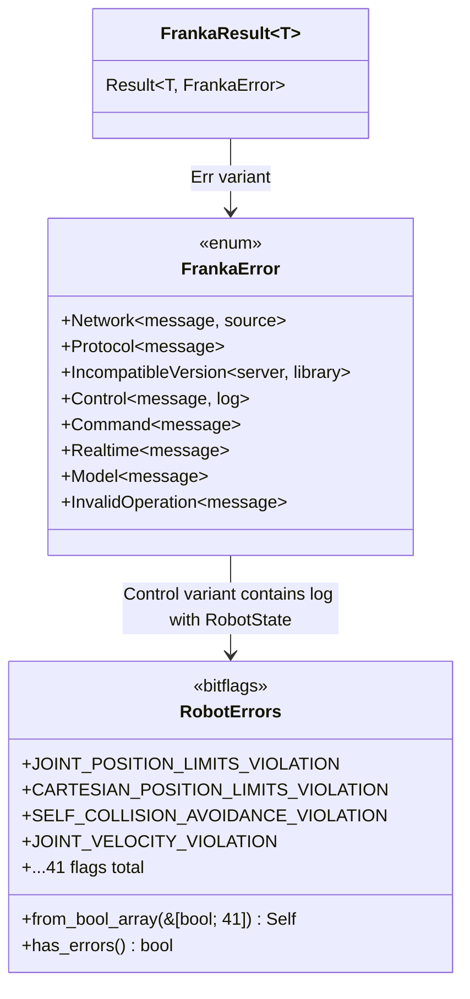
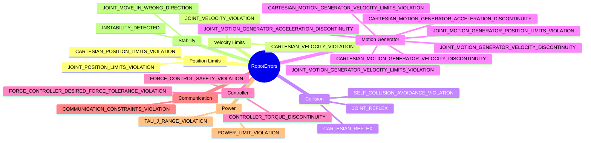
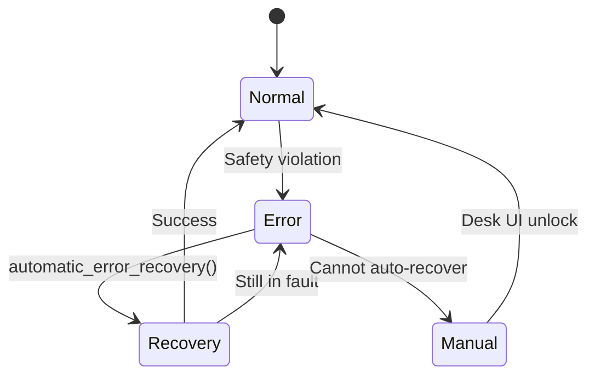

# Error Handling

## Overview

`franka-rs` uses a two-tier error system:

1. **`FrankaError`** — application-level errors (network failures, protocol issues, control exceptions)
2. **`RobotErrors`** — bitfield of 41 hardware safety flags from the robot controller



## `FrankaError`

The main error type, implementing `std::error::Error` and `Display` via `thiserror`:

| Variant | Cause | Contains |
|---------|-------|----------|
| `Network` | TCP/UDP failure, timeout, unreachable host | `message`, optional `io::Error` source |
| `Protocol` | Malformed packets, unexpected response format | `message` |
| `IncompatibleVersion` | Server/client version mismatch during handshake | `server_version`, `library_version` |
| `Control` | Robot reported errors during control loop | `message`, `Vec<RobotState>` log |
| `Command` | Robot rejected a configuration command | `message` |
| `Realtime` | Non-finite values in control command | `message` |
| `Model` | Invalid parameters for kinematics/dynamics | `message` |
| `InvalidOperation` | Attempted operation in wrong state | `message` |

### Pattern Matching

```rust
use franka_rs::errors::{FrankaError, FrankaResult};

fn try_connect() -> FrankaResult<()> {
    let robot = Robot::connect("172.16.0.2")?;
    Ok(())
}

match try_connect() {
    Ok(()) => println!("Connected!"),
    Err(FrankaError::Network { message, source }) => {
        eprintln!("Network: {message}");
        if let Some(io_err) = source {
            eprintln!("  IO error: {io_err}");
        }
    }
    Err(FrankaError::IncompatibleVersion { server_version, library_version }) => {
        eprintln!("Version mismatch: server={server_version}, lib={library_version}");
    }
    Err(FrankaError::Control { message, log }) => {
        eprintln!("Control error: {message}");
        eprintln!("  Last {} states logged", log.len());
        if let Some(last) = log.last() {
            eprintln!("  Errors: {:?}", last.current_errors);
        }
    }
    Err(e) => eprintln!("Other: {e}"),
}
```

### Constructor Helpers

```rust
// Simple network error
let err = FrankaError::network("connection refused");

// Network error with IO source
let io_err = std::io::Error::new(std::io::ErrorKind::TimedOut, "timeout");
let err = FrankaError::network_with_source("UDP receive", io_err);
```

## `RobotErrors` (Bitflags)

A 64-bit bitfield where each bit corresponds to a specific safety violation. Uses the `bitflags` crate.

### Error Categories



### Usage

```rust
use franka_rs::errors::RobotErrors;

let state = robot.read_once()?;

if state.current_errors.has_errors() {
    // Check specific errors
    if state.current_errors.contains(RobotErrors::JOINT_VELOCITY_VIOLATION) {
        eprintln!("Joint velocity limit exceeded!");
    }
    if state.current_errors.contains(RobotErrors::SELF_COLLISION_AVOIDANCE_VIOLATION) {
        eprintln!("Self-collision detected!");
    }

    // Iterate active errors
    println!("Active errors: {:?}", state.current_errors);
}

// Check last motion errors (persists after recovery)
if state.last_motion_errors.contains(RobotErrors::CARTESIAN_REFLEX) {
    println!("Last motion was stopped by Cartesian reflex");
}
```

### Wire Format Conversion

The robot sends errors as a `[bool; 41]` array. Conversion is handled internally:

```rust
let bools = [false; 41];
let errors = RobotErrors::from_bool_array(&bools);
assert!(!errors.has_errors());
```

## `FrankaResult<T>`

Convenience alias used throughout the library:

```rust
pub type FrankaResult<T> = Result<T, FrankaError>;
```

All public methods return `FrankaResult<T>`, making `?` propagation ergonomic:

```rust
fn do_work() -> FrankaResult<()> {
    let mut robot = Robot::connect("172.16.0.2")?;
    let state = robot.read_once()?;
    robot.control_torques(&MotionConfig::default(), |state, _| {
        ControlFlow::Break(Torques::new([0.0; 7]))
    })?;
    Ok(())
}
```

## Error Recovery

After a collision or safety violation:

```rust
// Attempt automatic recovery
match robot.automatic_error_recovery() {
    Ok(()) => println!("Recovery successful"),
    Err(e) => {
        eprintln!("Recovery failed: {e}");
        eprintln!("Manual intervention required (check Desk UI)");
    }
}
```


