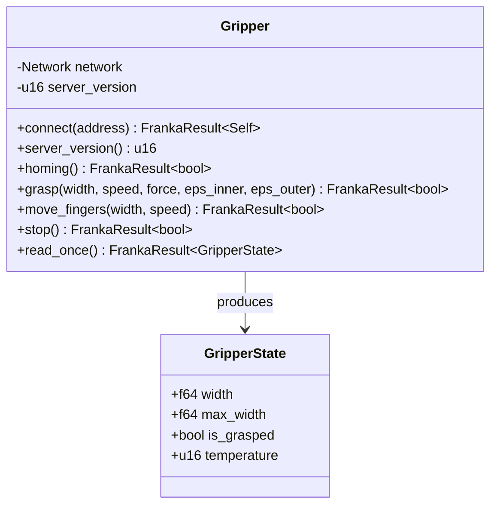
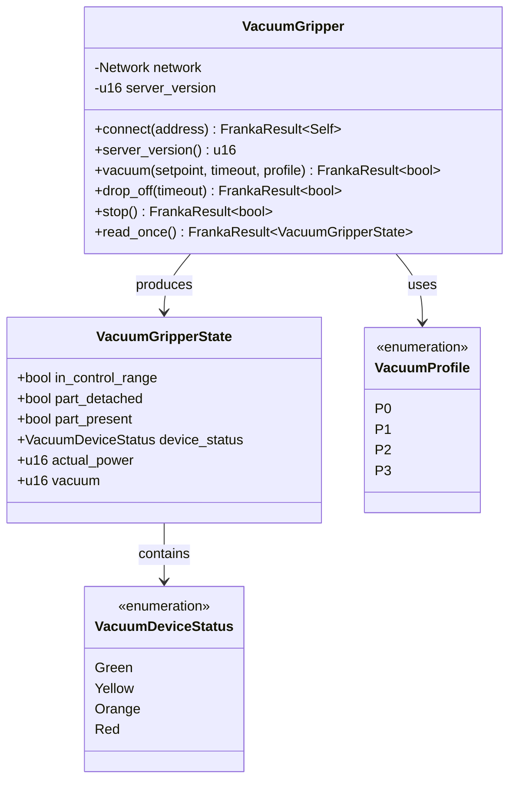
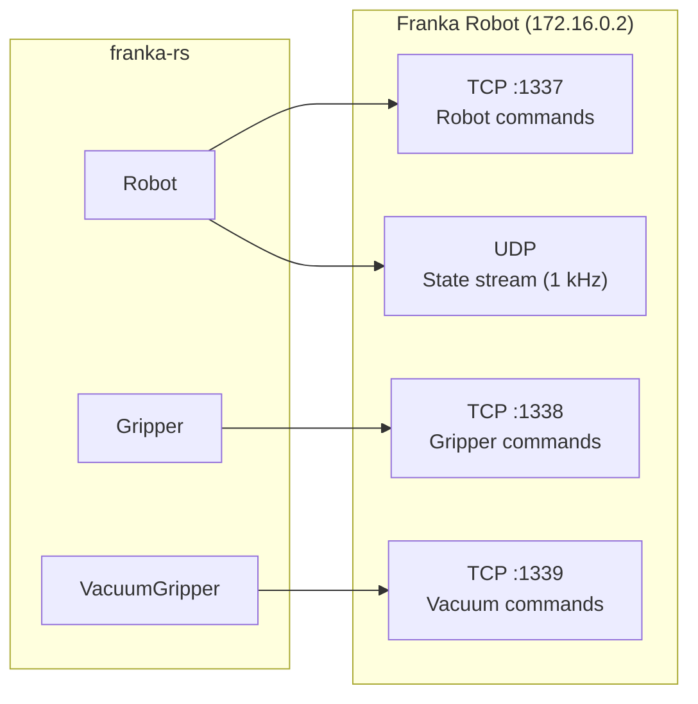

# Gripper & Vacuum Gripper

## Parallel Gripper

### Overview

The `Gripper` struct interfaces with the Franka parallel gripper over TCP (port 1338). It supports homing, grasping, moving, and state reading.



### Connection

```rust
use franka_rs::gripper::Gripper;

let mut gripper = Gripper::connect("172.16.0.2")?;
println!("Gripper protocol version: {}", gripper.server_version());
```

### Homing

Calibrates the gripper by measuring max opening width. Required after changing fingers:

```rust
let success = gripper.homing()?;
```

### Grasping

```rust
let grasped = gripper.grasp(
    0.04,   // target width: 40mm
    0.1,    // speed: 0.1 m/s
    60.0,   // force: 60 N
    0.005,  // epsilon_inner: 5mm tolerance
    0.005,  // epsilon_outer: 5mm tolerance
)?;

if grasped {
    println!("Object secured");
}
```

Grasp detection: object is considered grasped when measured width `d` satisfies:

```
(width - epsilon_inner) < d < (width + epsilon_outer)
```

### Moving

```rust
gripper.move_fingers(0.08, 0.1)?;  // Open to 80mm at 0.1 m/s
gripper.move_fingers(0.00, 0.05)?; // Close fully at 0.05 m/s
```

### Reading State

```rust
let state = gripper.read_once()?;
println!("Width: {:.3} m", state.width);
println!("Max width: {:.3} m", state.max_width);
println!("Grasped: {}", state.is_grasped);
println!("Temperature: {} C", state.temperature);
```

### `GripperState` Fields

| Field | Type | Description |
|-------|------|-------------|
| `width` | `f64` | Current opening width (m) |
| `max_width` | `f64` | Maximum opening width from homing (m) |
| `is_grasped` | `bool` | Whether an object is currently grasped |
| `temperature` | `u16` | Gripper temperature (degrees C) |

---

## Vacuum Gripper

### Overview

The `VacuumGripper` interfaces with the Franka cobot pump over TCP (port 1339). It supports vacuum activation, drop-off, and state monitoring.



### Connection

```rust
use franka_rs::vacuum_gripper::VacuumGripper;

let mut vacuum = VacuumGripper::connect("172.16.0.2")?;
```

### Vacuum Profiles

| Profile | Behavior |
|---------|----------|
| `P0` | Slow vacuum build-up, energy saving |
| `P1` | Medium vacuum |
| `P2` | Fast vacuum build-up |
| `P3` | Maximum suction power |

### Pick and Place

```rust
use franka_rs::vacuum_gripper::{VacuumGripper, VacuumProfile};
use std::time::Duration;

let mut vacuum = VacuumGripper::connect("172.16.0.2")?;

// Pick up — activate vacuum
let attached = vacuum.vacuum(
    50,                        // vacuum setpoint (10 * mbar)
    Duration::from_secs(3),    // timeout
    VacuumProfile::P2,         // fast build-up
)?;

if attached {
    let state = vacuum.read_once()?;
    println!("Part present: {}", state.part_present);
    println!("Vacuum: {} mbar", state.vacuum);
}

// Place — release vacuum
vacuum.drop_off(Duration::from_secs(2))?;
```

### `VacuumGripperState` Fields

| Field | Type | Description |
|-------|------|-------------|
| `in_control_range` | `bool` | Vacuum is within setpoint range |
| `part_detached` | `bool` | Part released after suction cycle |
| `part_present` | `bool` | Vacuum above H2 threshold (part detected) |
| `device_status` | `VacuumDeviceStatus` | Device health indicator |
| `actual_power` | `u16` | Current power consumption (%) |
| `vacuum` | `u16` | Current vacuum level (mbar) |

### `VacuumDeviceStatus`

| Status | Meaning |
|--------|---------|
| `Green` | Working optimally |
| `Yellow` | Working with warnings |
| `Orange` | Working with severe warnings |
| `Red` | Not working properly |

---

## Port Summary


