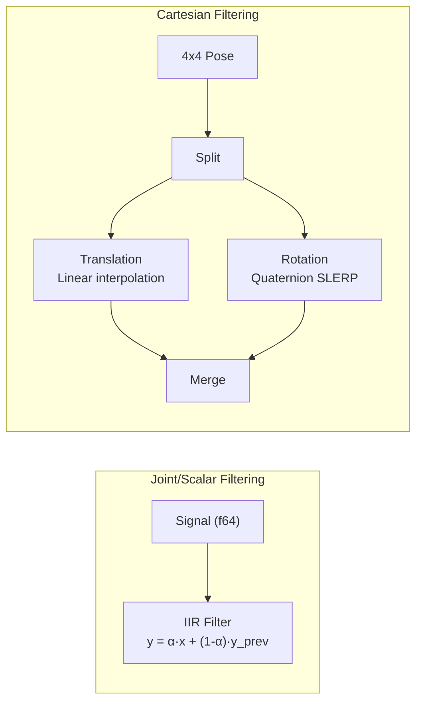
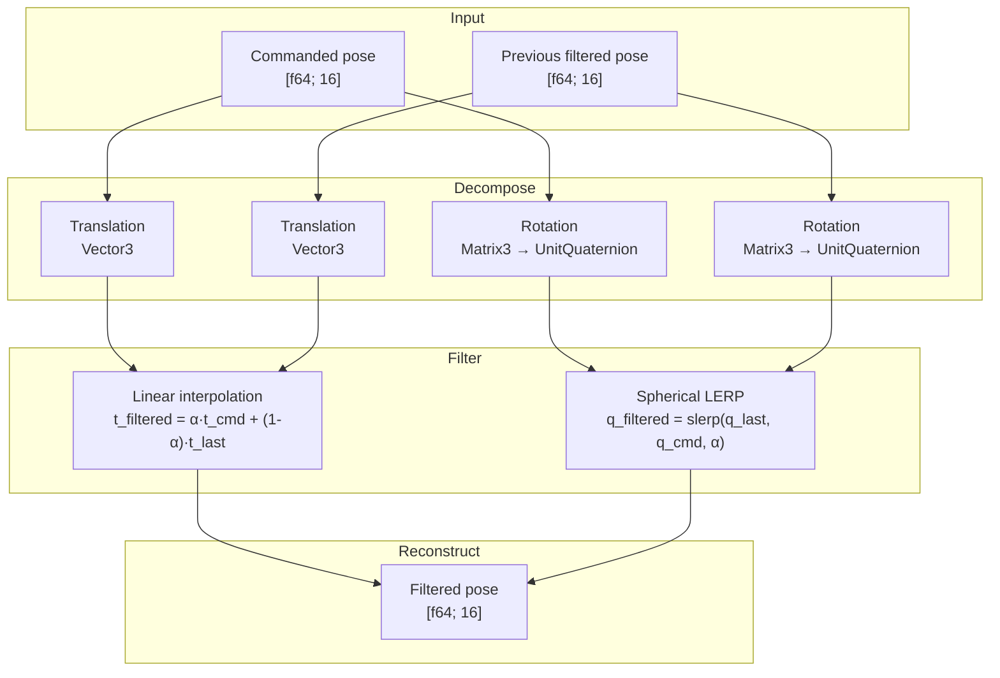

# Low-Pass Filter

## Overview

The `lowpass_filter` module provides first-order IIR low-pass filtering for smoothing control commands before transmission to the robot. It handles both scalar/joint-level signals (standard IIR) and Cartesian transformations (SLERP for rotation).



## Constants

| Constant | Value | Description |
|----------|-------|-------------|
| `MAX_CUTOFF_FREQUENCY` | 1000.0 Hz | Above this, filter is bypassed |
| `DEFAULT_CUTOFF_FREQUENCY` | 100.0 Hz | Default cutoff frequency |

## Filter Gain

The filter uses a first-order IIR with gain:

```
α = Δt / (Δt + 1 / (2π · f_c))
```

Where:
- `Δt` = sample time (0.001 s at 1 kHz)
- `f_c` = cutoff frequency (Hz)

| Cutoff (Hz) | α (gain) | Behavior |
|-------------|----------|----------|
| 0.001 | ~0.000006 | Nearly holds previous value |
| 10 | ~0.059 | Heavy smoothing |
| 100 | ~0.386 | Moderate smoothing (default) |
| 1000 | ~0.863 | Light smoothing |
| 100,000 | ~0.998 | Nearly passthrough |

## Public Functions

### `lowpass_filter`

Single scalar value:

```rust
let filtered = lowpass_filter(
    0.001,   // sample_time (1 kHz)
    10.0,    // current value
    5.0,     // previous filtered value
    100.0,   // cutoff frequency (Hz)
);
// filtered ≈ 0.386 * 10.0 + 0.614 * 5.0 ≈ 6.93
```

### `lowpass_filter_joints`

All 7 joints in one call:

```rust
let filtered = lowpass_filter_joints(
    0.001,           // sample_time
    &commanded,      // current [f64; 7]
    &last_filtered,  // previous [f64; 7]
    100.0,           // cutoff frequency
);
```

### `cartesian_lowpass_filter`

Filters a 4x4 homogeneous transformation matrix with proper SO(3) handling:

```rust
let filtered = cartesian_lowpass_filter(
    0.001,           // sample_time
    &commanded_pose, // current [f64; 16] column-major
    &last_pose,      // previous [f64; 16] column-major
    100.0,           // cutoff frequency
);
```

## Cartesian Filter Detail

The Cartesian filter separates translation and rotation to avoid gimbal lock and ensure smooth interpolation:



**Why SLERP?** Linear interpolation of rotation matrices produces non-orthogonal matrices (not valid rotations). Quaternion SLERP maintains unit quaternion constraint, producing valid rotations with constant angular velocity along the interpolation path.

## Usage in the Control Loop

The filter is applied automatically during `run_motion_loop` / `run_torque_loop` when `cutoff_frequency < MAX_CUTOFF_FREQUENCY` (1000 Hz):

```rust
// Filter enabled (default: 100 Hz cutoff)
let config = MotionConfig::default();

// Filter disabled (set cutoff to max)
let config = MotionConfig::default()
    .with_cutoff_frequency(1000.0);

// Heavy filtering (10 Hz cutoff)
let config = MotionConfig::default()
    .with_cutoff_frequency(10.0);
```

## Interaction with Rate Limiting

The filter is applied **before** rate limiting in the pipeline:

```
User command → Low-pass filter → Rate limiter → Send to robot
```

This order ensures that:
1. High-frequency noise is removed first
2. Rate limiting acts on the smoothed signal
3. The final command is both smooth and within hardware limits
