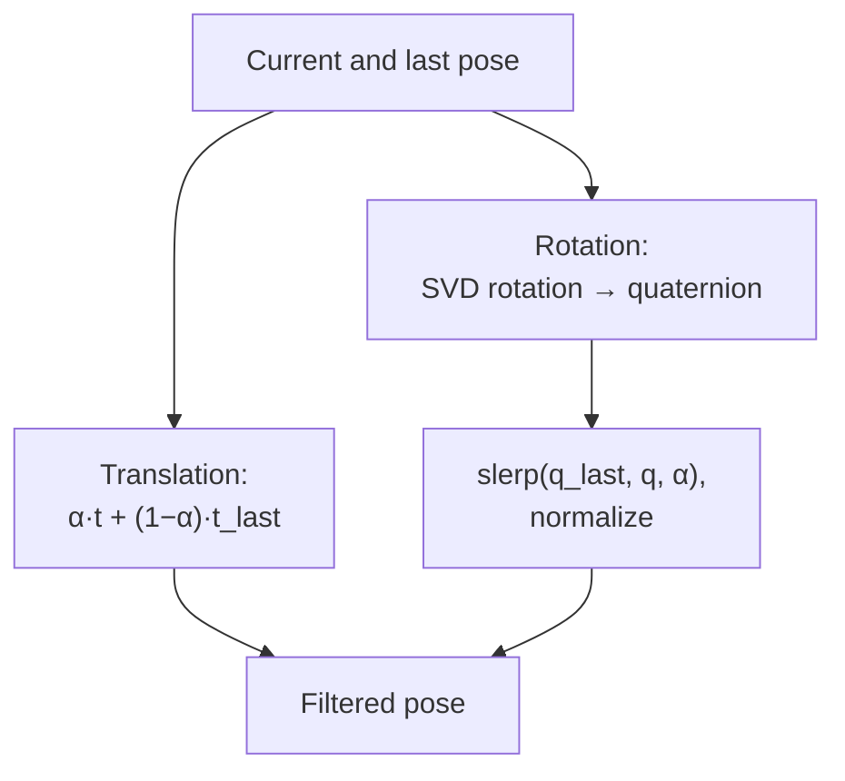

# Low-Pass Filter

`lowpass_filter` ports libfranka's first-order low-pass filter. Outputs are bit-identical to
libfranka 0.21.3 as built on the test machine (`tests/computation_test.rs`; another libfranka
build can round differently).

Each function returns `FrankaError::InvalidArgument` for a negative or non-finite sample time, a
cutoff that is not positive and finite, or a non-finite current or last value (for poses, any of
the 16). All return `FrankaResult`.

## Gain

```
y = α · x + (1 − α) · y_last,    α = Δt / (Δt + 1 / (2π · f_c))
```

| Cutoff `f_c` | α (Δt = 1 ms) |
|--------------|---------------|
| 10 Hz | ≈ 0.059 |
| 100 Hz (`DEFAULT_CUTOFF_FREQUENCY`) | ≈ 0.386 |
| 1000 Hz (`MAX_CUTOFF_FREQUENCY`) | ≈ 0.863 — the control loops filter only below this |

## Functions

```rust
let y = lowpass_filter(0.001, 10.0, 5.0, 100.0)?;                 // ≈ 6.93
let q = lowpass_filter_joints(0.001, &commanded, &last, 100.0)?;  // per joint
let pose = cartesian_lowpass_filter(0.001, &commanded_pose, &last_pose, 100.0)?; // [f64; 16]
```

## Cartesian Filter


```mermaid
flowchart TB
    IN["Current and last pose"] --> T["Translation:<br/>α·t + (1−α)·t_last"]
    IN --> R["Rotation:<br/>SVD rotation → quaternion"]
    R --> S["slerp(q_last, q, α),<br/>normalize"]
    T --> OUT["Filtered pose"]
    S --> OUT
```

Each rotation is taken as Eigen's `Affine3d::rotation()` does (polar decomposition by a Jacobi
SVD); `eigen_compat` reproduces this arithmetic exactly. Slerp keeps the rotation valid, which
element-wise interpolation of matrices would not. The result keeps the current pose's other
entries, including its last row.

## In the Control Loops

Filtering runs when `cutoff_frequency < MAX_CUTOFF_FREQUENCY` (NaN skips it), before rate
limiting and the final checks. The last value is the robot's last commanded value from the state
(on the first cycle of a joint position or pose motion, the command itself). Active control does
not filter.

```rust
let config = MotionConfig::default().with_cutoff_frequency(10.0);   // heavy smoothing
let config = MotionConfig::default().with_cutoff_frequency(1000.0); // off
```
