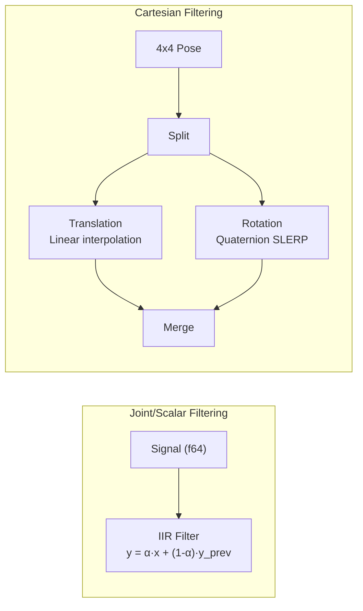
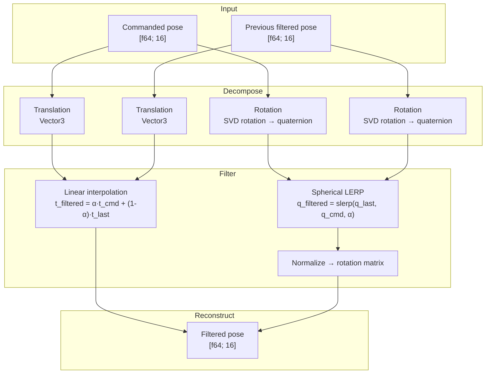

# Low-Pass Filter

## Overview

The `lowpass_filter` module provides libfranka's first-order low-pass filter for smoothing control commands before transmission to the robot. It handles scalar and joint-level signals, and Cartesian transformations (slerp for rotation). Its outputs are bit-identical to libfranka 0.21.3 as built on the test machine (another libfranka build can round differently) (`tests/computation_test.rs`).

Every function checks its inputs, as libfranka's do, and returns `FrankaError::InvalidArgument` for a negative or non-finite sample time, a cutoff frequency that is not positive and finite, or a non-finite current or last value (for poses, any of the 16 values). All return `FrankaResult`.


```mermaid
flowchart LR
    subgraph "Joint/Scalar Filtering"
        direction TB
        JS["Signal (f64)"] --> IIR["IIR Filter<br/>y = α·x + (1-α)·y_prev"]
    end

    subgraph "Cartesian Filtering"
        direction TB
        MAT["4x4 Pose"] --> SPLIT["Split"]
        SPLIT --> TRANS["Translation<br/>Linear interpolation"]
        SPLIT --> ROT["Rotation<br/>Quaternion SLERP"]
        TRANS --> MERGE["Merge"]
        ROT --> MERGE
    end
```

## Constants

| Constant | Value | Description |
|----------|-------|-------------|
| `MAX_CUTOFF_FREQUENCY` | 1000.0 Hz | The control loops filter only when the cutoff is below this (a NaN cutoff also skips the filter) |
| `DEFAULT_CUTOFF_FREQUENCY` | 100.0 Hz | Default cutoff frequency |

## Filter Gain

The filter uses a first-order IIR with gain:

```
α = Δt / (Δt + 1 / (2π · f_c))
```

Where:
- `Δt` = sample time (0.001 s at 1 kHz)
- `f_c` = cutoff frequency (Hz)

| Cutoff (Hz) | α (gain) | Behavior |
|-------------|----------|----------|
| 0.001 | ~0.000006 | Nearly holds previous value |
| 10 | ~0.059 | Heavy smoothing |
| 100 | ~0.386 | Moderate smoothing (default) |
| 1000 | ~0.863 | (Not applied in the control loops) |
| 100,000 | ~0.998 | Nearly passthrough |

## Public Functions

### `lowpass_filter`

Single scalar value:

```rust
let filtered = lowpass_filter(
    0.001,   // sample_time (1 kHz)
    10.0,    // current value
    5.0,     // last value
    100.0,   // cutoff frequency (Hz)
)?;
// filtered ≈ 0.386 * 10.0 + 0.614 * 5.0 ≈ 6.93
```

### `lowpass_filter_joints`

All 7 joints in one call:

```rust
let filtered = lowpass_filter_joints(
    0.001,           // sample_time
    &commanded,      // current [f64; 7]
    &last,           // last [f64; 7]
    100.0,           // cutoff frequency
)?;
```

### `cartesian_lowpass_filter`

Filters a 4x4 homogeneous transformation matrix with proper SO(3) handling:

```rust
let filtered = cartesian_lowpass_filter(
    0.001,           // sample_time
    &commanded_pose, // current [f64; 16] column-major
    &last_pose,      // last [f64; 16] column-major
    100.0,           // cutoff frequency
)?;
```

## Cartesian Filter Detail

The Cartesian filter separates translation and rotation. Each rotation is taken as Eigen's `Affine3d::rotation()` does (polar decomposition by a Jacobi SVD) and converted to a quaternion; the result is normalized and converted back. This arithmetic, in `eigen_compat`, reproduces libfranka's exactly. The result keeps the current pose's other entries, including its last row:


```mermaid
flowchart TD
    subgraph "Input"
        CMD["Commanded pose<br/>[f64; 16]"]
        LAST["Previous filtered pose<br/>[f64; 16]"]
    end

    subgraph "Decompose"
        CMD --> CMD_T["Translation<br/>Vector3"]
        CMD --> CMD_R["Rotation<br/>SVD rotation → quaternion"]
        LAST --> LAST_T["Translation<br/>Vector3"]
        LAST --> LAST_R["Rotation<br/>SVD rotation → quaternion"]
    end

    subgraph "Filter"
        CMD_T --> LERP["Linear interpolation<br/>t_filtered = α·t_cmd + (1-α)·t_last"]
        LAST_T --> LERP
        CMD_R --> SLERP["Spherical LERP<br/>q_filtered = slerp(q_last, q_cmd, α)"]
        LAST_R --> SLERP
        SLERP --> NORM["Normalize → rotation matrix"]
    end

    subgraph "Reconstruct"
        LERP --> OUT["Filtered pose<br/>[f64; 16]"]
        NORM --> OUT
    end
```

**Why SLERP?** Linear interpolation of rotation matrices produces non-orthogonal matrices (not valid rotations). Quaternion SLERP maintains unit quaternion constraint, producing valid rotations with constant angular velocity along the interpolation path.

## Usage in the Control Loop

The control loops (`run_motion_loop`, `run_torque_loop`, `run_motion_with_control_loop`) filter each command when `cutoff_frequency < MAX_CUTOFF_FREQUENCY` (1000 Hz). The last value is the robot's last commanded value from the state (on the first cycle of a joint position or pose motion, the command itself). The active interface does not filter.

```rust
// Filter enabled (default: 100 Hz cutoff)
let config = MotionConfig::default();

// Filter disabled (set cutoff to max)
let config = MotionConfig::default()
    .with_cutoff_frequency(1000.0);

// Heavy filtering (10 Hz cutoff)
let config = MotionConfig::default()
    .with_cutoff_frequency(10.0);
```

## Interaction with Rate Limiting

The filter is applied **before** rate limiting in the pipeline:

```
User command → Low-pass filter → Rate limiter → Final checks → Send to robot
```

This order ensures that:
1. High-frequency noise is removed first
2. Rate limiting acts on the smoothed signal
3. The final command is both smooth and within hardware limits
