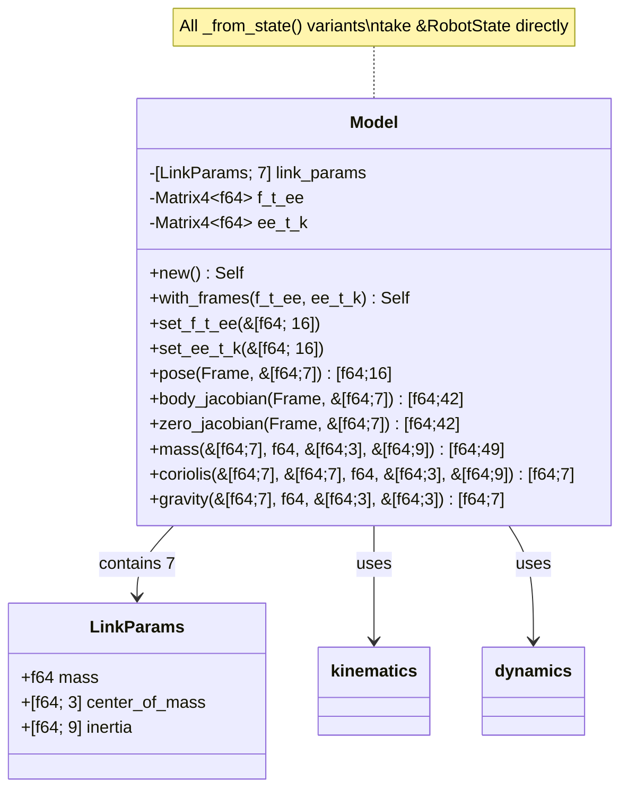
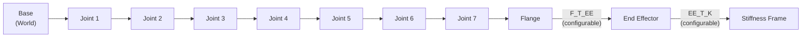
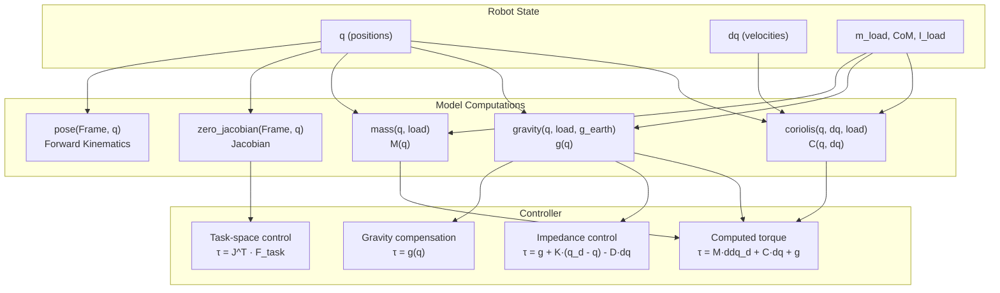

# Model (Kinematics & Dynamics)

## Overview

The `model` module computes the kinematic and dynamic properties of the Franka robot: forward kinematics, Jacobians, mass matrix, Coriolis forces, and gravity compensation. It uses modified Denavit-Hartenberg parameters and identified link inertial parameters.



## Frame Chain



The `Frame` enum selects any frame in this chain for kinematics computation.

## Creating a Model

```rust
use franka_rs::model::Model;

// Default: identity transforms for F_T_EE and EE_T_K
let model = Model::new();

// With custom tool transform
let f_t_ee: [f64; 16] = /* your tool frame */;
let ee_t_k: [f64; 16] = /* your stiffness frame */;
let model = Model::with_frames(&f_t_ee, &ee_t_k);

// Modify after creation
let mut model = Model::new();
model.set_f_t_ee(&f_t_ee);
model.set_ee_t_k(&ee_t_k);
```

## Kinematics

### Forward Kinematics (`pose`)

Computes the 4x4 homogeneous transformation (column-major) of any frame:

```rust
let q = [0.0, -0.785, 0.0, -2.356, 0.0, 1.571, 0.785]; // home position
let ee_pose = model.pose(Frame::EndEffector, &q);

// Extract translation
let x = ee_pose[12]; // column-major: translation is indices 12, 13, 14
let y = ee_pose[13];
let z = ee_pose[14];
```

From robot state:
```rust
let state = robot.read_once()?;
let ee_pose = model.pose_from_state(Frame::EndEffector, &state);
```

### Body Jacobian (`body_jacobian`)

6x7 matrix (column-major) mapping joint velocities to a twist expressed **in the target frame**:

```rust
let j_body = model.body_jacobian(Frame::EndEffector, &q);
// j_body is [f64; 42] (6 rows × 7 cols, column-major)
```

### Zero (Spatial) Jacobian (`zero_jacobian`)

6x7 matrix mapping joint velocities to a twist expressed **in the base frame**:

```rust
let j_zero = model.zero_jacobian(Frame::EndEffector, &q);
// Use for task-space control: F_task = J^T * tau
```

## Dynamics

### Mass Matrix (`mass`)

7x7 joint-space inertia matrix (column-major):

```rust
let m = model.mass(&q, load_mass, &load_com, &load_inertia);
// m is [f64; 49] (7×7, column-major)
// M(q) · ddq + C(q, dq) + g(q) = tau
```

### Coriolis Vector (`coriolis`)

7-element Coriolis and centrifugal force vector:

```rust
let c = model.coriolis(&q, &dq, load_mass, &load_com, &load_inertia);
// c is [f64; 7]
```

### Gravity Vector (`gravity`)

7-element gravity compensation torque vector:

```rust
let g = model.gravity(&q, load_mass, &load_com, &[0.0, 0.0, -9.81]);
// g is [f64; 7] — send these torques to hold position
```

## Dynamics Compensation Diagram



## Convenience Methods

Every computation has a `_from_state` variant that extracts parameters from `RobotState`:

| Method | Convenience Variant |
|--------|-------------------|
| `pose(frame, q)` | `pose_from_state(frame, &state)` |
| `body_jacobian(frame, q)` | `body_jacobian_from_state(frame, &state)` |
| `zero_jacobian(frame, q)` | `zero_jacobian_from_state(frame, &state)` |
| `mass(q, m, com, I)` | `mass_from_state(&state)` |
| `coriolis(q, dq, m, com, I)` | `coriolis_from_state(&state)` |
| `gravity(q, m, com, g)` | `gravity_from_state(&state)` |

## Example: Gravity Compensation

```rust
use franka_rs::model::Model;
use franka_rs::types::Torques;
use std::ops::ControlFlow;

let model = Model::new();

robot.control_torques(&config, |state, duration| {
    let gravity = model.gravity_from_state(state);

    if duration.as_secs_f64() >= 10.0 {
        ControlFlow::Break(Torques::new(gravity))
    } else {
        ControlFlow::Continue(Torques::new(gravity))
    }
})?;
```
