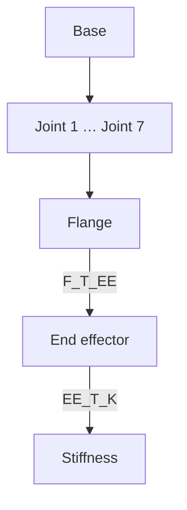

# Model (Kinematics & Dynamics)

`model` computes frame poses, Jacobians, mass matrix, Coriolis and gravity terms from the robot's
URDF, as libfranka's `Model` does (libfranka uses pinocchio on the same URDF). Outputs are compared
with libfranka's and pinocchio's in `validation/data/model_cases.txt`.

```rust
use franka_rs::model::{Model, RobotModel};

let model = robot.load_model()?;            // URDF from the robot
let model = Model::from_urdf(&urdf_text)?;  // or from a URDF document
```

`from_urdf` returns `FrankaError::Model` unless the URDF is a serial arm of seven revolute joints
ending in a `link8` flange. The methods belong to the `RobotModel` trait, which must be imported.

## Methods

| Method | Output |
|--------|--------|
| `pose(frame, q, f_t_ee, ee_t_k)` | `Isometry3<f64>` |
| `zero_jacobian(frame, q, f_t_ee, ee_t_k)` | `Jacobian` (6×7): linear then angular velocity, base-frame axes |
| `body_jacobian(frame, q, f_t_ee, ee_t_k)` | `Jacobian` (6×7): twist in the frame itself |
| `mass(q, payload)` | `MassMatrix` (7×7, kg·m²) |
| `coriolis(q, dq, payload)` | `JointVector` (N·m) |
| `coriolis_matrix(q, dq, payload)` | `CoriolisMatrix` (7×7), with `C · dq == coriolis` |
| `gravity(q, payload, gravity)` | `JointVector` (N·m) |
| `*_from_state(…, &state)` | the same at the measured state |

- `q`, `dq` are `JointVector` (`SVector<f64, 7>`; `.into()` converts to and from `[f64; 7]`).
- `payload` is a `RigidBodyInertia` (`mass`, `center_of_mass`, `rotational_inertia` about the
  center of mass, flange frame); `new`, `zero`, `combine`, `transformed` (re-expressed in a parent frame).
- `*_from_state` take `F_T_EE`/`EE_T_K` from the state, the payload from its configured end
  effector and load combined (`RobotState::total_load`), and gravity from `o_ddp_o`.

## Frames


```mermaid
flowchart TB
    B["Base"] --> J["Joint 1 … Joint 7"] --> F["Flange"]
    F -- "F_T_EE" --> E["End effector"]
    E -- "EE_T_K" --> K["Stiffness"]
```

`Frame` selects `Joint1`…`Joint7`, `Flange`, `EndEffector` or `Stiffness`.

## Example

```rust
let state = robot.read_once()?;
let position = model.pose_from_state(Frame::EndEffector, &state).translation.vector;
let jacobian = model.zero_jacobian_from_state(Frame::EndEffector, &state);
let mass = model.mass_from_state(&state);
let c = model.coriolis_matrix_from_state(&state);

let q = JointVector::from(state.q);
let payload = RigidBodyInertia::new(0.5, Vector3::new(0.0, 0.0, 0.05), Matrix3::from_diagonal_element(0.001));
let gravity = model.gravity(&q, &payload, &Vector3::new(0.0, 0.0, -9.81));
```

Torque commands are **without gravity** — the robot compensates it — so the gravity torque is for
analysis, not for adding to commands (see [Torque Control](../torque-control.md)).

## Coriolis Matrix

A Coriolis matrix is not unique. `coriolis_matrix` is pinocchio's `computeCoriolisMatrix` (the
matrix libfranka's deprecated `coriolis` overload multiplies by dq; libfranka does not expose
it). Tests compare it with pinocchio on the robot's URDF (to rounding level) and check
`C · dq == coriolis`, `C == 0` at rest, and that `Ṁ − 2C` is skew-symmetric.
