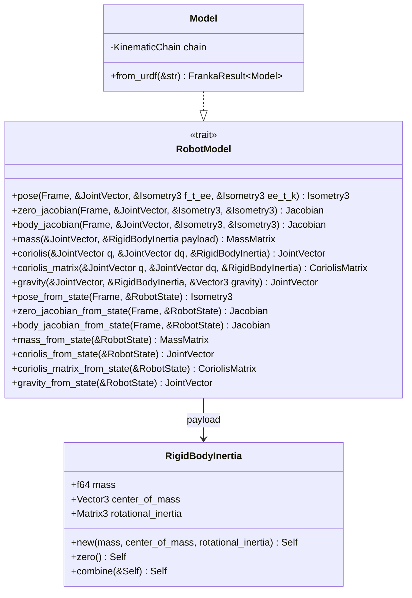

# Model (Kinematics & Dynamics)

## Overview

The `model` module computes the arm's kinematic and dynamic quantities — frame poses, Jacobians,
mass matrix, Coriolis and gravity torques — from the robot's URDF, as libfranka's `Model` does
(libfranka builds its model from the same URDF with pinocchio). Its outputs are compared with
libfranka's in `validation/data/model_cases.txt`.


```mermaid
classDiagram
    class RobotModel {
        <<trait>>
        +pose(Frame, &JointVector, &Isometry3 f_t_ee, &Isometry3 ee_t_k) Isometry3
        +zero_jacobian(Frame, &JointVector, &Isometry3, &Isometry3) Jacobian
        +body_jacobian(Frame, &JointVector, &Isometry3, &Isometry3) Jacobian
        +mass(&JointVector, &RigidBodyInertia payload) MassMatrix
        +coriolis(&JointVector q, &JointVector dq, &RigidBodyInertia) JointVector
        +coriolis_matrix(&JointVector q, &JointVector dq, &RigidBodyInertia) CoriolisMatrix
        +gravity(&JointVector, &RigidBodyInertia, &Vector3 gravity) JointVector
        +pose_from_state(Frame, &RobotState) Isometry3
        +zero_jacobian_from_state(Frame, &RobotState) Jacobian
        +body_jacobian_from_state(Frame, &RobotState) Jacobian
        +mass_from_state(&RobotState) MassMatrix
        +coriolis_from_state(&RobotState) JointVector
        +coriolis_matrix_from_state(&RobotState) CoriolisMatrix
        +gravity_from_state(&RobotState) JointVector
    }

    class Model {
        -KinematicChain chain
        +from_urdf(&str) FrankaResult~Model~
    }

    class RigidBodyInertia {
        +f64 mass
        +Vector3 center_of_mass
        +Matrix3 rotational_inertia
        +new(mass, center_of_mass, rotational_inertia) Self
        +zero() Self
        +combine(&Self) Self
    }

    Model ..|> RobotModel
    RobotModel --> RigidBodyInertia : payload
```

Type aliases: `JointVector` = `SVector<f64, 7>`, `Jacobian` = 6×7 matrix (linear velocity rows,
then angular velocity rows), `MassMatrix` and `CoriolisMatrix` = 7×7 matrices.

## Frame Chain


```mermaid
flowchart LR
    BASE["Base"] --> J1["Joint 1"] --> J2["Joint 2"] --> J3["Joint 3"] --> J4["Joint 4"] --> J5["Joint 5"] --> J6["Joint 6"] --> J7["Joint 7"] --> FL["Flange"]
    FL -->|"F_T_EE"| EE["End Effector"]
    EE -->|"EE_T_K"| K["Stiffness Frame"]
```

The `Frame` enum selects any frame in this chain. `F_T_EE` (end effector in the flange frame) and
`EE_T_K` (stiffness frame in the end-effector frame) are arguments of each call; the
`*_from_state` methods take them from `RobotState::f_t_ee` and `RobotState::ee_t_k`.

## Creating a Model

```rust
use franka_rs::model::{Model, RobotModel};

// From the connected robot's URDF
let model = robot.load_model()?;

// Or from a URDF document
let model = Model::from_urdf(&urdf_text)?;
```

`Model::from_urdf` returns `FrankaError::Model` if the URDF does not describe a serial arm of
seven revolute joints ending in a `link8` flange.

## Forward Kinematics

```rust
use franka_rs::model::RobotModel;
use franka_rs::types::Frame;

let state = robot.read_once()?;
let ee_pose = model.pose_from_state(Frame::EndEffector, &state); // Isometry3<f64>
let position = ee_pose.translation.vector;                       // x, y, z in the base frame
```

## Jacobians

```rust
// Zero Jacobian: the frame's linear and angular velocity in base-frame axes
let j_zero = model.zero_jacobian_from_state(Frame::EndEffector, &state);

// Body Jacobian: the frame's twist expressed in the frame itself
let j_body = model.body_jacobian_from_state(Frame::EndEffector, &state);
```

## Dynamics

The `*_from_state` methods use the state's total load: the end effector (`m_ee`, `f_x_cee`,
`i_ee`) and external load (`m_load`, `f_x_cload`, `i_load`) as configured, combined
(`RobotState::total_load`). `gravity_from_state` uses the state's `o_ddp_o` as the gravity vector.

```rust
let mass = model.mass_from_state(&state);         // 7×7, kg·m²
let coriolis = model.coriolis_from_state(&state); // N·m
let c_matrix = model.coriolis_matrix_from_state(&state); // 7×7, N·m·s; c_matrix * dq == coriolis
let gravity = model.gravity_from_state(&state);   // N·m

// Explicit arguments
use franka_rs::model::{JointVector, RigidBodyInertia};
use nalgebra::{Matrix3, Vector3};

let q = JointVector::from(state.q);
let payload = RigidBodyInertia::new(0.5, Vector3::new(0.0, 0.0, 0.05), Matrix3::from_diagonal_element(0.001));
let gravity = model.gravity(&q, &payload, &Vector3::new(0.0, 0.0, -9.81));
```

Torque commands are **without gravity**: the robot compensates gravity itself, so the model's
gravity torque is for analysis, not to be added to commands (see [Torque Control](../torque-control.md)).

### Coriolis Matrix

`coriolis_matrix` returns C(q, dq) with C(q, dq)·dq equal to `coriolis(q, dq)`. A Coriolis matrix
is not unique; franka-rs uses pinocchio's `computeCoriolisMatrix` (the matrix libfranka's
deprecated `coriolis` overload multiplies by dq; libfranka does not expose it). The tests compare
it with pinocchio on the robot's URDF (the `coriolis_matrix` cases in
`validation/data/model_cases.txt`, at rounding level, and one fixed case in the tests themselves)
and check that C·dq equals `coriolis`, that C is zero at rest, and that Ṁ − 2C is skew-symmetric.

## Method Summary

| Method | Inputs | Output |
|--------|--------|--------|
| `pose(frame, q, f_t_ee, ee_t_k)` | Frame, joint positions, frame offsets | `Isometry3<f64>` |
| `zero_jacobian(frame, q, f_t_ee, ee_t_k)` | Same | `Jacobian` (6×7) |
| `body_jacobian(frame, q, f_t_ee, ee_t_k)` | Same | `Jacobian` (6×7) |
| `mass(q, payload)` | Joint positions, payload | `MassMatrix` (7×7) |
| `coriolis(q, dq, payload)` | Joint positions and velocities, payload | `JointVector` |
| `coriolis_matrix(q, dq, payload)` | Joint positions and velocities, payload | `CoriolisMatrix` (7×7) |
| `gravity(q, payload, gravity)` | Joint positions, payload, gravity vector | `JointVector` |
| `*_from_state(...)` | `&RobotState` (and a frame) | As above, at the measured state |

A `JointVector` converts to `[f64; 7]` with `.into()`.
