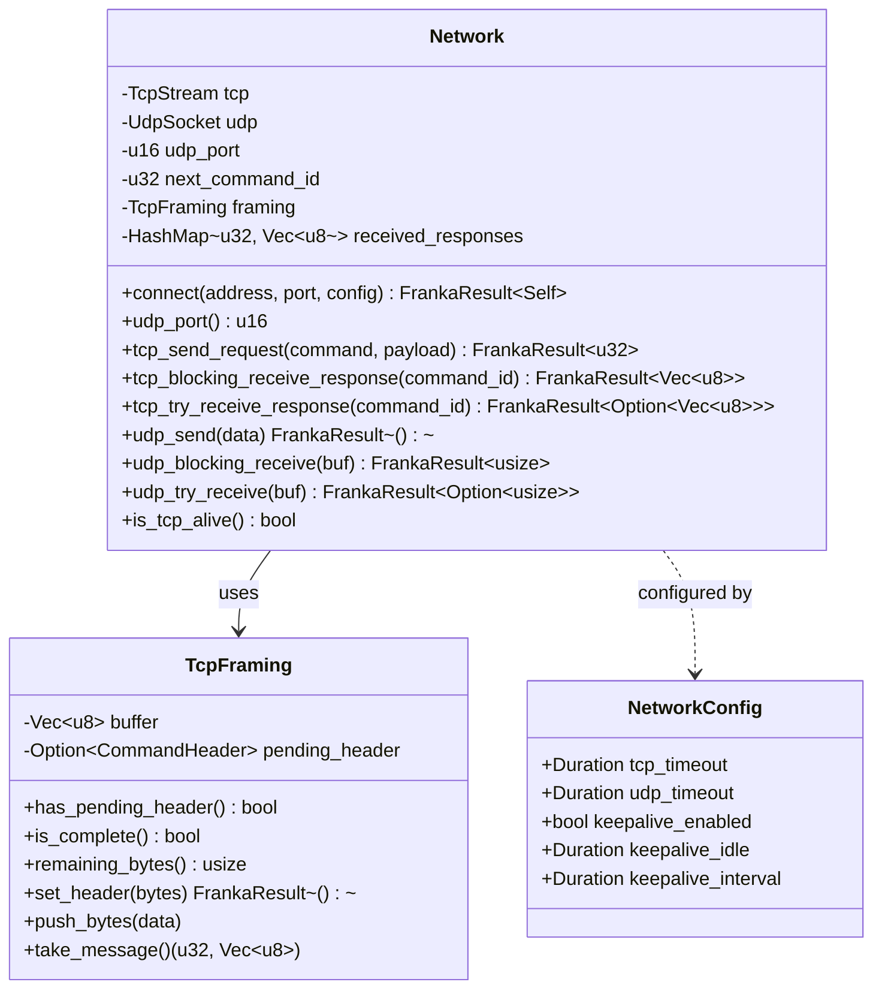
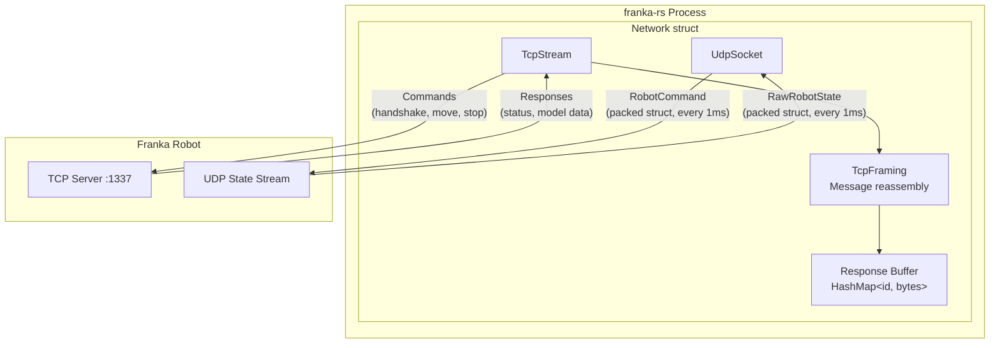
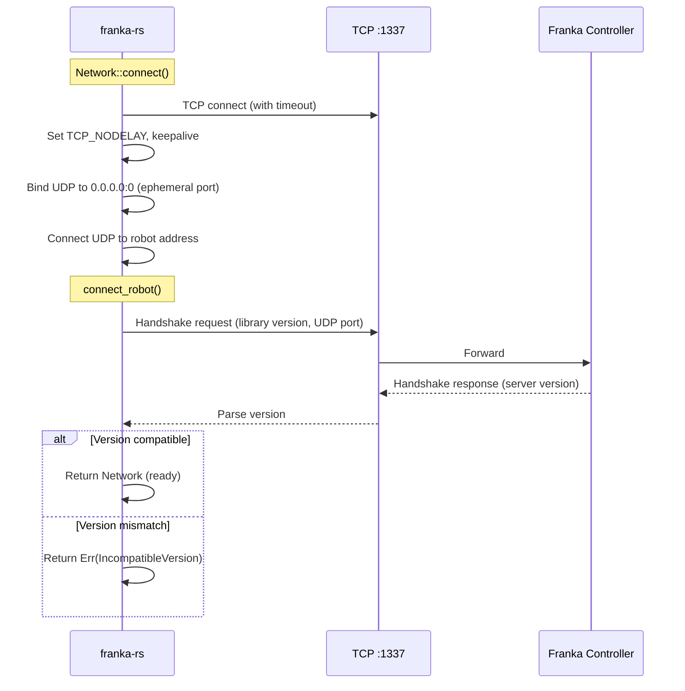

# Network Layer

## Overview

The `network` module manages all TCP and UDP communication with the Franka robot. It implements:

- TCP connection with keepalive and timeout configuration
- Message framing (length-prefixed) for the TCP command channel
- UDP socket for high-frequency (1 kHz) state and command exchange
- Protocol version handshake for robot, gripper, and vacuum gripper



## Architecture



## `NetworkConfig`

Configuration for the network connection:

```rust
use franka_rs::network::NetworkConfig;
use std::time::Duration;

let config = NetworkConfig {
    tcp_timeout: Duration::from_secs(5),
    udp_timeout: Duration::from_millis(10),
    keepalive_enabled: true,
    keepalive_idle: Duration::from_secs(1),
    keepalive_interval: Duration::from_secs(3),
};
```

| Field | Default | Description |
|-------|---------|-------------|
| `tcp_timeout` | 1000 ms | Read/write timeout for TCP socket |
| `udp_timeout` | 1000 ms | Receive timeout for UDP socket |
| `keepalive_enabled` | `true` | Enable TCP keepalive probes |
| `keepalive_idle` | 1 s | Time before first keepalive probe |
| `keepalive_interval` | 3 s | Interval between keepalive probes |

## Connection Flow



## TCP Command Protocol

All TCP messages use a common header:

```
┌──────────────────────────────────────��──────────┐
│ CommandHeader (12 bytes)                         │
├──────────┬──────────────┬───────────────────────┤
│ command  │ command_id   │ size                   │
│ (u32)    │ (u32)       │ (u32, total msg size)  │
├──────────┴──────────────┴───────────────────────┤
│ Payload (variable length)                        │
└──────────────────────────────────────────────────┘
```

The `command_id` field allows multiplexed request/response matching — responses can arrive out of order and are buffered in `received_responses` until claimed.

## UDP Protocol

The UDP channel carries two packed struct types at 1 kHz:

| Direction | Struct | Approximate Size |
|-----------|--------|-----------------|
| Robot → App | `RawRobotState` | ~2 KB |
| App → Robot | `RobotCommand` | ~300 bytes |

The UDP socket is "connected" (via `UdpSocket::connect`) so that `send`/`recv` can be used without per-packet address specification.

## Public Functions

### `connect_robot`

Performs the version handshake with the robot controller. Returns the server protocol version.

### `connect_gripper`

Performs handshake with the parallel gripper (port 1338).

### `connect_vacuum_gripper`

Performs handshake with the vacuum gripper (port 1339).

## Resource Cleanup

`Network` implements `Drop` to cleanly shut down the TCP connection:

```rust
impl Drop for Network {
    fn drop(&mut self) {
        let _ = self.tcp.shutdown(std::net::Shutdown::Both);
    }
}
```

This ensures the robot controller is notified when the connection is closed, preventing stale session state.
