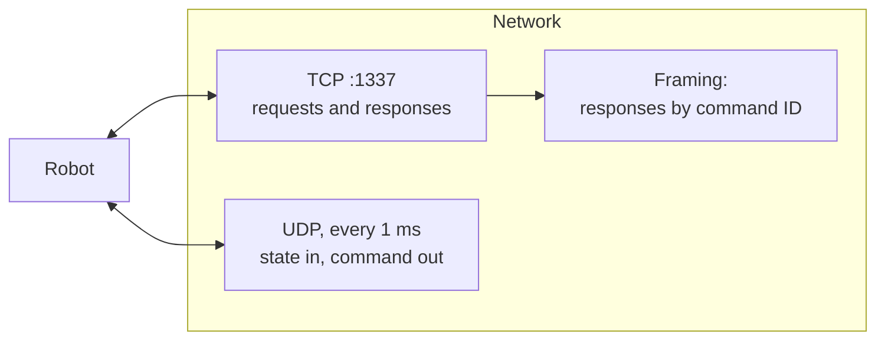

# Network Layer

`Network` owns the TCP command connection and the UDP state/command socket.

```mermaid
flowchart LR
    R["Robot"]
    subgraph N["Network"]
        TCP["TCP :1337<br/>requests and responses"] --> FR["Framing:<br/>responses by command ID"]
        UDP["UDP, every 1 ms<br/>state in, command out"]
    end
    R <--> TCP
    R <--> UDP
```

## Connection

`Network::connect(address, port, &NetworkConfig)`:
1. TCP connect with timeout; `TCP_NODELAY`, keepalive, read/write timeouts.
2. Bind an unconnected UDP socket on `0.0.0.0:0` (`[::]:0` for IPv6).

`connect_robot`, `connect_gripper` and `connect_vacuum_gripper` then send the Connect request
(protocol version, UDP port) and return the server version, or `IncompatibleVersion`.

| `NetworkConfig` field | Default |
|-------|---------|
| `tcp_timeout`, `udp_timeout` | 1000 ms |
| `keepalive_enabled` | `true` |
| `keepalive_idle`, `keepalive_interval` | 1 s, 3 s |

`Robot` always uses `NetworkConfig::default()`.

## TCP

Robot messages are a 12-byte header — `command`, `command_id`, `size` (total), each `u32` —
followed by the payload. `tcp_send_request` writes header and payload in one write and returns the
command ID; responses are matched by ID and buffered until claimed
(`tcp_blocking_receive_response`, `tcp_try_receive_response`). Framing keeps partial headers
across non-blocking reads and reserves at most 64 KiB before a message's bytes arrive.

`Network<H>` is generic over the header type (internal `MessageHeader` trait): `Network` (the default) uses the
robot's; `Gripper` and `VacuumGripper` use `Network::<H>::connect_with_header` with their protocols'
10-byte header (`command: u16`, `command_id`, `size`).

## UDP

| Direction | Struct | Size |
|-----------|--------|------|
| Robot → franka-rs | `RawRobotState` | 1377 bytes (exact; other sizes → `Protocol`) |
| franka-rs → Robot | `RobotCommand` | 371 bytes |

The socket stays unconnected because the robot sends from an ephemeral port: datagrams from other
hosts are dropped, and commands go to the address of the latest state (`udp_send` fails before
the first state).

## Non-blocking Reads and Checks

Non-blocking reads use `MSG_DONTWAIT` without changing the socket's mode.
`tcp_throw_if_connection_closed` peeks (`MSG_PEEK`) to detect a closed connection;
`is_tcp_alive` polls for errors without clearing them. `Network` also records the latest state's
message ID and modes and the running Move's modes, which the control loop uses as libfranka's
`Robot::Impl` does. Dropping `Network` shuts the TCP connection down.
