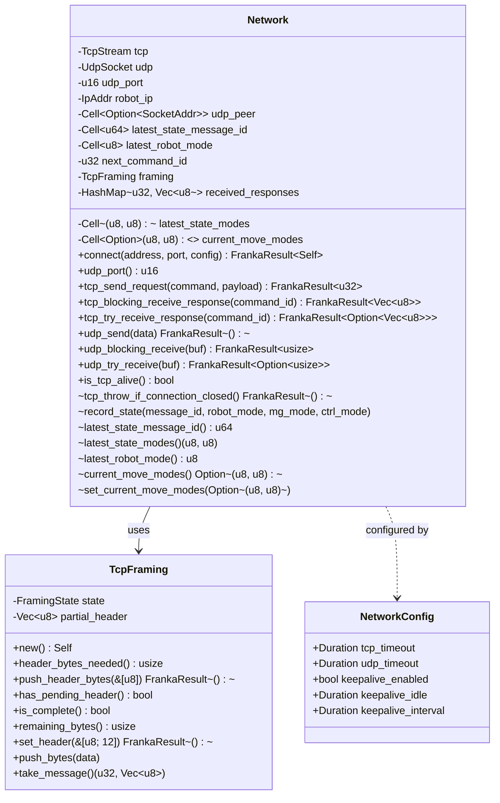
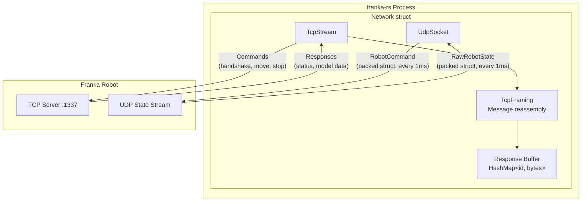
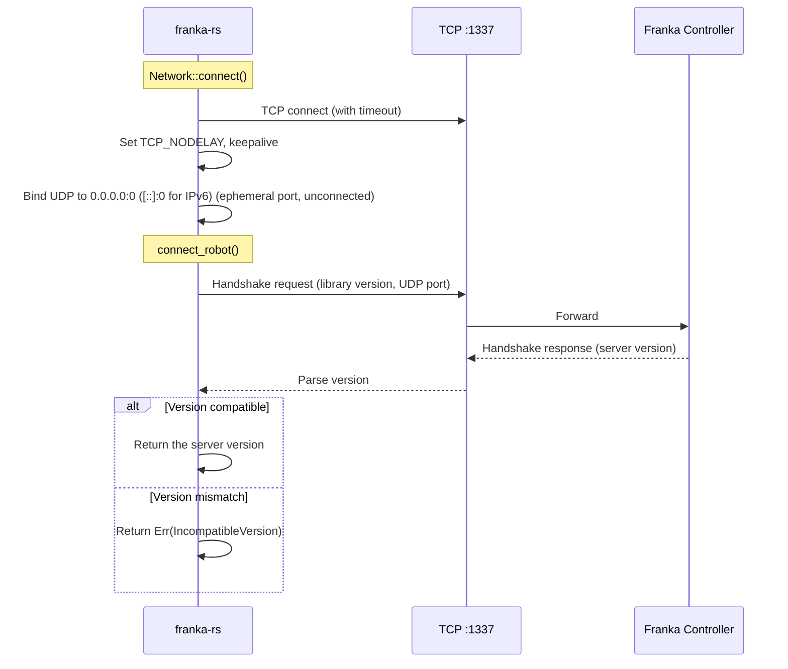

# Network Layer

## Overview

The `network` module manages all TCP and UDP communication with the Franka robot. It implements:

- TCP connection with keepalive and timeout configuration
- Message framing (length-prefixed) for the TCP command channel, robust to split headers
- An unconnected UDP socket for the 1 kHz state and command exchange, accepting datagrams from
  the robot's address only
- Non-blocking reads and the connection check by socket flags (`MSG_DONTWAIT`, `MSG_PEEK`),
  without switching the socket's blocking mode
- The motion bookkeeping libfranka keeps in `Robot::Impl`: the latest state's message ID and modes,
  and the running Move's modes
- Protocol version handshake for robot, gripper, and vacuum gripper


```mermaid
classDiagram
    class Network {
        -TcpStream tcp
        -UdpSocket udp
        -u16 udp_port
        -IpAddr robot_ip
        -Cell~Option~SocketAddr~~ udp_peer
        -Cell~u64~ latest_state_message_id
        -Cell~(u8, u8)~ latest_state_modes
        -Cell~u8~ latest_robot_mode
        -Cell~Option~(u8, u8)~~ current_move_modes
        -u32 next_command_id
        -TcpFraming framing
        -HashMap~u32, Vec~u8~~ received_responses
        +connect(address, port, config) FrankaResult~Self~
        +udp_port() u16
        +tcp_send_request(command, payload) FrankaResult~u32~
        +tcp_blocking_receive_response(command_id) FrankaResult~Vec~u8~~
        +tcp_try_receive_response(command_id) FrankaResult~Option~Vec~u8~~~
        +udp_send(data) FrankaResult~()~
        +udp_blocking_receive(buf) FrankaResult~usize~
        +udp_try_receive(buf) FrankaResult~Option~usize~~
        +is_tcp_alive() bool
        ~tcp_throw_if_connection_closed() FrankaResult~()~
        ~record_state(message_id, robot_mode, mg_mode, ctrl_mode)
        ~latest_state_message_id() u64
        ~latest_state_modes() (u8, u8)
        ~latest_robot_mode() u8
        ~current_move_modes() Option~(u8, u8)~
        ~set_current_move_modes(Option~(u8, u8)~)
    }

    class NetworkConfig {
        +Duration tcp_timeout
        +Duration udp_timeout
        +bool keepalive_enabled
        +Duration keepalive_idle
        +Duration keepalive_interval
    }

    class TcpFraming {
        -FramingState state
        -Vec~u8~ partial_header
        +new() Self
        +header_bytes_needed() usize
        +push_header_bytes(&[u8]) FrankaResult~()~
        +has_pending_header() bool
        +is_complete() bool
        +remaining_bytes() usize
        +set_header(&[u8; 12]) FrankaResult~()~
        +push_bytes(data)
        +take_message() (u32, Vec~u8~)
    }

    Network --> TcpFraming : uses
    Network ..> NetworkConfig : configured by
```

Members marked `~` are crate-private. `FramingState` is `Idle` or `Reading { command_id, buffer,
expected_size }`; at most 64 KiB is reserved for a message before its bytes arrive.

## Architecture


```mermaid
flowchart TB
    subgraph "franka-rs Process"
        subgraph "Network struct"
            TCP[TcpStream]
            UDP[UdpSocket]
            FRAME[TcpFraming<br/>Message reassembly]
            RESP[Response Buffer<br/>HashMap&lt;id, bytes&gt;]
        end
    end

    subgraph "Franka Robot"
        TCPS[TCP Server :1337]
        UDPS[UDP State Stream]
    end

    TCP -->|"Commands<br/>(handshake, move, stop)"| TCPS
    TCPS -->|"Responses<br/>(status, model data)"| TCP
    TCP --> FRAME
    FRAME --> RESP

    UDP -->|"RobotCommand<br/>(packed struct, every 1ms)"| UDPS
    UDPS -->|"RawRobotState<br/>(packed struct, every 1ms)"| UDP
```

## `NetworkConfig`

Configuration for the network connection (`Robot` always uses `NetworkConfig::default()`):

```rust
use franka_rs::network::NetworkConfig;
use std::time::Duration;

let config = NetworkConfig {
    tcp_timeout: Duration::from_secs(5),
    udp_timeout: Duration::from_millis(10),
    keepalive_enabled: true,
    keepalive_idle: Duration::from_secs(1),
    keepalive_interval: Duration::from_secs(3),
};
```

| Field | Default | Description |
|-------|---------|-------------|
| `tcp_timeout` | 1000 ms | Read/write timeout for TCP socket |
| `udp_timeout` | 1000 ms | Receive timeout for UDP socket |
| `keepalive_enabled` | `true` | Enable TCP keepalive probes |
| `keepalive_idle` | 1 s | Time before first keepalive probe |
| `keepalive_interval` | 3 s | Interval between keepalive probes |

## Connection Flow


```mermaid
sequenceDiagram
    participant App as franka-rs
    participant TCP as TCP :1337
    participant Robot as Franka Controller

    Note over App: Network::connect()
    App->>TCP: TCP connect (with timeout)
    App->>App: Set TCP_NODELAY, keepalive
    App->>App: Bind UDP to 0.0.0.0:0 ([::]:0 for IPv6) (ephemeral port, unconnected)

    Note over App: connect_robot()
    App->>TCP: Handshake request (library version, UDP port)
    TCP->>Robot: Forward
    Robot-->>TCP: Handshake response (server version)
    TCP-->>App: Parse version

    alt Version compatible
        App->>App: Return the server version
    else Version mismatch
        App->>App: Return Err(IncompatibleVersion)
    end
```

## TCP Command Protocol

Robot TCP messages use this header (libfranka's gripper and vacuum gripper protocols use a
10-byte header with a `u16` command; franka-rs currently uses the 12-byte header for those too —
see the known issue in [Gripper Interface](../gripper.md)):

```
┌──────────────────────────────────────────────────┐
│ CommandHeader (12 bytes)                         │
├──────────┬──────────────┬────────────────────────┤
│ command  │ command_id   │ size                   │
│ (u32)    │ (u32)        │ (u32, total msg size)  │
├──────────┴──────────────┴────────────────────────┤
│ Payload (variable length)                        │
└──────────────────────────────────────────────────┘
```

The `command_id` field allows multiplexed request/response matching — responses can arrive out of order and are buffered in `received_responses` until claimed.

## UDP Protocol

The UDP channel carries two packed struct types at 1 kHz:

| Direction | Struct | Size |
|-----------|--------|-----------------|
| Robot → App | `RawRobotState` | 1377 bytes |
| App → Robot | `RobotCommand` | 371 bytes |

The UDP socket is left unconnected, because the robot sends its states from an ephemeral port:
datagrams are received with `recv_from`, those from any host other than the robot are dropped,
and commands are sent to the address the latest state came from (`udp_send` fails before any
state has arrived). A robot state datagram must be exactly 1377 bytes; any other size is a
`FrankaError::Protocol`.

## Public Functions

### `connect_robot`

Performs the version handshake with the robot controller. Returns the server protocol version.

### `connect_gripper`

Performs handshake with the parallel gripper (port 1338).

### `connect_vacuum_gripper`

Performs handshake with the vacuum gripper (port 1339).

## Resource Cleanup

`Network` implements `Drop` to cleanly shut down the TCP connection:

```rust
impl Drop for Network {
    fn drop(&mut self) {
        let _ = self.tcp.shutdown(std::net::Shutdown::Both);
    }
}
```

This ensures the robot controller is notified when the connection is closed, preventing stale session state.
