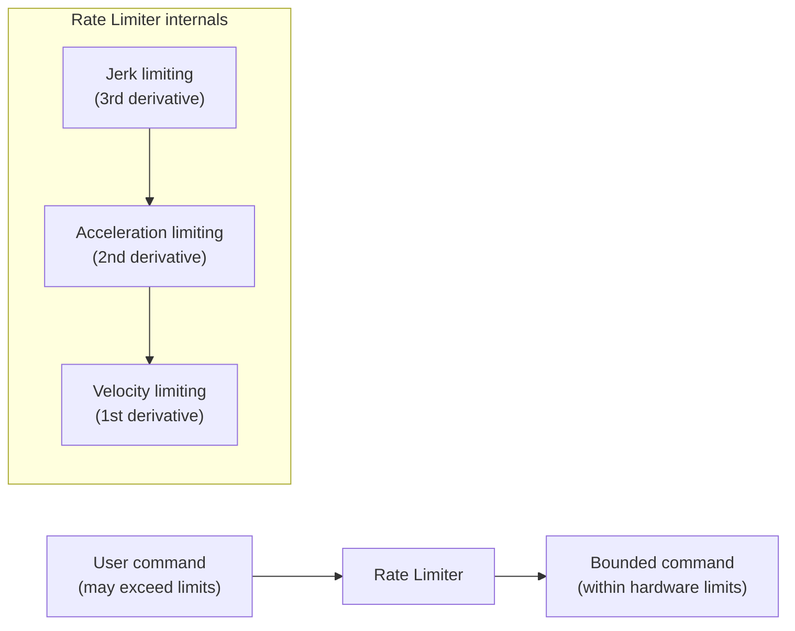
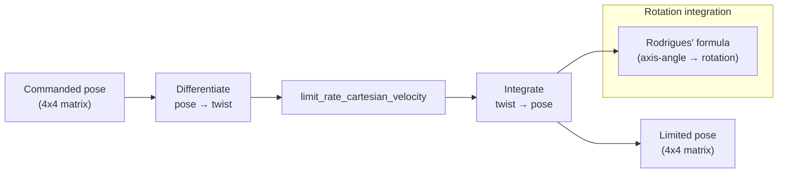
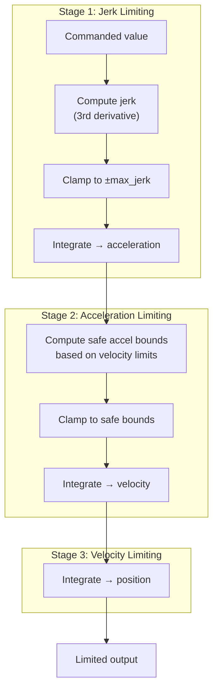

# Rate Limiting

## Overview

The `rate_limiting` module enforces hardware-safe limits on joint and Cartesian commands by clamping velocity, acceleration, and jerk. This prevents protective stops caused by exceeding the robot's physical limits.



## Hardware Limits

### Joint Limits

| Quantity | Joints 1-4 | Joints 5-7 | Unit |
|----------|-----------|-----------|------|
| Max velocity | (per-joint limits) | (per-joint limits) | rad/s |
| Max acceleration | 10.0 | 10.0 | rad/s^2 |
| Max jerk | 5000.0 | 5000.0 | rad/s^3 |
| Max torque rate | 1000.0 | 1000.0 | Nm/s |

### Cartesian Limits

| Quantity | Translational | Rotational | Unit |
|----------|--------------|------------|------|
| Max velocity | 3.0 | 2.5 | m/s, rad/s |
| Max acceleration | 9.0 | 17.0 | m/s^2, rad/s^2 |
| Max jerk | 4500.0 | 8500.0 | m/s^3, rad/s^3 |

### Elbow Limits

| Quantity | Value | Unit |
|----------|-------|------|
| Max velocity | 1.5 | rad/s |
| Max acceleration | 10.0 | rad/s^2 |
| Max jerk | 5000.0 | rad/s^3 |

All limits include a small epsilon (`LIMIT_EPS = 1e-3`) subtracted for numerical safety.

## Public Functions

### `limit_rate_torques`

Clamps the time derivative of per-joint torque commands:

```rust
let limited = limit_rate_torques(
    &MAX_TORQUE_RATE,  // max derivative per joint (Nm/s)
    &commanded,        // desired torques
    &last_commanded,   // previous cycle torques
);
```

### `limit_rate_joint_positions`

Limits joint position commands through a cascade of jerk → acceleration → velocity limiting:

```rust
let limited = limit_rate_joint_positions(
    &upper_velocity_limits,
    &lower_velocity_limits,
    &max_acceleration,
    &max_jerk,
    &commanded,
    &last_commanded,
    &last_velocity,
    &last_acceleration,
);
```

### `limit_rate_joint_velocities`

Same cascade for joint velocity commands.

### `limit_rate_cartesian_velocity`

Limits a 6D twist `[vx, vy, vz, wx, wy, wz]`:

```rust
let limited = limit_rate_cartesian_velocity(
    MAX_TRANSLATIONAL_VELOCITY,
    MAX_TRANSLATIONAL_ACCELERATION,
    MAX_TRANSLATIONAL_JERK,
    MAX_ROTATIONAL_VELOCITY,
    MAX_ROTATIONAL_ACCELERATION,
    MAX_ROTATIONAL_JERK,
    &commanded_twist,
    &last_twist,
    &last_acceleration,
);
```

### `limit_rate_cartesian_pose`

Limits a 4x4 pose by computing the implied twist, limiting it, and integrating back:



```rust
let limited = limit_rate_cartesian_pose(
    MAX_TRANSLATIONAL_VELOCITY,
    MAX_TRANSLATIONAL_ACCELERATION,
    MAX_TRANSLATIONAL_JERK,
    MAX_ROTATIONAL_VELOCITY,
    MAX_ROTATIONAL_ACCELERATION,
    MAX_ROTATIONAL_JERK,
    &commanded_pose,     // [f64; 16] column-major
    &last_commanded,     // [f64; 16]
    &last_twist,         // [f64; 6]
    &last_acceleration,  // [f64; 6]
);
```

## Limiting Algorithm

The core algorithm processes each degree of freedom through a three-stage cascade:



The safe acceleration bound is computed as:

```
safe_max_accel = min(max_accel, (max_jerk / max_accel) * (vel_limit - current_vel))
```

This ensures the system can always decelerate to zero before hitting the velocity limit.

## When Rate Limiting Activates

Rate limiting is transparent — if your trajectory is smooth and within limits, the output equals the input. It only modifies commands that would otherwise cause:

- **Velocity violations** → commanded velocity clamped
- **Acceleration violations** → acceleration bounded, trajectory smoothed
- **Jerk violations** → jerk bounded, preventing sharp transients

> **Note**: Rate limiting prevents protective stops but introduces tracking error. If your trajectory consistently triggers rate limiting, consider redesigning it with smoother profiles (e.g., trapezoidal or S-curve velocity).
