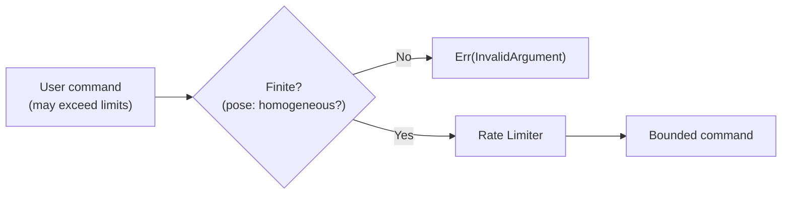
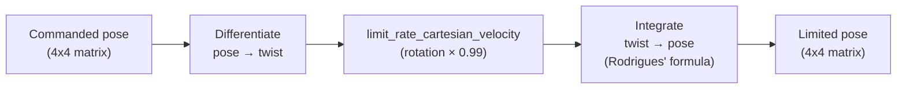
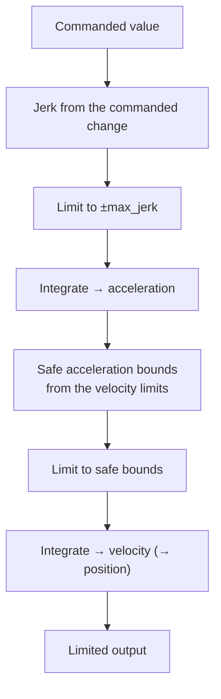

# Rate Limiting

## Overview

The `rate_limiting` module limits the velocity, acceleration and jerk of joint and Cartesian
commands, and the rate of torque commands, as libfranka's `limitRate` functions do. Its outputs
are bit-identical to libfranka 0.21.3 as built on the test machine (another libfranka build can round differently) (`tests/computation_test.rs`). The control loops apply it
when `MotionConfig::limit_rate` is on (the default); the active interface does not.

Every public function checks its input first and returns `FrankaError::InvalidArgument` if a
commanded value is not finite (and, for poses, if the commanded matrix is not a homogeneous
transformation), as libfranka throws `std::invalid_argument`. All return `FrankaResult`.


```mermaid
flowchart LR
    CMD["User command<br/>(may exceed limits)"] --> CHECK{"Finite?<br/>(pose: homogeneous?)"}
    CHECK -->|No| ERR["Err(InvalidArgument)"]
    CHECK -->|Yes| RL["Rate Limiter"]
    RL --> SAFE["Bounded command"]
```

## Limits

Each limit is reduced by `LIMIT_EPS = 1e-3`.

### Joint Limits

| Quantity | Value | Unit |
|----------|-------|------|
| Max velocity | Position-dependent, from the robot's URDF (`JointVelocityLimits`), tightened by `JOINT_VELOCITY_LIMITS_TOLERANCE` | rad/s |
| Max acceleration | 10.0 | rad/s² |
| Max jerk | 5000.0 | rad/s³ |
| Max torque rate | 1000.0 | Nm/s |

### Cartesian Limits

| Quantity | Translational | Rotational | Unit |
|----------|--------------|------------|------|
| Max velocity | 3.0 | 2.5 | m/s, rad/s |
| Max acceleration | 9.0 | 17.0 | m/s², rad/s² |
| Max jerk | 4500.0 | 8500.0 | m/s³, rad/s³ |

`limit_rate_cartesian_pose` scales the rotational limits by
`FACTOR_CARTESIAN_ROTATION_POSE_INTERFACE = 0.99`.

### Elbow Limits

| Quantity | Value | Unit |
|----------|-------|------|
| Max velocity | 1.5 | rad/s |
| Max acceleration | 10.0 | rad/s² |
| Max jerk | 5000.0 | rad/s³ |

## Public Functions

### `limit_rate_torques`

Limits the time derivative of per-joint torque commands:

```rust
let limited = limit_rate_torques(
    &MAX_TORQUE_RATE,  // max derivative per joint (Nm/s)
    &commanded,        // desired torques
    &last_commanded,   // previous cycle's torques (robot state tau_j_d)
)?;
```

### `limit_rate_velocity` and `limit_rate_position`

Limit one value through the jerk → acceleration → velocity cascade below;
`limit_rate_position` converts the position step to a velocity first.

### `limit_rate_joint_positions` and `limit_rate_joint_velocities`

Apply the scalar functions to each joint:

```rust
let limited = limit_rate_joint_positions(
    &upper_velocity_limits,
    &lower_velocity_limits,
    &max_acceleration,
    &max_jerk,
    &commanded,
    &last_commanded,
    &last_velocity,
    &last_acceleration,
)?;
```

### `limit_rate_cartesian_velocity`

Limits a 6D twist `[vx, vy, vz, wx, wy, wz]`, translation and rotation each as a 3-vector:

```rust
let limited = limit_rate_cartesian_velocity(
    MAX_TRANSLATIONAL_VELOCITY,
    MAX_TRANSLATIONAL_ACCELERATION,
    MAX_TRANSLATIONAL_JERK,
    MAX_ROTATIONAL_VELOCITY,
    MAX_ROTATIONAL_ACCELERATION,
    MAX_ROTATIONAL_JERK,
    &commanded_twist,
    &last_twist,
    &last_acceleration,
)?;
```

### `limit_rate_cartesian_pose`

Limits a 4×4 pose by computing the implied twist, limiting it, and integrating back. The rotation
of each pose is taken as Eigen's `Affine3d::rotation()` does (polar decomposition by a Jacobi
SVD) and the rotation difference as an angle-axis; this arithmetic reproduces libfranka's exactly
(`eigen_compat`).


```mermaid
flowchart LR
    POSE_CMD["Commanded pose<br/>(4x4 matrix)"] --> DIFF["Differentiate<br/>pose → twist"]
    DIFF --> LIMIT["limit_rate_cartesian_velocity<br/>(rotation × 0.99)"]
    LIMIT --> INTEGRATE["Integrate<br/>twist → pose<br/>(Rodrigues' formula)"]
    INTEGRATE --> POSE_OUT["Limited pose<br/>(4x4 matrix)"]
```

```rust
let limited = limit_rate_cartesian_pose(
    MAX_TRANSLATIONAL_VELOCITY,
    MAX_TRANSLATIONAL_ACCELERATION,
    MAX_TRANSLATIONAL_JERK,
    MAX_ROTATIONAL_VELOCITY,
    MAX_ROTATIONAL_ACCELERATION,
    MAX_ROTATIONAL_JERK,
    &commanded_pose,     // [f64; 16] column-major
    &last_commanded,     // [f64; 16]
    &last_twist,         // [f64; 6]
    &last_acceleration,  // [f64; 6]
)?;
```

## Limiting Algorithm

### Joints and Elbow (per value)


```mermaid
flowchart TD
    CMD["Commanded value"] --> D3["Jerk from the commanded change"]
    D3 --> CLAMP3["Limit to ±max_jerk"]
    CLAMP3 --> INT3["Integrate → acceleration"]
    INT3 --> SAFE["Safe acceleration bounds<br/>from the velocity limits"]
    SAFE --> CLAMP2["Limit to safe bounds"]
    CLAMP2 --> INT2["Integrate → velocity (→ position)"]
    INT2 --> OUT["Limited output"]
```

The safe acceleration bounds are:

```
safe_max_accel = min((max_jerk / max_accel) * (upper_vel_limit - last_vel), max_accel)
safe_min_accel = max((max_jerk / max_accel) * (lower_vel_limit - last_vel), -max_accel)
```

so the value can always decelerate before reaching a velocity limit. The minimum and maximum
follow C++ `std::min`/`std::max` exactly, including for NaN.

### Cartesian (per 3-vector)

Jerk is limited by its norm, the acceleration is integrated, and the acceleration's norm is
limited by `min((max_jerk / max_accel) * d, max_accel)`, where `d` is the distance from the last
velocity to the maximum-velocity sphere along the acceleration direction.

## When Rate Limiting Activates

For a smooth trajectory within the limits, the output is the input up to rounding. Otherwise:

- **Velocity violations** → velocity limited
- **Acceleration violations** → acceleration bounded, trajectory smoothed
- **Jerk violations** → jerk bounded, preventing sharp transients

> **Note**: Rate limiting prevents some robot reflexes but introduces tracking error. If your
> trajectory regularly triggers it, use smoother profiles.
