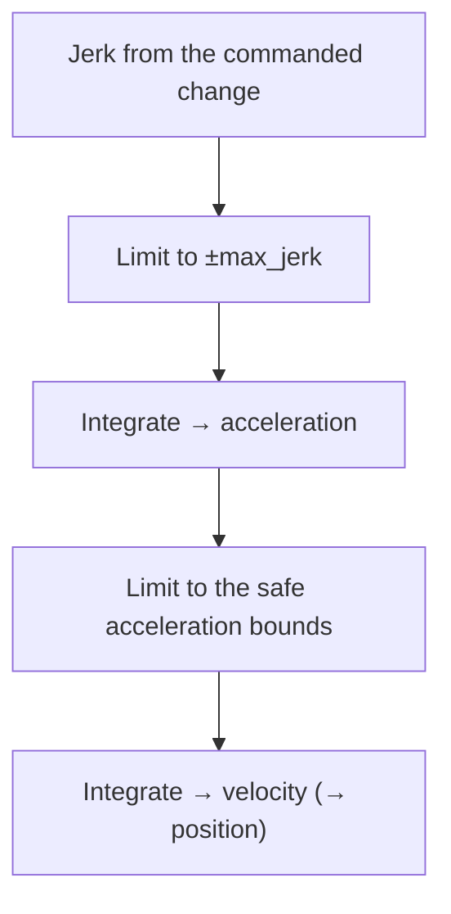

# Rate Limiting

`rate_limiting` ports libfranka's `limitRate` functions: it limits velocity, acceleration and jerk
of joint, elbow and Cartesian commands, and the rate of torques. Outputs are bit-identical to
libfranka 0.21.3 as built on the test machine (`tests/computation_test.rs`; another libfranka
build can round differently). The control loops apply it when `MotionConfig::limit_rate` is on
(the default); active control does not.

Each function first checks that the commanded values are finite (and, for poses, that the matrix
is a homogeneous transformation) and returns `FrankaError::InvalidArgument` otherwise, as
libfranka throws `std::invalid_argument`. All return `FrankaResult`.

## Limits

Each value is reduced by `LIMIT_EPS = 1e-3`.

| Quantity | Velocity | Acceleration | Jerk |
|----------|----------|--------------|------|
| Joints | from the URDF, position-dependent (`JointVelocityLimits`, less `JOINT_VELOCITY_LIMITS_TOLERANCE`) | 10 rad/s² | 5000 rad/s³ |
| Cartesian translation | 3.0 m/s | 9 m/s² | 4500 m/s³ |
| Cartesian rotation | 2.5 rad/s | 17 rad/s² | 8500 rad/s³ |
| Elbow | 1.5 rad/s | 10 rad/s² | 5000 rad/s³ |
| Torque rate | — | — | 1000 Nm/s (`MAX_TORQUE_RATE`) |

`limit_rate_cartesian_pose` scales the rotational limits by
`FACTOR_CARTESIAN_ROTATION_POSE_INTERFACE = 0.99`.

`JointVelocityLimits::from_urdf(&urdf)` reads the position-dependent limits; `upper(&q)` and
`lower(&q)` give the velocity bounds at joint positions `q` (`Robot::connect` builds it; `Default`
is all zero).

## Functions

| Function | Limits | Extra inputs |
|----------|--------|--------------|
| `limit_rate_torques(max_rate, cmd, last)` | torque rate per joint | last commanded torques |
| `limit_rate_velocity`, `limit_rate_position` | one value | velocity limits, max accel/jerk, last velocity and acceleration (position: also last position) |
| `limit_rate_joint_velocities`, `limit_rate_joint_positions` | 7 joints (the scalar functions per joint) | per-joint arrays |
| `limit_rate_cartesian_velocity` | 6D twist `[v; ω]`, each part as a 3-vector | last twist and acceleration |
| `limit_rate_cartesian_pose` | 4×4 pose via its implied twist | last pose, twist, acceleration |

```rust
let limited = limit_rate_joint_positions(
    &upper_velocity, &lower_velocity, &MAX_JOINT_ACCELERATION, &MAX_JOINT_JERK,
    &commanded, &last_commanded, &last_velocity, &last_acceleration,
)?;
```

## Algorithm

**Per value (joints, elbow):**


```mermaid
flowchart TB
    A["Jerk from the commanded change"] --> B["Limit to ±max_jerk"]
    B --> C["Integrate → acceleration"]
    C --> D["Limit to the safe acceleration bounds"]
    D --> E["Integrate → velocity (→ position)"]
```

```
safe_max_accel = min((max_jerk / max_accel) · (upper_vel_limit − last_vel),  max_accel)
safe_min_accel = max((max_jerk / max_accel) · (lower_vel_limit − last_vel), −max_accel)
```

so the value can always slow down before a velocity limit. `min`/`max` follow C++
`std::min`/`std::max` exactly, including for NaN.

**Per 3-vector (Cartesian):** the jerk is limited by its norm; the acceleration's norm by
`min((max_jerk / max_accel) · d, max_accel)`, with `d` the distance from the last velocity to the
maximum-velocity sphere along the acceleration.

**Pose:** the pose difference gives a twist (rotation as Eigen's `Affine3d::rotation()` and
angle-axis, reproduced in `eigen_compat`), the twist is limited, and integrated back with
Rodrigues' formula.

A smooth command within the limits passes through unchanged up to rounding. Limiting avoids some
robot reflexes at the cost of tracking error; prefer trajectories that stay within the limits.
