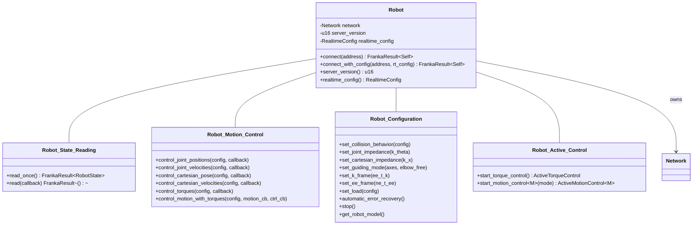
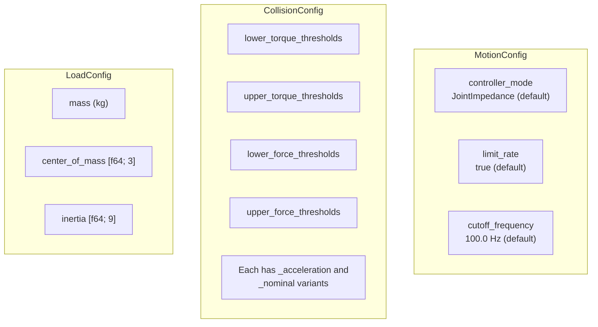

# Robot API

## Overview

The `Robot` struct is the primary entry point for interacting with a Franka robot. It owns the network connection and provides state reading, configuration, and motion/torque control.



## Connection

```rust
use franka_rs::robot::Robot;
use franka_rs::types::RealtimeConfig;

// Simple connection (enforces real-time scheduling)
let mut robot = Robot::connect("172.16.0.2")?;

// Development mode (no real-time requirement)
let mut robot = Robot::connect_with_config(
    "172.16.0.2",
    RealtimeConfig::Ignore,
)?;

println!("Server version: {}", robot.server_version());
```

## State Reading

### `read_once`

Blocks until a single state packet arrives over UDP:

```rust
let state = robot.read_once()?;
println!("Joint positions: {:?}", state.q);
println!("Mode: {:?}", state.robot_mode);
```

### `read`

Continuous reading with a callback. Returns when callback returns `false`:

```rust
robot.read(|state| {
    println!("q[0] = {:.4}", state.q[0]);
    state.robot_mode == RobotMode::Idle // continue while idle
})?;
```

## Motion Control

All motion methods take a `MotionConfig` and a callback:

```rust
use franka_rs::robot::config::MotionConfig;
use franka_rs::types::ControllerMode;

// Default config: JointImpedance, rate limiting on, 100 Hz filter
let config = MotionConfig::default();

// Custom config
let config = MotionConfig::default()
    .with_controller_mode(ControllerMode::CartesianImpedance)
    .with_rate_limiting(false)
    .with_cutoff_frequency(50.0);
```

### Available Control Methods

| Method | Output Type | Internal Controller |
|--------|-------------|-------------------|
| `control_joint_positions` | `JointPositions` | Yes |
| `control_joint_velocities` | `JointVelocities` | Yes |
| `control_cartesian_pose` | `CartesianPose` | Yes |
| `control_cartesian_velocities` | `CartesianVelocities` | Yes |
| `control_torques` | `Torques` | No (external) |
| `control_motion_with_torques` | `M` + `Torques` | No (external) |

All callbacks have the signature:

```rust
fn(&RobotState, Duration) -> ControlFlow<T, T>
```

Return `ControlFlow::Continue(cmd)` to keep running, `ControlFlow::Break(cmd)` to send the final command and stop.

### Ownership Guarantee

Control methods take `&mut self`, which the Rust borrow checker enforces at compile time:

```rust
let mut robot = Robot::connect("172.16.0.2")?;

// This compiles — exclusive access
robot.control_torques(&config, |state, _| { /* ... */ })?;

// This would NOT compile — can't use robot while control is active
// let state = robot.read_once(); // ← borrow checker error
```

## Configuration Commands

### Collision Behavior

```rust
use franka_rs::robot::config::CollisionConfig;

let collision = CollisionConfig::symmetric(
    [20.0; 7],  // lower torque thresholds (Nm) — contact detection
    [40.0; 7],  // upper torque thresholds (Nm) — collision detection
    [20.0; 6],  // lower force thresholds (N/Nm)
    [40.0; 6],  // upper force thresholds (N/Nm)
);
robot.set_collision_behavior(&collision)?;
```

### Joint Impedance

```rust
// Stiffness values in Nm/rad, range [0, 14250]
robot.set_joint_impedance([600.0, 600.0, 600.0, 600.0, 250.0, 150.0, 50.0])?;
```

### Cartesian Impedance

```rust
// [x, y, z, roll, pitch, yaw]
// Linear: [10, 3000] N/m. Rotational: [1, 300] Nm/rad
robot.set_cartesian_impedance([3000.0, 3000.0, 3000.0, 300.0, 300.0, 300.0])?;
```

### Load Configuration

```rust
use franka_rs::robot::config::LoadConfig;

let load = LoadConfig::new(
    0.5,                  // mass (kg)
    [0.0, 0.0, 0.05],    // center of mass in flange frame (m)
    [0.001, 0.0, 0.0,    // inertia tensor (kg·m²)
     0.0, 0.001, 0.0,
     0.0, 0.0, 0.001],
);
robot.set_load(&load)?;
```

### Guiding Mode

```rust
// Unlock all Cartesian axes for hand-guiding
robot.set_guiding_mode([true; 6], true)?;

// Unlock only Z translation and rotation around Z
robot.set_guiding_mode([false, false, true, false, false, true], false)?;
```

### Error Recovery

```rust
robot.automatic_error_recovery()?;
```

### Stop

```rust
robot.stop()?;
```

## Configuration Summary


