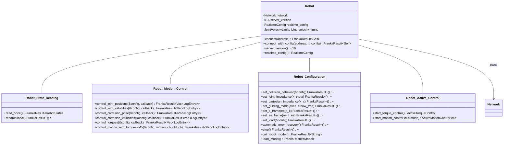
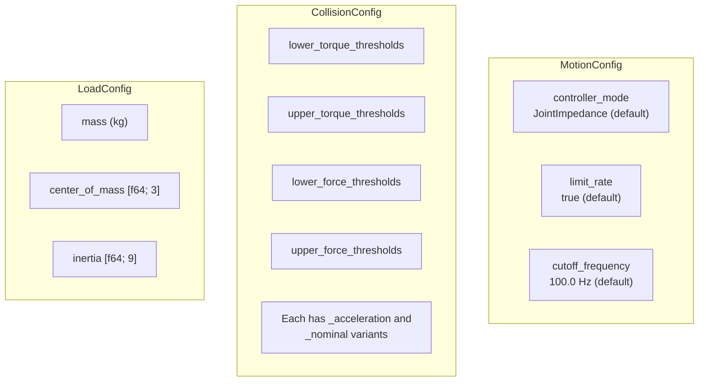

# Robot API

## Overview

The `Robot` struct is the primary entry point for interacting with a Franka robot. It owns the network connection and provides state reading, configuration, and motion/torque control.


```mermaid
classDiagram
    class Robot {
        -Network network
        -u16 server_version
        -RealtimeConfig realtime_config
        -JointVelocityLimits joint_velocity_limits
        +connect(address) FrankaResult~Self~
        +connect_with_config(address, rt_config) FrankaResult~Self~
        +server_version() u16
        +realtime_config() RealtimeConfig
    }

    class Robot_State_Reading {
        +read_once() FrankaResult~RobotState~
        +read(callback) FrankaResult~()~
    }

    class Robot_Motion_Control {
        +control_joint_positions(&config, callback) FrankaResult~Vec~LogEntry~~
        +control_joint_velocities(&config, callback) FrankaResult~Vec~LogEntry~~
        +control_cartesian_pose(&config, callback) FrankaResult~Vec~LogEntry~~
        +control_cartesian_velocities(&config, callback) FrankaResult~Vec~LogEntry~~
        +control_torques(&config, callback) FrankaResult~Vec~LogEntry~~
        +control_motion_with_torques~M~(&config, motion_cb, ctrl_cb) FrankaResult~Vec~LogEntry~~
    }

    class Robot_Configuration {
        +set_collision_behavior(&config) FrankaResult~()~
        +set_joint_impedance(k_theta) FrankaResult~()~
        +set_cartesian_impedance(k_x) FrankaResult~()~
        +set_guiding_mode(axes, elbow_free) FrankaResult~()~
        +set_k_frame(ee_t_k) FrankaResult~()~
        +set_ee_frame(ne_t_ee) FrankaResult~()~
        +set_load(&config) FrankaResult~()~
        +automatic_error_recovery() FrankaResult~()~
        +stop() FrankaResult~()~
        +get_robot_model() FrankaResult~String~
        +load_model() FrankaResult~Model~
    }

    class Robot_Active_Control {
        +start_torque_control() ActiveTorqueControl
        +start_motion_control~M~(mode) ActiveMotionControl~M~
    }

    Robot -- Robot_State_Reading
    Robot -- Robot_Motion_Control
    Robot -- Robot_Configuration
    Robot -- Robot_Active_Control

    Robot --> Network : owns
```

## Connection

```rust
use franka_rs::robot::Robot;
use franka_rs::types::RealtimeConfig;

// Uses RealtimeConfig::Ignore
let mut robot = Robot::connect("172.16.0.2")?;

// Explicit realtime configuration (stored only; see Connecting to the Robot)
let mut robot = Robot::connect_with_config(
    "172.16.0.2",
    RealtimeConfig::Enforce,
)?;

println!("Server version: {}", robot.server_version());
```

`connect` performs the handshake, waits for the first state, and downloads the robot's URDF to
read its joint velocity limits, which the joint position and velocity loops use for rate limiting.
`load_model` downloads the URDF again and builds a `Model`.

## State Reading

### `read_once`

Returns the newest state already received if it is newer than the last one read; otherwise waits for the next state:

```rust
let state = robot.read_once()?;
println!("Joint positions: {:?}", state.q);
println!("Mode: {:?}", state.robot_mode);
```

### `read`

Continuous reading with a callback. Returns when callback returns `false`:

```rust
use franka_rs::types::RobotMode;

robot.read(|state| {
    println!("q[0] = {:.4}", state.q[0]);
    state.robot_mode == RobotMode::Idle // continue while idle
})?;
```

## Motion Control

All motion methods take a `MotionConfig` and a callback:

```rust
use franka_rs::robot::config::MotionConfig;
use franka_rs::types::ControllerMode;

// Default config: JointImpedance, rate limiting on, 100 Hz filter
let config = MotionConfig::default();

// Custom config
let config = MotionConfig::default()
    .with_controller_mode(ControllerMode::CartesianImpedance)
    .with_rate_limiting(false)
    .with_cutoff_frequency(50.0);
```

### Available Control Methods

| Method | Output Type | Internal Controller |
|--------|-------------|-------------------|
| `control_joint_positions` | `JointPositions` | Yes (`config.controller_mode`) |
| `control_joint_velocities` | `JointVelocities` | Yes |
| `control_cartesian_pose` | `CartesianPose` | Yes |
| `control_cartesian_velocities` | `CartesianVelocities` | Yes |
| `control_torques` | `Torques` | No (external) |
| `control_motion_with_torques` | `M` + `Torques` (two callbacks) | No (external) |

The motion-only methods return `FrankaError::InvalidOperation` if `config.controller_mode` is
`ExternalController`. All callbacks have the signature:

```rust
FnMut(&RobotState, Duration) -> ControlFlow<T, T>
```

The `Duration` is the time since the previous call (normally 1 ms). Return
`ControlFlow::Continue(cmd)` to keep running, `ControlFlow::Break(cmd)` to send the final command
and stop. On success the methods return the motion's log (`Vec<LogEntry>`); on an error the motion
is cancelled (StopMove) and the error returned.

### Ownership Guarantee

Control methods take `&mut self`, which the Rust borrow checker enforces at compile time:

```rust
let mut robot = Robot::connect("172.16.0.2")?;

// This compiles — exclusive access while the call runs
robot.control_torques(&config, |state, _| { /* ... */ })?;

// Inside the callback, `robot` cannot be used (it is mutably borrowed); the same holds while an
// ActiveTorqueControl or ActiveMotionControl exists:
let ctrl = robot.start_torque_control()?;
// let state = robot.read_once(); // ← borrow checker error while `ctrl` is alive
```

## Configuration Commands

### Collision Behavior

```rust
use franka_rs::robot::config::CollisionConfig;

let collision = CollisionConfig::symmetric(
    [20.0; 7],  // lower torque thresholds (Nm) — contact detection
    [40.0; 7],  // upper torque thresholds (Nm) — collision detection
    [20.0; 6],  // lower force thresholds (N/Nm)
    [40.0; 6],  // upper force thresholds (N/Nm)
);
robot.set_collision_behavior(&collision)?;
```

### Joint Impedance

```rust
// Stiffness values in Nm/rad, range [0, 14250] (libfranka's documented range)
robot.set_joint_impedance([600.0, 600.0, 600.0, 600.0, 250.0, 150.0, 50.0])?;
```

### Cartesian Impedance

```rust
// [x, y, z, roll, pitch, yaw]
// Linear: [10, 3000] N/m. Rotational: [1, 300] Nm/rad
robot.set_cartesian_impedance([3000.0, 3000.0, 3000.0, 300.0, 300.0, 300.0])?;
```

### Load Configuration

```rust
use franka_rs::robot::config::LoadConfig;

let load = LoadConfig::new(
    0.5,                  // mass (kg)
    [0.0, 0.0, 0.05],    // center of mass in flange frame (m)
    [0.001, 0.0, 0.0,    // inertia tensor (kg·m²)
     0.0, 0.001, 0.0,
     0.0, 0.0, 0.001],
);
robot.set_load(&load)?;
```

### Guiding Mode

```rust
// Unlock all Cartesian axes for hand-guiding
robot.set_guiding_mode([true; 6], true)?;

// Unlock only Z translation and rotation around Z
robot.set_guiding_mode([false, false, true, false, false, true], false)?;
```

### Error Recovery

```rust
robot.automatic_error_recovery()?;
```

### Stop

```rust
robot.stop()?;
```

## Configuration Summary


```mermaid
flowchart TD
    subgraph "MotionConfig"
        MC_CM["controller_mode<br/>JointImpedance (default)"]
        MC_RL["limit_rate<br/>true (default)"]
        MC_CF["cutoff_frequency<br/>100.0 Hz (default)"]
    end

    subgraph "CollisionConfig"
        CC_LT["lower_torque_thresholds"]
        CC_UT["upper_torque_thresholds"]
        CC_LF["lower_force_thresholds"]
        CC_UF["upper_force_thresholds"]
        CC_NOTE["Each has _acceleration and<br/>_nominal variants"]
    end

    subgraph "LoadConfig"
        LC_M["mass (kg)"]
        LC_COM["center_of_mass [f64; 3]"]
        LC_I["inertia [f64; 9]"]
    end
```
