# Types & Constants

## Overview

The `types` module provides domain-specific newtypes that wrap raw numeric arrays, giving compile-time type safety to joint and Cartesian commands. The `constants` module defines protocol and physical parameters.

```mermaid
classDiagram
    class JointPositions {
        +[f64; 7] inner
        +new(values: [f64; 7]) Self
        +Deref~[f64; 7]~
    }

    class JointVelocities {
        +[f64; 7] inner
        +new(values: [f64; 7]) Self
        +Deref~[f64; 7]~
    }

    class Torques {
        +[f64; 7] inner
        +new(values: [f64; 7]) Self
        +Deref~[f64; 7]~
    }

    class CartesianPose {
        +Isometry3~f64~ inner
        +Option~[f64; 2]~ elbow
        +from_isometry(Isometry3) Self
        +from_column_major(&[f64; 16]) Self
        +to_column_major() [f64; 16]
        +with_elbow([f64; 2]) Self
    }

    class CartesianVelocities {
        +Vector3~f64~ linear
        +Vector3~f64~ angular
        +Option~[f64; 2]~ elbow
        +new(linear, angular) Self
        +from_array(&[f64; 6]) Self
        +to_array() [f64; 6]
        +with_elbow([f64; 2]) Self
    }

    class Frame {
        <<enumeration>>
        Joint1
        Joint2
        Joint3
        Joint4
        Joint5
        Joint6
        Joint7
        Flange
        EndEffector
        Stiffness
    }

    class RobotMode {
        <<enumeration>>
        Other
        Idle
        Move
        Guiding
        Reflex
        UserStopped
        AutomaticErrorRecovery
    }

    class ControllerMode {
        <<enumeration>>
        JointImpedance
        CartesianImpedance
        ExternalController
    }

    class RealtimeConfig {
        <<enumeration>>
        Enforce
        Ignore
    }

    class MotionGeneratorMode {
        <<enumeration>>
        Idle
        JointPosition
        JointVelocity
        CartesianPosition
        CartesianVelocity
        None
    }
```



## Motion Command Types

These newtypes wrap `[f64; 7]` arrays and provide `Deref`/`DerefMut` access for ergonomic indexing:

### `JointPositions`

Joint positions in radians. Used with `control_joint_positions`.

```rust
let jp = JointPositions::new([0.0, -0.785, 0.0, -2.356, 0.0, 1.571, 0.785]);
assert_eq!(jp[0], 0.0);    // Deref to &[f64; 7]
assert_eq!(jp.len(), 7);
```

### `JointVelocities`

Joint velocities in rad/s. Used with `control_joint_velocities`.

```rust
let jv = JointVelocities::new([0.0; 7]);
```

### `Torques`

Joint torques in Nm (without gravity/friction). Used with `control_torques`.

```rust
let tau = Torques::new([0.0; 7]);
```

### `CartesianPose`

End-effector pose in SE(3), stored internally as `nalgebra::Isometry3<f64>`.

```rust
// From a column-major 4x4 homogeneous transform
let pose = CartesianPose::from_column_major(&state.o_t_ee);

// From nalgebra types directly
let iso = Isometry3::translation(0.5, 0.0, 0.3);
let pose = CartesianPose::from_isometry(iso);

// With elbow configuration
let pose = pose.with_elbow([state.elbow[0], state.elbow[1]]);

// Convert back to wire format
let matrix: [f64; 16] = pose.to_column_major();
```

### `CartesianVelocities`

6D twist: linear velocity (m/s) + angular velocity (rad/s) in base frame.

```rust
use nalgebra::Vector3;

let cv = CartesianVelocities::new(
    Vector3::new(0.1, 0.0, 0.0),  // 10 cm/s in x
    Vector3::zeros(),               // no rotation
);

// Or from a flat array [vx, vy, vz, wx, wy, wz]
let cv = CartesianVelocities::from_array(&[0.1, 0.0, 0.0, 0.0, 0.0, 0.0]);
```

## Enumerations

### `Frame`

Reference frame for kinematics computations (forward kinematics, Jacobians):

| Variant | Description |
|---------|-------------|
| `Joint1`..`Joint7` | Frame at the output of joint *i* |
| `Flange` | Flange (last link, before EE attachment) |
| `EndEffector` | End effector (Flange × F_T_EE) |
| `Stiffness` | Stiffness frame (EE × EE_T_K) |

### `RobotMode`

Current operational mode of the robot:

| Variant | Description |
|---------|-------------|
| `Idle` | Robot is powered on, ready for commands |
| `Move` | Robot is executing a motion |
| `Guiding` | Hand-guiding mode is active |
| `Reflex` | Robot is in reflex mode (collision response) |
| `UserStopped` | External stop button pressed |
| `AutomaticErrorRecovery` | Automatic recovery in progress |
| `Other` | Unknown/unrecognized mode |

### `ControllerMode`

Which internal controller the robot uses:

| Variant | When to Use |
|---------|-------------|
| `JointImpedance` | Motion-only control (default) |
| `CartesianImpedance` | Motion-only with Cartesian stiffness |
| `ExternalController` | Torque control (you provide all torques) |

### `RealtimeConfig`

| Variant | Behavior |
|---------|----------|
| `Enforce` | Requires SCHED_FIFO (Linux PREEMPT_RT). Production use. |
| `Ignore` | Normal scheduling. Development/simulation. |

## Constants

| Constant | Value | Description |
|----------|-------|-------------|
| `DELTA_T` | `1e-3` (1 ms) | Control loop sample time |
| `NUM_JOINTS` | `7` | Number of robot joints |
| `ROBOT_COMMAND_PORT` | `1337` | TCP port for robot commands |
| `GRIPPER_COMMAND_PORT` | `1338` | TCP port for gripper commands |
| `VACUUM_GRIPPER_COMMAND_PORT` | `1339` | TCP port for vacuum gripper |
| `ROBOT_PROTOCOL_VERSION` | `10` | Protocol version for handshake |
| `GRIPPER_PROTOCOL_VERSION` | `3` | Gripper protocol version |
| `DEFAULT_TIMEOUT_MS` | `1000` | Network timeout (ms) |

## Conversions

All joint types implement `From<[f64; 7]>`:

```rust
let positions: JointPositions = [0.0; 7].into();
let velocities: JointVelocities = [0.0; 7].into();
let torques: Torques = [0.0; 7].into();
```
