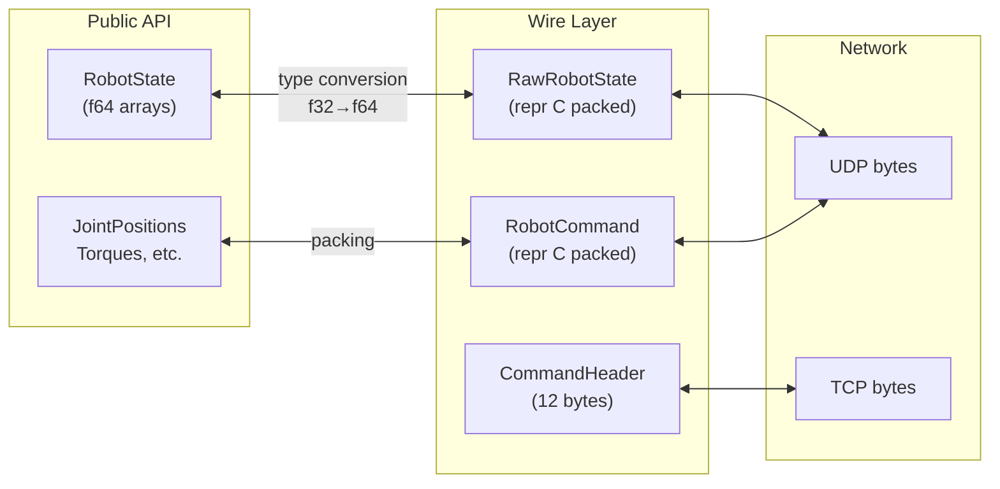
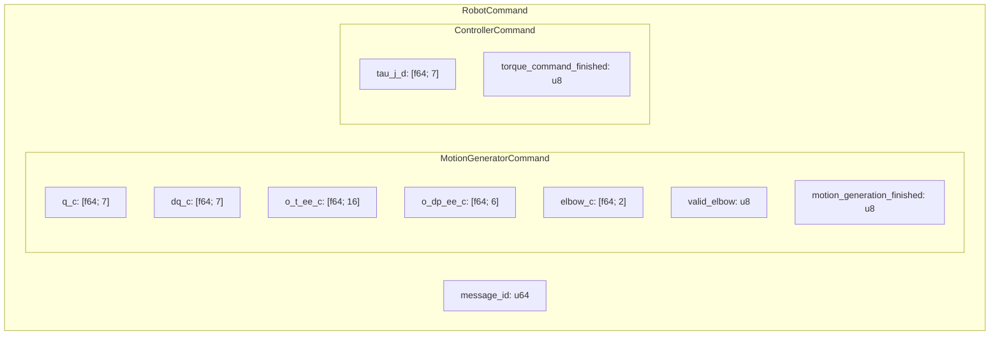

# Wire Protocol

## Overview

The `wire` module contains `#[repr(C, packed)]` structs that match the binary format of the Franka Control Interface (FCI) protocol. These structs are internal (`pub(crate)`) and are not part of the public API — they exist solely for zero-copy serialization/deserialization of network messages.



## Wire Submodules

### `wire::robot`

Robot protocol structs:

| Struct | Direction | Description |
|--------|-----------|-------------|
| `RawRobotState` | Robot → App | Full robot state (UDP, ~2 KB) |
| `RobotCommand` | App → Robot | Motion + control command (UDP) |
| `MotionGeneratorCommand` | (embedded) | Desired positions/velocities/pose |
| `ControllerCommand` | (embedded) | Desired torques |
| `CommandHeader` | Both (TCP) | 12-byte message header |
| `MoveRequest` | App → Robot | Start motion command |
| `SetCollisionBehaviorRequest` | App → Robot | Collision thresholds |
| `SetJointImpedanceRequest` | App → Robot | Joint stiffness values |
| `SetCartesianImpedanceRequest` | App → Robot | Cartesian stiffness values |
| `SetGuidingModeRequest` | App → Robot | Hand-guiding axes |
| `SetLoadRequest` | App → Robot | Payload parameters |
| `SetNeToEeRequest` | App → Robot | NE → EE transform |
| `SetEeToKRequest` | App → Robot | EE → K transform |

### `wire::gripper`

| Struct | Description |
|--------|-------------|
| `RawGripperState` | Gripper state (width, temperature, grasped) |
| `GraspRequest` | Grasp parameters (width, speed, force, epsilon) |
| `MoveRequest` | Move parameters (width, speed) |
| `CommandHeader` | Gripper TCP header |

### `wire::vacuum`

| Struct | Description |
|--------|-------------|
| `RawVacuumGripperState` | Vacuum state (pressure, part detection) |
| `VacuumRequest` | Vacuum parameters (setpoint, profile, timeout) |
| `DropOffRequest` | Drop-off parameters (timeout) |
| `CommandHeader` | Vacuum gripper TCP header |

## Protocol Message Format

### TCP Messages

```
┌───────────────────────────────────────────────┐
│ CommandHeader (12 bytes)                       │
├─────────┬─────────────┬───────────────────────┤
│ command │ command_id  │ size                   │
│ u32 LE  │ u32 LE      │ u32 LE (total)        │
├─────────┴─────────────┴───────────────────────┤
│ Payload (size - 12 bytes)                      │
│ (struct-specific, packed little-endian)        │
└───────────────────────────────────────────────┘
```

### UDP State Packet

```
┌─────────────────────────────────────┐
│ RawRobotState                        │
│ (all fields packed, no padding)      │
│                                      │
│ Poses:      f32[16] × 6 (384 bytes) │
│ Joint data: f32[7]  × N             │
│ Cartesian:  f32[6]  × N             │
│ Scalars:    f32, u8, u16, etc.      │
│ Errors:     bool[41] (41 bytes)     │
│ Timestamp:  u64 (microseconds)      │
│                                      │
│ Total: ~2 KB                         │
└─────────────────────────────────────┘
```

### UDP Command Packet



## Type Conversions

The wire layer handles conversion between the compact wire format and the ergonomic public types:

| Wire Format | Public Type | Conversion |
|------------|-------------|------------|
| `f32` arrays | `f64` arrays | Widening cast |
| `u8` booleans | Rust `bool` | `!= 0` |
| `u8` enums | Rust `enum` | `from_wire()` match |
| `[bool; 41]` | `RobotErrors` | `from_bool_array()` bitfield |
| `u64` microseconds | `Duration` | `Duration::from_micros()` |

## Safety

Wire structs use `unsafe` for zero-copy deserialization:

```rust
// Internal only — not exposed to users
let raw = unsafe { RawRobotState::from_bytes(&buf[..n]) };
let state = raw.to_robot_state();  // Safe conversion to public type
```

This is safe because:
1. Size is validated before casting (`n >= RawRobotState::SIZE`)
2. All fields are numeric (no pointers, no references)
3. Packed repr ensures no padding bytes
4. The public API (`RobotState`) uses safe Rust types only
