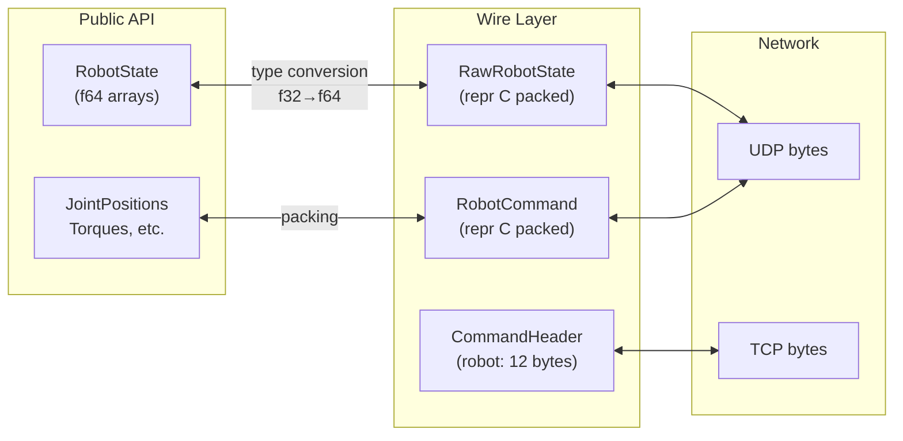
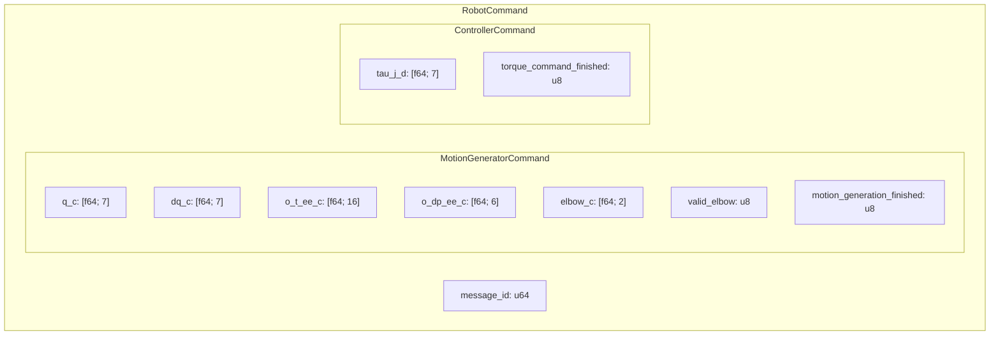

# Wire Protocol

## Overview

The `wire` module contains `#[repr(C, packed)]` structs that match the binary format of the Franka Control Interface (FCI) protocol. The module is crate-private (`pub(crate)`); the structs exist for zero-copy serialization and deserialization of network messages. One reaches users indirectly: `logging::LogEntry::command` is a `wire::robot::RobotCommand` (not to be confused with `network::RobotCommand`, the TCP command helper). For `wire::robot`, struct sizes, field offsets and enum values are checked against libfranka's headers (`validation/data/message_layout.txt`); the gripper and vacuum structs are not checked.


```mermaid
flowchart LR
    subgraph "Public API"
        RS["RobotState<br/>(f64 arrays)"]
        CMD["JointPositions<br/>Torques, etc."]
    end

    subgraph "Wire Layer"
        RAW["RawRobotState<br/>(repr C packed)"]
        WCMD["RobotCommand<br/>(repr C packed)"]
        HDR["CommandHeader<br/>(robot: 12 bytes)"]
    end

    subgraph "Network"
        UDP["UDP bytes"]
        TCP["TCP bytes"]
    end

    RS <-->|"type conversion<br/>f32→f64"| RAW
    CMD <-->|"packing"| WCMD
    RAW <--> UDP
    WCMD <--> UDP
    HDR <--> TCP
```

## Wire Submodules

### `wire::robot`

Robot protocol structs:

| Struct | Direction | Description |
|--------|-----------|-------------|
| `RawRobotState` | Robot → App | Full robot state (UDP, 1377 bytes) |
| `RobotCommand` | App → Robot | Motion + control command (UDP, 371 bytes) |
| `MotionGeneratorCommand` | (embedded) | Desired positions/velocities/pose |
| `ControllerCommand` | (embedded) | Desired torques |
| `CommandHeader` | Both (TCP) | 12-byte message header (`command: u32`) |
| `ConnectRequest` / `ConnectResponse` | Both (TCP) | Version handshake (with the UDP port) |
| `MoveRequest` | App → Robot | Start motion command |
| `SetCollisionBehaviorRequest` | App → Robot | Collision thresholds |
| `SetJointImpedanceRequest` | App → Robot | Joint stiffness values |
| `SetCartesianImpedanceRequest` | App → Robot | Cartesian stiffness values |
| `SetGuidingModeRequest` | App → Robot | Hand-guiding axes |
| `SetLoadRequest` | App → Robot | Payload parameters |
| `SetNeToEeRequest` | App → Robot | NE → EE transform |
| `SetEeToKRequest` | App → Robot | EE → K transform |
| `CommandResponse` | Robot → App | Status of a setter command |

Enums: `Command` (TCP command numbers), `ConnectStatus`, `MoveControllerMode` and
`MoveMotionGeneratorMode` (the Move request's numbering, which differs from the robot state's),
`MoveStatus`, `GetterSetterStatus`, `StopMoveStatus`, `AutomaticErrorRecoveryStatus`.

### `wire::gripper`

| Struct | Description |
|--------|-------------|
| `RawGripperState` | Gripper state (width, temperature, grasped) |
| `GraspRequest` | Grasp parameters (width, speed, force, epsilon) |
| `MoveRequest` | Move parameters (width, speed) |
| `CommandHeader` | Gripper TCP header (10 bytes, `command: u16`) |

### `wire::vacuum`

| Struct | Description |
|--------|-------------|
| `RawVacuumGripperState` | Vacuum state (in control range, part detached/present, device status, power, vacuum) |
| `VacuumRequest` | Vacuum parameters (setpoint, profile, timeout) |
| `DropOffRequest` | Drop-off parameters (timeout) |
| `CommandHeader` | Vacuum gripper TCP header (10 bytes, `command: u16`) |

The gripper and vacuum headers are defined here, but `Network` currently frames every connection
with the robot's 12-byte header — see the known issue in [Gripper Interface](../gripper.md).

## Protocol Message Format

### TCP Messages (robot)

```
┌───────────────────────────────────────────────┐
│ CommandHeader (12 bytes)                       │
├─────────┬─────────────┬───────────────────────┤
│ command │ command_id  │ size                   │
│ u32 LE  │ u32 LE      │ u32 LE (total)        │
├─────────┴─────────────┴───────────────────────┤
│ Payload (size - 12 bytes)                      │
│ (struct-specific, packed little-endian)        │
└───────────────────────────────────────────────┘
```

### UDP State Packet

```
┌──────────────────────────────────────────────┐
│ RawRobotState (packed, no padding)           │
│                                              │
│ message_id:  u64 (also the time, in ms)      │
│ Poses:       f32[16] × 6, plus O_T_EE_c      │
│ Joint data:  f32[7] (q, dq, tau_J, ...)      │
│ Cartesian:   f32[6], f32[3]                  │
│ Accelerometers: f32[3] × 6, top and bottom   │
│ motion_generator_mode, controller_mode: u8   │
│ errors, reflex_reason: u8[41] each           │
│ robot_mode: u8                               │
│ control_command_success_rate: f32            │
│                                              │
│ Total: 1377 bytes                            │
└──────────────────────────────────────────────┘
```

### UDP Command Packet


```mermaid
flowchart TD
    subgraph "RobotCommand"
        MID["message_id: u64"]
        subgraph "MotionGeneratorCommand"
            QC["q_c: [f64; 7]"]
            DQC["dq_c: [f64; 7]"]
            OTEE["o_t_ee_c: [f64; 16]"]
            ODPEE["o_dp_ee_c: [f64; 6]"]
            ELBOW["elbow_c: [f64; 2]"]
            VE["valid_elbow: u8"]
            FIN["motion_generation_finished: u8"]
        end
        subgraph "ControllerCommand"
            TAU["tau_j_d: [f64; 7]"]
            CFIN["torque_command_finished: u8"]
        end
    end
```

## Type Conversions

The wire layer handles conversion between the compact wire format and the ergonomic public types:

| Wire Format | Public Type | Conversion |
|------------|-------------|------------|
| `f32` arrays | `f64` arrays | Widening cast |
| `u8` booleans | Rust `bool` | `!= 0` |
| `u8` enums | Rust `enum` | `from_wire()` match |
| `[u8; 41]` | `RobotErrors` | `from_bool_array()` bitfield |
| `message_id` (`u64`, ms) | `RobotState::time` (`Duration`) | `Duration::from_millis()` |

## Safety

Wire structs use `unsafe` for zero-copy deserialization:

```rust
// Internal only — not exposed to users
let raw = unsafe { RawRobotState::from_bytes(&buf[..n]) };
let state = raw.to_robot_state();  // Safe conversion to public type
```

This is safe because:
1. Size is validated before casting: a robot state datagram must be exactly `RawRobotState::SIZE` bytes (the receive buffer is one byte larger, so an oversized datagram is detected); gripper states must be at least their struct size
2. All fields are numeric (no pointers, no references)
3. Packed repr ensures no padding bytes
4. The public API (`RobotState`) uses safe Rust types only
