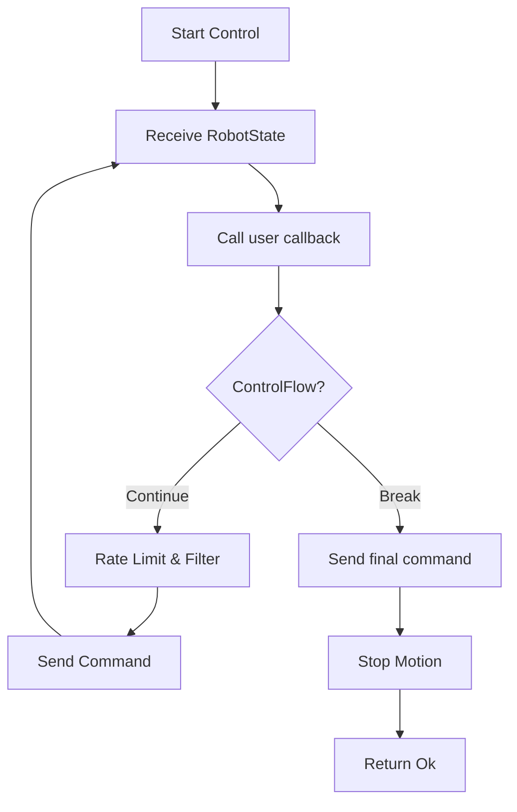

# Motion Control

## Overview

`franka-rs` provides four motion generation modes, each accepting a callback that runs at 1 kHz:

| Method | Output Type | Use Case |
|--------|-------------|----------|
| `control_joint_positions` | `JointPositions` | Joint-space trajectory tracking |
| `control_joint_velocities` | `JointVelocities` | Velocity-resolved control |
| `control_cartesian_pose` | `CartesianPose` | Task-space pose tracking |
| `control_cartesian_velocities` | `CartesianVelocities` | Task-space velocity control |

## Control Flow Pattern

All control methods use Rust's `ControlFlow` enum to signal when motion is complete:

```rust
use std::ops::ControlFlow;
use franka_rs::types::JointPositions;

robot.control_joint_positions(|state, duration| {
    let t = duration.as_secs_f64();

    if t >= 5.0 {
        // Motion complete — send final position and stop
        ControlFlow::Break(JointPositions::new(state.q_d))
    } else {
        // Continue generating trajectory
        let mut q_d = state.q_d;
        q_d[0] += 0.1 * (2.0 * std::f64::consts::PI * t).sin() * 0.001;
        ControlFlow::Continue(JointPositions::new(q_d))
    }
})?;
```



## Joint Position Control

```rust
use franka_rs::types::JointPositions;

// Move joint 4 by 0.5 rad over 3 seconds
let q_start = robot.read_once()?.q;

robot.control_joint_positions(|_state, duration| {
    let t = duration.as_secs_f64();
    let total = 3.0;

    if t >= total {
        let mut q_final = q_start;
        q_final[3] += 0.5;
        return ControlFlow::Break(JointPositions::new(q_final));
    }

    // Cosine interpolation for smooth acceleration
    let s = 0.5 * (1.0 - (std::f64::consts::PI * t / total).cos());
    let mut q = q_start;
    q[3] += 0.5 * s;
    ControlFlow::Continue(JointPositions::new(q))
})?;
```

## Cartesian Pose Control

```rust
use franka_rs::types::CartesianPose;
use nalgebra::Isometry3;

let initial_pose = robot.read_once()?.o_t_ee;

robot.control_cartesian_pose(|_state, duration| {
    let t = duration.as_secs_f64();

    if t >= 4.0 {
        return ControlFlow::Break(CartesianPose::from_column_major(&initial_pose));
    }

    // Circular motion in XY plane
    let radius = 0.05;
    let omega = 2.0 * std::f64::consts::PI / 4.0;
    let dx = radius * (omega * t).cos() - radius;
    let dy = radius * (omega * t).sin();

    let mut pose = initial_pose;
    pose[12] += dx; // x translation (column-major index)
    pose[13] += dy; // y translation
    ControlFlow::Continue(CartesianPose::from_column_major(&pose))
})?;
```

## Combined Motion + Torque Control

For impedance control or force overlay on a motion trajectory:

```rust
robot.control_joint_positions_with_torques(|state, duration| {
    let t = duration.as_secs_f64();

    // Generate position trajectory
    let q_d = compute_trajectory(t, &state.q);
    let positions = JointPositions::new(q_d);

    // Add compliance torques
    let tau = compute_impedance_torques(state);
    let torques = Torques::new(tau);

    if t >= 5.0 {
        ControlFlow::Break((positions, torques))
    } else {
        ControlFlow::Continue((positions, torques))
    }
})?;
```

## Rate Limiting

All commands pass through the rate limiter before being sent to the robot. This enforces:

| Quantity | Limit |
|----------|-------|
| Joint velocity | ±2.175 rad/s (joints 1-4), ±2.61 rad/s (joints 5-7) |
| Joint acceleration | ±15 rad/s² (joints 1-4), ±20 rad/s² (joints 5-7) |
| Joint jerk | ±7500 rad/s³ |
| Cartesian velocity | ±1.7 m/s (translation), ±2.5 rad/s (rotation) |
| Torque rate | ±1000 Nm/s |

If your commanded trajectory exceeds these limits, it will be clamped automatically. This prevents protective stops but may cause trajectory tracking error.

## Low-Pass Filtering

After rate limiting, commands are smoothed by a low-pass Butterworth filter:

- **Cutoff frequency**: 100 Hz (configurable)
- **Rotation**: Filtered via quaternion SLERP
- **Translation/joints**: Standard IIR filter

This removes high-frequency noise from your trajectory generator while preserving the overall motion profile.
