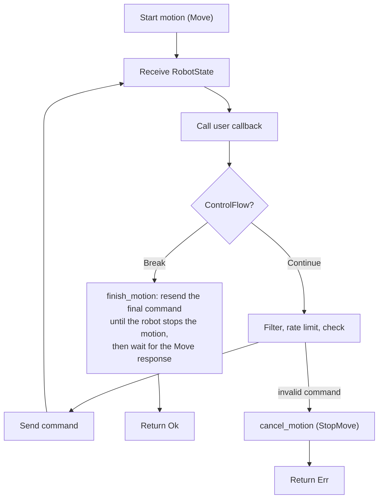

# Motion Control

## Overview

`franka-rs` provides four motion generator modes. Each takes a `MotionConfig` and a callback that
runs every millisecond (1 kHz):

| Method | Output Type | Use Case |
|--------|-------------|----------|
| `control_joint_positions` | `JointPositions` | Joint-space trajectory tracking |
| `control_joint_velocities` | `JointVelocities` | Velocity-resolved control |
| `control_cartesian_pose` | `CartesianPose` | Task-space pose tracking |
| `control_cartesian_velocities` | `CartesianVelocities` | Task-space velocity control |

`control_motion_with_torques` combines a motion generator with torque commands (see below). Each
mode has an active (non-callback) counterpart, `Robot::start_motion_control::<M>`; see
[Active Control](./modules/active-control.md).

All modes have been validated against libfranka 0.21.3 (built on the test machine; see
`validation/torque_validation_plan.md`): offline against a mock robot, bit-identical commands in
every mode and interface, with filtering and rate limiting on and off, and on the error paths; on
the robot, identical commands except the message ID for torque, joint position, joint velocity,
Cartesian pose and Cartesian velocity control through both interfaces (filtering and rate
limiting off, JointImpedance); combined motion + torque offline only.

## Motion Configuration

```rust
use franka_rs::robot::config::MotionConfig;
use franka_rs::types::ControllerMode;

let config = MotionConfig::default()                           // JointImpedance, limiting on, 100 Hz
    .with_controller_mode(ControllerMode::CartesianImpedance) // robot's internal controller
    .with_rate_limiting(true)
    .with_cutoff_frequency(100.0);                            // ≥ 1000 Hz turns the filter off
```

Motion-only methods need an internal controller (`JointImpedance` or `CartesianImpedance`);
`ExternalController` returns `FrankaError::InvalidOperation` because it needs torques.

## Control Flow Pattern

The callback receives the robot state and the time since its previous call (normally 1 ms; keep
your own clock by adding it up). It returns `ControlFlow::Continue(command)` to keep going or
`ControlFlow::Break(command)` to finish with that command.

```rust
use std::ops::ControlFlow;

use franka_rs::robot::config::MotionConfig;
use franka_rs::types::JointPositions;

// Move joint 4 by 0.5 rad over 3 s, starting from the first commanded position.
let mut time = 0.0;
let mut q_start: Option<[f64; 7]> = None;
robot.control_joint_positions(&MotionConfig::default(), |state, period| {
    time += period.as_secs_f64();
    let start = *q_start.get_or_insert(state.q_d);
    let total = 3.0;
    let s = if time >= total { 1.0 } else { 0.5 * (1.0 - (std::f64::consts::PI * time / total).cos()) };
    let mut q = start;
    q[3] += 0.5 * s;
    if time >= total {
        ControlFlow::Break(JointPositions::new(q))
    } else {
        ControlFlow::Continue(JointPositions::new(q))
    }
})?;
```

Start trajectories from the first state the callback receives (`q_d`, or `o_t_ee_c` for a pose),
as libfranka's examples do: the robot expects the first command to continue from its commanded
state.


```mermaid
flowchart TD
    START["Start motion (Move)"] --> RECV[Receive RobotState]
    RECV --> CALL[Call user callback]
    CALL --> CHECK{ControlFlow?}
    CHECK -->|Continue| PROC["Filter, rate limit, check"]
    PROC --> SEND[Send command]
    SEND --> RECV
    CHECK -->|Break| FIN["finish_motion: resend the final command<br/>until the robot stops the motion,<br/>then wait for the Move response"]
    FIN --> END[Return Ok]
    PROC -->|"invalid command"| CANCEL["cancel_motion (StopMove)"]
    CANCEL --> ERR[Return Err]
```

An error from the callback path, a robot error or a panic in the callback cancels the motion with
a StopMove request before the error is returned or the panic continues.

## Cartesian Pose Control

`CartesianPose` holds the column-major 4×4 end-effector pose exactly as given, with an optional
elbow (`with_elbow([joint-3 angle, ±1])`).

```rust
use std::ops::ControlFlow;

use franka_rs::robot::config::MotionConfig;
use franka_rs::types::CartesianPose;

// Circle of 5 cm radius in the x–y plane over 4 s.
let mut time = 0.0;
let mut initial: Option<[f64; 16]> = None;
robot.control_cartesian_pose(&MotionConfig::default(), |state, period| {
    time += period.as_secs_f64();
    let start = *initial.get_or_insert(state.o_t_ee_c);
    let radius = 0.05;
    let angle = 2.0 * std::f64::consts::PI * (time / 4.0).min(1.0);
    let mut pose = start;
    pose[12] += radius * angle.cos() - radius; // x translation (column-major index 12)
    pose[13] += radius * angle.sin();          // y translation
    if time >= 4.0 {
        ControlFlow::Break(CartesianPose::from_column_major(&pose))
    } else {
        ControlFlow::Continue(CartesianPose::from_column_major(&pose))
    }
})?;
```

## Combined Motion + Torque Control

`control_motion_with_torques` runs a motion generator together with torque commands under the
robot's external controller. It takes two callbacks: the torque callback runs first each cycle
and, while it has not finished, the motion callback runs after it, as in libfranka. Either
returning `Break` finishes the motion.

```rust
use std::ops::ControlFlow;

use franka_rs::robot::config::MotionConfig;
use franka_rs::types::{JointPositions, Torques};

robot.control_motion_with_torques(
    &MotionConfig::default(),
    |state, _period| ControlFlow::Continue(JointPositions::new(state.q_d)),
    |state, _period| ControlFlow::Continue(Torques::new(compute_impedance_torques(state))),
)?;
```

## Rate Limiting

In the callback interface, with `MotionConfig::limit_rate` on (the default), commands are limited
as libfranka's are (each limit reduced by 1e-3):

| Quantity | Limit |
|----------|-------|
| Joint velocity | Position-dependent, from the robot's URDF (`JointVelocityLimits`) |
| Joint acceleration | 10 rad/s² |
| Joint jerk | 5000 rad/s³ |
| Cartesian translation | 3.0 m/s, 9 m/s², 4500 m/s³ |
| Cartesian rotation | 2.5 rad/s, 17 rad/s², 8500 rad/s³ (× 0.99 for pose commands) |
| Elbow | 1.5 rad/s, 10 rad/s², 5000 rad/s³ |
| Torque rate | 1000 Nm/s |

A command that exceeds a limit is limited, which can cause tracking error. A non-finite value, a
pose that is not a homogeneous transformation, or an elbow sign other than ±1 is not limited but
rejected with `FrankaError::InvalidArgument`. The active interface sends commands without limiting,
after the same checks.

## Low-Pass Filtering

Before rate limiting, commands are smoothed by a first-order low-pass filter with gain
`Ts / (Ts + 1 / (2π f_c))` (`Ts` = 1 ms):

- **Cutoff frequency**: 100 Hz by default, `MotionConfig::with_cutoff_frequency`; 1000 Hz or more
  turns it off, and a cutoff of zero or below is rejected with `InvalidArgument`
- **Rotation**: interpolated by quaternion slerp, with libfranka's (Eigen's) exact arithmetic
- **Translation, joints, velocities**: filtered element by element
