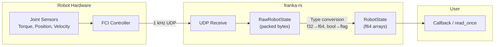

# Reading Robot State

## RobotState

The `RobotState` struct provides the complete state of the robot at a given instant. It is received at 1 kHz over UDP.

### Key Fields

| Field | Type | Description |
|-------|------|-------------|
| `q` | `[f64; 7]` | Measured joint positions (rad) |
| `dq` | `[f64; 7]` | Measured joint velocities (rad/s) |
| `q_d` | `[f64; 7]` | Desired joint positions (rad) |
| `dq_d` | `[f64; 7]` | Desired joint velocities (rad/s) |
| `tau_j` | `[f64; 7]` | Measured joint torques (Nm) |
| `tau_j_d` | `[f64; 7]` | Desired joint torques (Nm) |
| `tau_ext_hat_filtered` | `[f64; 7]` | Filtered external torque estimate (Nm) |
| `o_t_ee` | `[f64; 16]` | End-effector pose in base frame (column-major 4x4) |
| `o_f_ext_hat_k` | `[f64; 6]` | External wrench estimate at stiffness frame (N, Nm) |
| `robot_mode` | `RobotMode` | Current robot mode |
| `m_load` | `f64` | Configured load mass (kg) |
| `f_x_cload` | `[f64; 3]` | Load center of mass in flange frame (m) |
| `i_load` | `[f64; 9]` | Load inertia tensor (kg·m²) |

## Reading Once

```rust
let state = robot.read_once()?;
println!("Joint 1 position: {:.4} rad", state.q[0]);
println!("End-effector z-height: {:.4} m", state.o_t_ee[14]); // z-translation
```

## Continuous Reading

```rust
use std::ops::ControlFlow;

robot.read(|state| {
    if state.robot_mode != RobotMode::Move {
        return ControlFlow::Break(());
    }

    println!("tau_ext: {:?}", state.tau_ext_hat_filtered);
    ControlFlow::Continue(())
})?;
```

## State Flow Diagram



## Using State with the Model

```rust
use franka_rs::model::Model;
use franka_rs::types::Frame;

let model = Model::new();
let state = robot.read_once()?;

// Forward kinematics from current state
let ee_pose = model.pose_from_state(Frame::EndEffector, &state);

// Gravity compensation torques
let gravity = model.gravity_from_state(&state);

// Jacobian at current configuration
let jacobian = model.zero_jacobian_from_state(Frame::EndEffector, &state);
```
