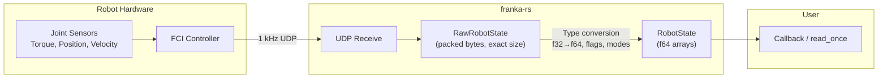

# Reading Robot State

## RobotState

The `RobotState` struct holds the complete state of the robot at one instant. The robot sends it
every millisecond over UDP; its values arrive in single precision and are widened to `f64`.

### Key Fields

| Field | Type | Description |
|-------|------|-------------|
| `q` | `[f64; 7]` | Measured joint positions (rad) |
| `dq` | `[f64; 7]` | Measured joint velocities (rad/s) |
| `q_d` | `[f64; 7]` | Desired joint positions (rad) |
| `dq_d` | `[f64; 7]` | Desired joint velocities (rad/s) |
| `tau_j` | `[f64; 7]` | Measured joint torques (Nm) |
| `tau_j_d` | `[f64; 7]` | Desired joint torques without gravity (Nm) |
| `tau_ext_hat_filtered` | `[f64; 7]` | Filtered external torque estimate (Nm) |
| `o_t_ee` | `[f64; 16]` | End-effector pose in base frame (column-major 4×4) |
| `o_t_ee_c` | `[f64; 16]` | Last commanded end-effector pose (column-major 4×4) |
| `o_f_ext_hat_k` | `[f64; 6]` | Estimated external wrench, in the base frame (N, Nm) |
| `k_f_ext_hat_k` | `[f64; 6]` | Estimated external wrench, in the stiffness frame (N, Nm) |
| `elbow` | `[f64; 2]` | Elbow: joint-3 angle (rad) and sign of joint 4 |
| `robot_mode` | `RobotMode` | Current robot mode |
| `m_ee`, `f_x_cee`, `i_ee` | `f64`, `[f64; 3]`, `[f64; 9]` | End-effector mass, center of mass (flange frame), inertia, as configured |
| `m_load`, `f_x_cload`, `i_load` | `f64`, `[f64; 3]`, `[f64; 9]` | External load mass, center of mass (flange frame), inertia, as configured |
| `current_errors`, `last_motion_errors` | `RobotErrors` | Active errors, and the errors that ended the last motion |
| `control_command_success_rate` | `f64` | Fraction of recent commands the robot received in time (0–1) |
| `time` | `Duration` | Robot time of this state (from the state's message ID, in ms) |

## Reading Once

`read_once` returns the newest state already received if it is newer than the last one read, and
otherwise waits for the next one.

```rust
let state = robot.read_once()?;
println!("Joint 1 position: {:.4} rad", state.q[0]);
println!("End-effector z-height: {:.4} m", state.o_t_ee[14]); // z-translation
```

## Continuous Reading

The callback returns `true` to keep reading and `false` to stop.

```rust
use franka_rs::types::RobotMode;

robot.read(|state| {
    println!("tau_ext: {:?}", state.tau_ext_hat_filtered);
    state.robot_mode == RobotMode::Idle
})?;
```

## State Flow Diagram


```mermaid
flowchart LR
    subgraph Robot Hardware
        SENSORS[Joint Sensors<br/>Torque, Position, Velocity]
        FCI[FCI Controller]
    end

    subgraph franka-rs
        UDP[UDP Receive]
        RAW["RawRobotState<br/>(packed bytes, exact size)"]
        STATE["RobotState<br/>(f64 arrays)"]
    end

    subgraph User
        CB[Callback / read_once]
    end

    SENSORS --> FCI
    FCI -->|"1 kHz UDP"| UDP
    UDP --> RAW
    RAW -->|"Type conversion<br/>f32→f64, flags, modes"| STATE
    STATE --> CB
```

## Using State with the Model

```rust
use franka_rs::model::RobotModel;
use franka_rs::types::Frame;

let model = robot.load_model()?; // built from the robot's URDF
let state = robot.read_once()?;

// Forward kinematics at the measured state (an Isometry3)
let ee_pose = model.pose_from_state(Frame::EndEffector, &state);

// Gravity torques with the configured end effector and load (the robot already compensates
// gravity in torque control; this is for analysis)
let gravity = model.gravity_from_state(&state);

// Jacobian at the measured configuration (6×7)
let jacobian = model.zero_jacobian_from_state(Frame::EndEffector, &state);
```
