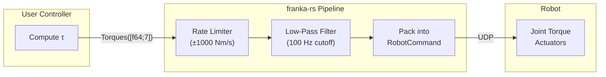
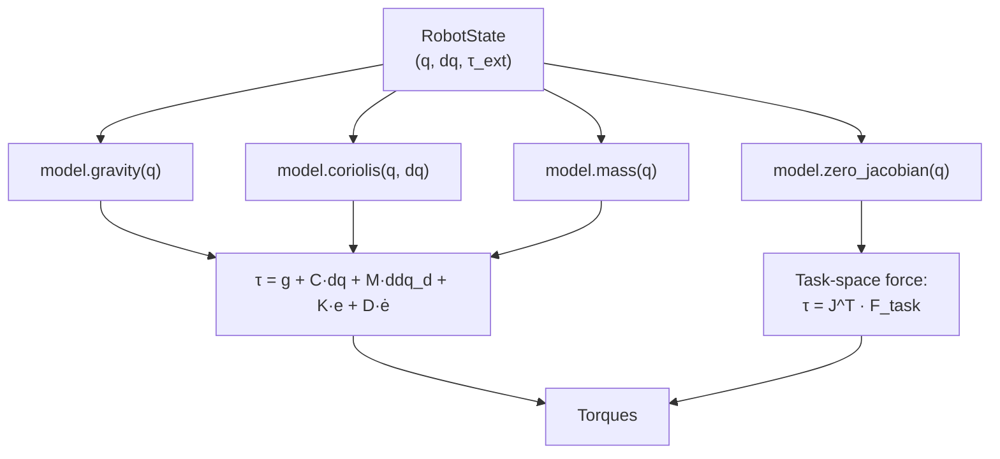

# Torque Control

## Overview

Direct torque control sends joint torques to the robot at 1 kHz. This is the lowest-level control interface, suitable for:

- Gravity compensation
- Impedance/compliance control
- Force control
- Custom dynamics controllers
- Learning-based control

## Basic Torque Control

```rust
use franka_rs::types::Torques;
use franka_rs::model::Model;
use std::ops::ControlFlow;

let model = Model::new();

robot.control_torques(|state, duration| {
    // Pure gravity compensation
    let gravity = model.gravity(
        &state.q,
        state.m_load,
        &state.f_x_cload,
        &[0.0, 0.0, -9.81],
    );

    if duration.as_secs_f64() >= 10.0 {
        ControlFlow::Break(Torques::new(gravity))
    } else {
        ControlFlow::Continue(Torques::new(gravity))
    }
})?;
```

## Impedance Control

```rust
let model = Model::new();
let stiffness = [600.0, 600.0, 600.0, 600.0, 250.0, 150.0, 50.0]; // Nm/rad
let damping = [50.0, 50.0, 50.0, 50.0, 30.0, 25.0, 15.0];         // Nm·s/rad
let q_desired = robot.read_once()?.q;

robot.control_torques(|state, duration| {
    let gravity = model.gravity(&state.q, 0.0, &[0.0; 3], &[0.0, 0.0, -9.81]);

    let mut tau = [0.0; 7];
    for i in 0..7 {
        tau[i] = gravity[i]
            + stiffness[i] * (q_desired[i] - state.q[i])
            - damping[i] * state.dq[i];
    }

    if duration.as_secs_f64() >= 30.0 {
        ControlFlow::Break(Torques::new(tau))
    } else {
        ControlFlow::Continue(Torques::new(tau))
    }
})?;
```

## Torque Control Pipeline



## Using the Model for Dynamics Compensation



## Safety Considerations

- **Always include gravity compensation** — sending zero torques will cause the robot to fall
- **Start with low gains** — high stiffness/damping can cause instability
- **Monitor `tau_ext_hat_filtered`** — detects unexpected contacts
- **The rate limiter caps torque derivative at ±1000 Nm/s** — ensure smooth torque profiles
- **External torques exceeding collision thresholds trigger protective stops** — configure collision behavior appropriately

## Active Torque Control (Non-Callback)

For integration with external control loops or async frameworks:

```rust
let mut ctrl = robot.start_torque_control()?;

loop {
    let state = ctrl.read_state()?;
    let tau = compute_my_torques(&state);

    if should_stop() {
        ctrl.write_torques_finish(Torques::new(tau))?;
        break;
    }
    ctrl.write_torques(Torques::new(tau))?;
}
// ctrl is dropped here — sends stop command automatically (RAII)
```
