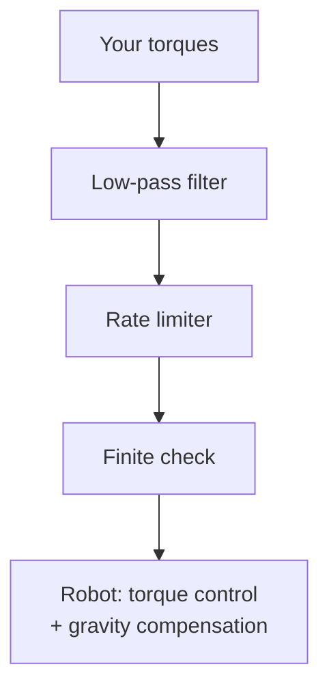

# Torque Control

Torque control commands joint torques every millisecond — the lowest-level interface, for
impedance, force and custom dynamics controllers.

Commanded torques are **without gravity and friction** (as libfranka documents for
`franka::Torques`): the robot compensates gravity for the arm and the end effector and load
configured in Desk. Zero torques therefore hold the arm when that configuration is accurate; with
an inaccurate one the arm can drift. Do not add the model's gravity torque — that would compensate
twice.

## Callback Interface

```rust
// Joint impedance holding the starting configuration for 30 s.
let stiffness = [600.0, 600.0, 600.0, 600.0, 250.0, 150.0, 50.0]; // Nm/rad
let damping = [50.0, 50.0, 50.0, 50.0, 30.0, 25.0, 15.0];         // Nm·s/rad
let mut q_ref: Option<[f64; 7]> = None;
let mut time = 0.0;
robot.control_torques(&MotionConfig::default(), |state, period| {
    time += period.as_secs_f64();                      // period: time since the previous call
    let q0 = *q_ref.get_or_insert(state.q);
    let tau = Torques::new(std::array::from_fn(|i| stiffness[i] * (q0[i] - state.q[i]) - damping[i] * state.dq[i]));
    if time >= 30.0 { ControlFlow::Break(tau) } else { ControlFlow::Continue(tau) }
})?;
```

Each torque command is low-pass filtered (cutoff < 1000 Hz, default 100 Hz), rate limited
(`limit_rate`, default on; about 1000 Nm/s) and checked to be finite, then sent. A non-finite
torque or invalid cutoff returns `InvalidArgument` and cancels the motion (StopMove). Torque loops
always use the external controller, whatever `MotionConfig::controller_mode` says.


```mermaid
flowchart TB
    U["Your torques"] --> L["Low-pass filter"] --> R["Rate limiter"] --> C["Finite check"] --> S["Robot: torque control<br/>+ gravity compensation"]
```

## Active Interface

```rust
let mut ctrl = robot.start_torque_control()?;
let mut state = ctrl.read_state()?;
loop {
    let tau = Torques::new(compute_torques(&state));
    if should_stop(&state) {
        ctrl.finish(&tau)?;
        break;
    }
    state = ctrl.write_torques(&tau)?; // sends, returns the next state
}
```

No filtering or rate limiting; the finite check still applies. A session dropped unfinished
(error, `?`, panic) is cancelled with StopMove. See [Active Control](./modules/active-control.md).

## Dynamics from the Model

```rust
let model = robot.load_model()?;                                   // needs `use franka_rs::model::RobotModel`
let state = robot.read_once()?;
let coriolis: [f64; 7] = model.coriolis_from_state(&state).into(); // N·m
let c = model.coriolis_matrix_from_state(&state);                  // 7×7, C·dq = coriolis
let mass = model.mass_from_state(&state);                          // 7×7
let jacobian = model.zero_jacobian_from_state(Frame::EndEffector, &state); // τ = Jᵀ F
```

## Safety

- Start with low gains; high stiffness or damping can cause instability.
- Monitor `tau_ext_hat_filtered` for unexpected contact.
- External torques above the collision thresholds (`set_collision_behavior`) trigger a reflex.
- Keep the user stop button in reach.
