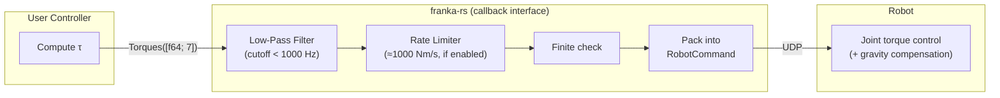

# Torque Control

## Overview

Torque control sends joint torques to the robot every millisecond (1 kHz). It is the lowest-level
control interface, suited to impedance and compliance control, force control and custom dynamics
controllers.

The commanded torques are **without gravity and friction**: the robot compensates gravity (for the
arm and the end effector and load configured in Desk) itself, as libfranka documents for
`franka::Torques`. A command of zero torques therefore holds the arm against gravity when the
configured end-effector mass and center of mass are accurate, as libfranka's `communication_test`
relies on; with an inaccurate configuration the arm can drift. Do not add the model's gravity
torque to the command; that would compensate gravity twice.

## Basic Torque Control

The callback receives the robot state and the time since the previous call (normally 1 ms). It
returns `ControlFlow::Continue(torques)` to keep going or `ControlFlow::Break(torques)` to send the
final command and stop.

```rust
use std::ops::ControlFlow;

use franka_rs::robot::config::MotionConfig;
use franka_rs::types::Torques;

// Zero torques for 10 s: the robot compensates gravity, so the arm holds if the end effector is
// configured accurately in Desk.
let mut time = 0.0;
robot.control_torques(&MotionConfig::default(), |_state, period| {
    time += period.as_secs_f64();
    let torques = Torques::new([0.0; 7]);
    if time >= 10.0 {
        ControlFlow::Break(torques)
    } else {
        ControlFlow::Continue(torques)
    }
})?;
```

`MotionConfig` selects rate limiting (default on) and the low-pass filter cutoff (default 100 Hz;
1000 Hz or more turns the filter off). Torque loops always run with the robot's external
controller, whatever `MotionConfig::controller_mode` says.

## Impedance Control

A joint impedance law holding the configuration the arm had when the motion started:

```rust
use std::ops::ControlFlow;

use franka_rs::robot::config::MotionConfig;
use franka_rs::types::Torques;

let stiffness = [600.0, 600.0, 600.0, 600.0, 250.0, 150.0, 50.0]; // Nm/rad
let damping = [50.0, 50.0, 50.0, 50.0, 30.0, 25.0, 15.0];         // Nm·s/rad
let mut q_desired: Option<[f64; 7]> = None;
let mut time = 0.0;

robot.control_torques(&MotionConfig::default(), |state, period| {
    time += period.as_secs_f64();
    let q_ref = *q_desired.get_or_insert(state.q);
    let tau: [f64; 7] =
        std::array::from_fn(|i| stiffness[i] * (q_ref[i] - state.q[i]) - damping[i] * state.dq[i]);
    if time >= 30.0 {
        ControlFlow::Break(Torques::new(tau))
    } else {
        ControlFlow::Continue(Torques::new(tau))
    }
})?;
```

## Torque Control Pipeline

In the callback interface each torque command is processed as libfranka's control loop does: the
low-pass filter (if the cutoff is below 1000 Hz), then the rate limiter (if enabled), then a check
that every value is finite. A non-finite torque, or an invalid cutoff, returns
`FrankaError::InvalidArgument`; the motion is then cancelled with a StopMove request.


```mermaid
flowchart LR
    subgraph "User Controller"
        CTRL[Compute τ]
    end

    subgraph "franka-rs (callback interface)"
        LP["Low-Pass Filter<br/>(cutoff < 1000 Hz)"]
        RL["Rate Limiter<br/>(≈1000 Nm/s, if enabled)"]
        FIN["Finite check"]
        CMD["Pack into<br/>RobotCommand"]
    end

    subgraph "Robot"
        JOINT["Joint torque control<br/>(+ gravity compensation)"]
    end

    CTRL -->|"Torques([f64; 7])"| LP
    LP --> RL
    RL --> FIN
    FIN --> CMD
    CMD -->|UDP| JOINT
```

## Using the Model for Dynamics Compensation

The model gives the arm's kinematics and dynamics at a robot state. Coriolis and mass terms can be
used in a controller; gravity is already compensated by the robot.

```rust
use franka_rs::model::RobotModel;
use franka_rs::types::Frame;

let model = robot.load_model()?;          // built from the robot's URDF
let state = robot.read_once()?;

let coriolis: [f64; 7] = model.coriolis_from_state(&state).into(); // N·m
let c_matrix = model.coriolis_matrix_from_state(&state);         // 7×7, C(q, dq)
let mass = model.mass_from_state(&state);                        // 7×7, kg·m²
let jacobian = model.zero_jacobian_from_state(Frame::EndEffector, &state); // 6×7
// A task-space force F (6-vector) maps to joint torques as jacobian.transpose() * F.
```

## Safety Considerations

- **Zero torques hold the arm** only when the end effector and load are configured accurately in
  Desk; the robot adds gravity compensation for the configured values.
- **Start with low gains**: high stiffness or damping can cause instability.
- **Monitor `tau_ext_hat_filtered`** to detect unexpected contact.
- **The rate limiter** (callback interface, when enabled) limits the torque rate to about
  1000 Nm/s; the active interface sends torques unfiltered and unlimited, after the finite check.
- **External torques above the collision thresholds trigger a reflex**: configure them with
  `Robot::set_collision_behavior`.

## Active Torque Control (Non-Callback)

For integration with your own loop: `read_state` returns the latest state, `write_torques` sends
torques and returns the next state, and `finish` sends the final torques and ends the motion.

```rust
use franka_rs::types::Torques;

let mut ctrl = robot.start_torque_control()?;
let mut state = ctrl.read_state()?;
loop {
    let tau = Torques::new(compute_my_torques(&state));
    if should_stop(&state) {
        ctrl.finish(&tau)?;
        break;
    }
    state = ctrl.write_torques(&tau)?;
}
// Dropping a session that was not finished (an error, a `?` or a panic) cancels the motion with
// a StopMove request; after a successful `finish` nothing more is sent.
```
